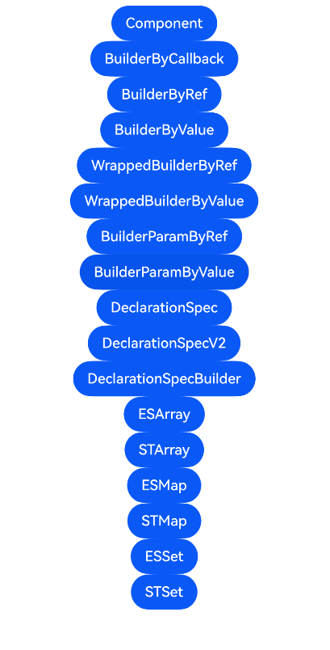

# ArkTS-Dyn使用ArkTS-Sta的UI示例

## 介绍

本工程帮助开发者更好地理解ArkTS-Dyn使用ArkTS-Sta UI的使用场景。该工程中展示的代码详细描述可查如下链接：

[在ArkTS-Dyn中使用ArkTS-Sta的自定义组件](https://gitcode.com/openharmony/docs/blob/OpenHarmony_feature_sta_20260331/zh-cn/application-dev/ui/arkts-dyn-interop-sta-component.md)

[在ArkTS-Dyn中使用ArkTS-Sta的自定义构建函数（@Builder）](https://gitcode.com/openharmony/docs/blob/OpenHarmony_feature_sta_20260331/zh-cn/application-dev/ui/arkts-dyn-interop-sta-builder.md)

[在ArkTS-Dyn中使用ArkTS-Sta的wrapBuilder（封装全局@Builder）](https://gitcode.com/openharmony/docs/blob/OpenHarmony_feature_sta_20260331/zh-cn/application-dev/ui/arkts-dyn-interop-sta-wrappedbuilder.md)

[在ArkTS-Dyn中使用ArkTS-Sta的@BuilderParam（引用@Builder函数）](https://gitcode.com/openharmony/docs/blob/OpenHarmony_feature_sta_20260331/zh-cn/application-dev/ui/arkts-dyn-interop-sta-builderparam.md)

[UI集合类型互操作(Array/Map/Set)](https://gitcode.com/openharmony/docs/blob/OpenHarmony_feature_sta_20260331/zh-cn/application-dev/ui/arkts-dyn-interop-sta-ui-collection.md)

## 使用说明

执行测试用例会先打开相应界面，然后点击按钮或图标，演示接口的使用效果。

## 效果预览

|首页                                   |
|----------------------------------------------|
||

## 工程目录
```
entry/src/
├── main
│   ├── ets
│   │   ├── entryability
│   │   ├── pages
│   │   │   ├── Index.ets
│   │   │   ├── BuilderByRef.ets
│   │   │   ├── BuilderByValue.ets
│   │   │   ├── BuilderParamByRef.ets
│   │   │   ├── BuilderParamByValue.ets
│   │   │   ├── Component.ets
│   │   │   ├── DeclarationSpec.ets
│   │   │   ├── DeclarationSpecBuilder.ets
│   │   │   ├── DeclarationSpecV2.ets
│   │   │   ├── ESArray.ets
│   │   │   ├── ESMap.ets
│   │   │   ├── ESSet.ets
│   │   │   ├── STArray.ets
│   │   │   ├── STMap.ets
│   │   │   ├── STSet.ets
│   │   │   ├── WrappedBuilderByRef.ets
│   │   │   └── WrappedBuilderByValue.ets
│   └── resources
│       ├── ...
├─── ... 
```

## 具体实现

1. 在ArkTS-Dyn中使用ArkTS-Sta的自定义组件、@Builder构建函数、wrapBuilder和@BuilderParam。

2. 在ArkTS-Dyn中使用ArkTS-Sta的集合类型Array、Map、Set。

## 相关权限

不涉及。

## 依赖

不涉及。

## 约束与限制

1.本示例已适配API version 23及以上版本SDK。

## 下载

如需单独下载本工程，执行如下命令：

```
git init
git config core.sparsecheckout true
echo code/DocsSample/ArkUISample-Sta/DynInteropStaUI/ > .git/info/sparse-checkout
git remote add origin https://gitcode.com/openharmony/applications_app_samples.git
git pull origin master
```
