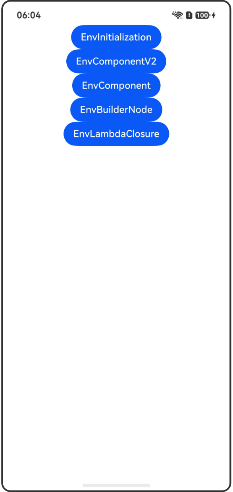

# @Env环境变量

## 介绍

本工程帮助开发者更好地理解@Env装饰器的使用场景。该工程中展示的代码详细描述可查如下链接：

[@Env环境变量](https://gitcode.com/openharmony/docs/blob/OpenHarmony_feature_sta_20260331/zh-cn/application-dev/ui/state-management-static/arkts-static-new-env.md)

## 使用说明

执行测试用例会先打开相应界面，然后点击按钮或图标，演示接口的使用效果。

## 效果预览

|首页                                   |
|----------------------------------------------|
||

## 工程目录

```
entry/src/
├── main
│   ├── ets
│   │   ├── entryability
│   │   │   └── EntryAbility.ets
│   │   └── pages
│   │       ├── Index.ets
│   │       ├── EnvInitialization.ets
│   │       ├── EnvComponentV2.ets
│   │       ├── EnvComponent.ets
│   │       ├── EnvBuilderNode.ets
│   │       ├── SubWindow.ets
│   │       ├── EnvLambdaClosure.ets
│   │       └── SubWindowLambda.ets
│   └── resources
│       ├── ...
├─── ... 
```

## 具体实现

1. @Env初始化流程：展示@Env变量在不同组件中的初始化和复用机制。
2. 在@ComponentV2中使用@Env：展示在@ComponentV2中使用@Env监听系统环境变量变化。
3. 在@Component中使用@Env：展示在@Component中使用@Env监听系统环境变量变化。
4. 通过BuilderNode切换窗口：展示通过BuilderNode切换窗口时@Env的更新机制。
5. 使用lambda闭包传递@Env：展示使用lambda闭包函数传递@Env变量，确保子组件能响应变化。

## 相关权限

不涉及。

## 依赖

不涉及。

## 约束与限制

1.本示例已适配API version 24及以上版本SDK。

## 下载

如需单独下载本工程，执行如下命令：

```
git init
git config core.sparsecheckout true
echo code/DocsSample/ArkUISample-Sta/EnvDecorator/ > .git/info/sparse-checkout
git remote add origin https://gitcode.com/openharmony/applications_app_samples.git
git pull origin master
```