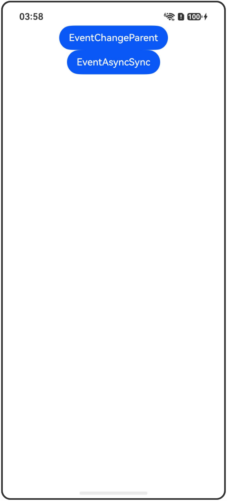

# @Event装饰器：规范组件输出

## 介绍

本工程帮助开发者更好地理解@Event装饰器的使用场景。该工程中展示的代码详细描述可查如下链接：

[@Event装饰器：规范组件输出](https://gitcode.com/openharmony/docs/blob/master/zh-cn/application-dev/ui/state-management-static/arkts-static-new-event.md)

## 使用说明

执行测试用例会先打开相应界面，然后点击按钮或图标，演示接口的使用效果。

## 效果预览

|首页                                   |
|----------------------------------------------|
||

## 工程目录
```
entry/src/
├── main
│   ├── ets
│   │   ├── entryability
│   │   ├── pages
│   │   │   ├── Index.ets
│   │   │   ├── EventChangeParent.ets
│   │   │   └── EventAsyncSync.ets
│   └── resources
│       ├── ...
├─── ... 
```

## 具体实现

1. 更改父组件中变量：使用@Event可以修改父组件中变量，当该变量作为子组件@Param变量的数据源时，该变化将同步更新到子组件的@Param变量。

2. 异步同步示例：使用@Event修改父组件的值是立刻生效的，但从父组件将变化同步回子组件的过程是异步的，即在调用完@Event的方法后，子组件内的值不会立刻修改。

## 相关权限

不涉及。

## 依赖

不涉及。

## 约束与限制

1.本示例已适配API version 23及以上版本SDK。

## 下载

如需单独下载本工程，执行如下命令：

```
git init
git config core.sparsecheckout true
echo code/DocsSample/ArkUISample-Sta/EventDecorator/ > .git/info/sparse-checkout
git remote add origin https://gitcode.com/openharmony/applications_app_samples.git
git pull origin master
```