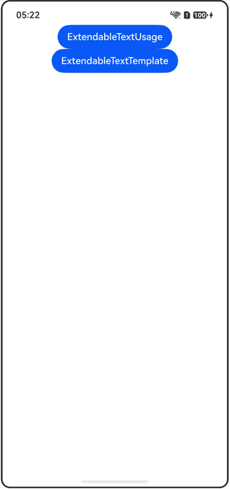

# 内置组件扩展

## 介绍

本工程帮助开发者更好地理解内置组件扩展的使用场景。该工程中展示的代码详细描述可查如下链接：

[内置组件扩展](https://gitcode.com/openharmony/docs/blob/OpenHarmony_feature_sta_20260331/zh-cn/application-dev/ui/state-management-static/arkts-static-extendable-inner-component.md)

## 使用说明

执行测试用例会先打开相应界面，然后点击按钮或图标，演示接口的使用效果。

## 效果预览

|首页                                   |
|----------------------------------------------|
||

## 工程目录
```
entry/src/
├── main
│   ├── ets
│   │   ├── entryability
│   │   ├── pages
│   │   │   ├── Index.ets
│   │   │   ├── ExtendableTextUsage.ets
│   │   │   └── ExtendableTextTemplate.ets
│   └── resources
│       ├── ...
├─── ... 
```

## 具体实现

1. 创建自定义内置组件扩展类：开发者可以按需创建内置组件扩展类，并在其中重写现有的属性和新增自定义属性。

2. 内置组件扩展类的使用：开发者自定义的扩展组件与对应的内置组件使用方式基本一致，包括调用位置、可包含的子组件等。

3. 内置组件扩展类的模板化使用：开发者可以在自定义的内置组件扩展类中定义模板化的属性设置，实现可变属性样式的模板组件和固定样式的模板组件。

## 相关权限

不涉及。

## 依赖

不涉及。

## 约束与限制

1.本示例已适配API version 26及以上版本SDK。

## 下载

如需单独下载本工程，执行如下命令：

```
git init
git config core.sparsecheckout true
echo code/DocsSample/ArkUISample-Sta/ExtendableInnerComponent/ > .git/info/sparse-checkout
git remote add origin https://gitcode.com/openharmony/applications_app_samples.git
git pull origin master
```
