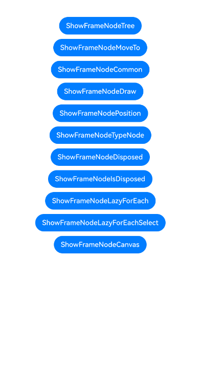

# 框架节点 (FrameNode)指南文档示例

### 介绍

本示例通过使用[ArkUI指南文档](https://gitcode.com/openharmony/docs/blob/OpenHarmony_feature_sta_20260331/zh-cn/application-dev/ui/)中各场景的开发示例，展示在工程中，帮助开发者更好地理解ArkUI提供的组件及组件属性并合理使用。该工程中展示的代码详细描述可查如下链接：

1. [自定义组件节点 (FrameNode)](https://gitcode.com/openharmony/docs/blob/OpenHarmony_feature_sta_20260331/zh-cn/application-dev/ui/arkts-user-defined-arktsNode-frameNode.md)。

### 效果预览

|首页                                   |
|----------------------------------------------|
||

### 工程目录
```
entry/src/
├── main
│   ├── ets
│   │   ├── entryability
│   |   |   └── EntryAbility.ets                     // 程序入口类 
│   │   ├── pages
│   │   │   ├── samples
│   |   |   |   ├── FrameNodeCanvas.ets              // FrameNode画布绘制
│   |   |   |   ├── FrameNodeCommon.ets              // FrameNode通用属性
│   |   |   |   ├── FrameNodeDisposed.ets            // FrameNode释放
│   |   |   |   ├── FrameNodeDraw.ets                // FrameNode自定义绘制
│   |   |   |   ├── FrameNodeIsDisposed.ets          // 检查FrameNode是否释放
│   |   |   |   ├── FrameNodeLazyForEach.ets         // FrameNode懒加载
│   |   |   |   ├── FrameNodeLazyForEachSelect.ets   // FrameNode懒加载选择
│   |   |   |   ├── FrameNodeMoveTo.ets              // FrameNode移动
│   |   |   |   ├── FrameNodePosition.ets            // FrameNode位置信息
│   |   |   |   ├── FrameNodeTree.ets                // FrameNode节点树操作
│   |   |   |   └── FrameNodeTypeNode.ets            // FrameNode类型节点
│   │   │   └── Index.ets                            // 主界面
│   └── resources
│       ├── ...
├─── ... 
```

### 具体实现

1. 通过FrameNode创建自定义框架节点，支持节点树的增删改查；
2. 使用FrameNode的commonAttribute设置节点属性，commonEvent添加事件监听；
3. 通过typeNode创建系统类型节点（如Text、Column、Row等）；
4. 支持通过NodeAdapter实现懒加载列表。

### 相关权限

不涉及。

### 依赖

不涉及。

### 约束与限制

1.本示例仅支持标准系统上运行, 支持设备：RK3568。

2.本示例为Stage模型，arkTSVersion为1.2。

3.本示例需要使用Sta SDK配套IDE版本才可编译运行。

### 下载

如需单独下载本工程，执行如下命令：

```
git init
git config core.sparsecheckout true
echo code/DocsSample/ArkUISample-Sta/FrameNode/ > .git/info/sparse-checkout
git remote add origin https://gitcode.com/openharmony/applications_app_samples.git
git pull origin OpenHarmony_feature_sta_20260331
```
