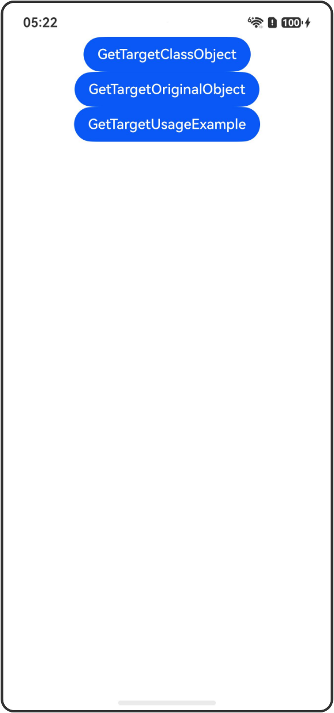

# getTarget接口：获取状态管理框架包装前的原始对象

## 介绍

本工程帮助开发者更好地理解getTarget接口的使用场景。该工程中展示的代码详细描述可查如下链接：

[getTarget接口：获取状态管理框架包装前的原始对象](https://gitcode.com/openharmony/docs/blob/OpenHarmony_feature_sta_20260331/zh-cn/application-dev/ui/state-management-static/arkts-static-new-getTarget.md)

## 使用说明

执行测试用例会先打开相应界面，然后点击按钮或图标，演示接口的使用效果。

## 效果预览

|首页                                   |
|----------------------------------------------|
||

## 工程目录
```
entry/src/
├── main
│   ├── ets
│   │   ├── entryability
│   │   ├── pages
│   │   │   ├── Index.ets
│   │   │   ├── GetTargetClassObject.ets
│   │   │   ├── GetTargetOriginalObject.ets
│   │   │   └── GetTargetUsageExample.ets
│   └── resources
│       ├── ...
├─── ... 
```

## 具体实现

1. 非对象类型入参：getTarget传入非对象类型，如number、string、undefined、null，会直接返回传入内容。

2. 传入class对象：getTarget传入非Date、Map、Set、Array、interface字面量之外的class时，不做处理，直接返回传入内容。

3. 更改原始对象的属性：更改getTarget获取的原始对象中的内容不会被观察，也不会触发UI刷新。

4. 使用场景示例：使用getTarget判断对象是否被状态管理包装。

## 相关权限

不涉及。

## 依赖

不涉及。

## 约束与限制

1.本示例已适配API version 23及以上版本SDK。

## 下载

如需单独下载本工程，执行如下命令：

```
git init
git config core.sparsecheckout true
echo code/DocsSample/ArkUISample-Sta/GetTarget/ > .git/info/sparse-checkout
git remote add origin https://gitcode.com/openharmony/applications_app_samples.git
git pull origin master
```