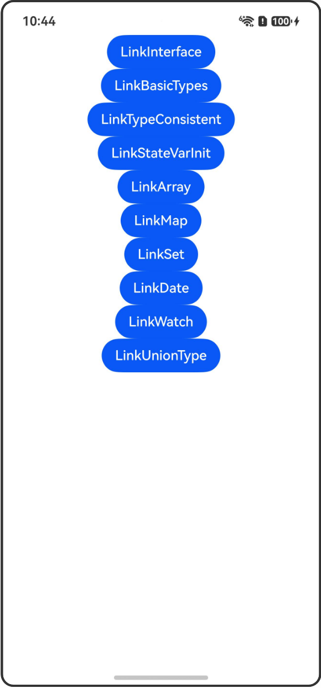

# @Link装饰器：父子双向同步

## 介绍

本工程帮助开发者更好地理解@Link装饰器的使用场景。该工程中展示的代码详细描述可查如下链接：

[@Link装饰器：父子双向同步](https://gitcode.com/openharmony/docs/blob/OpenHarmony_feature_sta_20260331/zh-cn/application-dev/ui/state-management-static/arkts-static-link.md)

## 使用说明

执行测试用例会先打开相应界面，然后点击按钮或图标，演示接口的使用效果。

## 效果预览

|首页                                   |
|----------------------------------------------|
||

## 工程目录
```
entry/src/
├── main
│   ├── ets
│   │   ├── entryability
│   │   ├── pages
│   │   │   ├── Index.ets
│   │   │   ├── LinkInterface.ets
│   │   │   ├── LinkBasicTypes.ets
│   │   │   ├── LinkTypeConsistent.ets
│   │   │   ├── LinkStateVarInit.ets
│   │   │   ├── LinkArray.ets
│   │   │   ├── LinkMap.ets
│   │   │   ├── LinkSet.ets
│   │   │   ├── LinkDate.ets
│   │   │   ├── LinkWatch.ets
│   │   │   └── LinkUnionType.ets
│   └── resources
│       ├── ...
├─── ... 
```

## 具体实现

1. @Link装饰interface字面量：可以观察到字面量整体及其属性的变化。

2. @Link装饰简单类型和类对象：简单类型和类对象类型都可以实现父子组件双向同步。

3. @Link数据源类型一致：@Link装饰的状态变量的类型要和数据源的类型保持一致。

4. @Link使用状态变量初始化：@Link装饰的状态变量仅能被状态变量初始化。

5. @Link装饰数组类型：可以观察到数组整体和数组项的变化。

6. @Link装饰Map类型：可以观察到Map整体赋值以及通过API操作带来的变化。

7. @Link装饰Set类型：可以观察到Set整体赋值以及通过API操作带来的变化。

8. @Link装饰Date类型：可以观察到Date整体赋值以及通过API操作带来的变化。

9. @Link使用@Watch：通过@Watch可以在双向同步时更改本地变量。

10. @Link支持联合类型：支持null、undefined以及联合类型。

## 相关权限

不涉及。

## 依赖

不涉及。

## 约束与限制

1.本示例已适配API version 23及以上版本SDK。

## 下载

如需单独下载本工程，执行如下命令：

```
git init
git config core.sparsecheckout true
echo code/DocsSample/ArkUISample-Sta/LinkDecorator/ > .git/info/sparse-checkout
git remote add origin https://gitcode.com/openharmony/applications_app_samples.git
git pull origin master
```