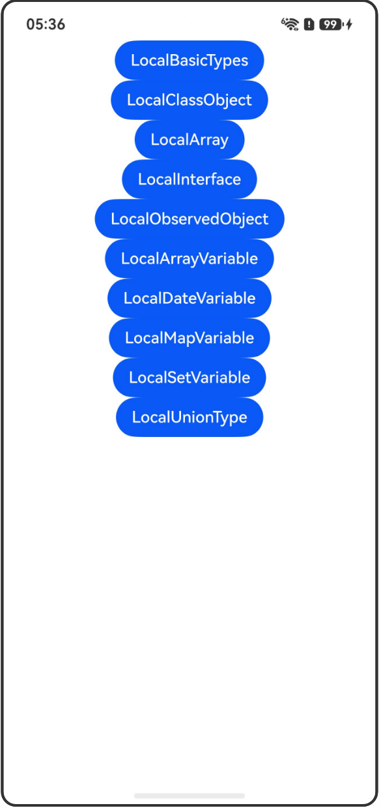

# @Local装饰器：组件内部状态

## 介绍

本工程帮助开发者更好地理解@Local装饰器的使用场景。该工程中展示的代码详细描述可查如下链接：

[@Local装饰器：组件内部状态](https://gitcode.com/openharmony/docs/blob/master/zh-cn/application-dev/ui/state-management-static/arkts-static-new-local.md)

## 使用说明

执行测试用例会先打开相应界面，然后点击按钮或图标，演示接口的使用效果。

## 效果预览

|首页                                   |
|----------------------------------------------|
||

## 工程目录
```
entry/src/
├── main
│   ├── ets
│   │   ├── entryability
│   │   ├── pages
│   │   │   ├── Index.ets
│   │   │   ├── LocalBasicTypes.ets
│   │   │   ├── LocalClassObject.ets
│   │   │   ├── LocalArray.ets
│   │   │   ├── LocalInterface.ets
│   │   │   ├── LocalComponentV2.ets
│   │   │   ├── LocalNoParentInit.ets
│   │   │   ├── LocalObservedObject.ets
│   │   │   ├── LocalArrayVariable.ets
│   │   │   ├── LocalDateVariable.ets
│   │   │   ├── LocalMapVariable.ets
│   │   │   ├── LocalSetVariable.ets
│   │   │   └── LocalUnionType.ets
│   └── resources
│       ├── ...
├─── ... 
```

## 具体实现

1. @Local装饰基本类型：当装饰boolean、string、number时，可以观察到对变量赋值的变化。

2. @Local装饰类对象：仅能观察到对类对象整体赋值的变化，无法直接观察到对类成员属性赋值的变化。对类成员属性的观察依赖@ObservedV2与@Trace装饰器。

3. @Local装饰数组：可以观察到数组整体或数组项的变化。

4. @Local装饰interface字面量类型：仅能观察到字面量整体的变化，无法观察到属性的变化。

5. @Local仅能在@ComponentV2装饰的自定义组件中使用。

6. @Local装饰的变量表示组件内部状态，不支持从父组件传入初始化。

7. 观察对象整体变化：使用@Local装饰对象，可以达到观察对象本身变化的效果。

8. 装饰Array类型变量：可以观察到Array整体及其元素的变化。通过API操作更改数组内容也能被观察到。

9. 装饰Date类型变量：可以观察到Date整体及其API操作的变化。

10. 装饰Map类型变量：可以观察到Map整体及其API操作带来的变化。

11. 装饰Set类型变量：可以观察到Set整体及其API操作带来的变化。

12. 联合类型：@Local支持null、undefined以及联合类型。

## 相关权限

不涉及。

## 依赖

不涉及。

## 约束与限制

1.本示例已适配API version 23及以上版本SDK。

## 下载

如需单独下载本工程，执行如下命令：

```
git init
git config core.sparsecheckout true
echo code/DocsSample/ArkUISample/LocalDecorator/ > .git/info/sparse-checkout
git remote add origin https://gitcode.com/openharmony/applications_app_samples.git
git pull origin master
```