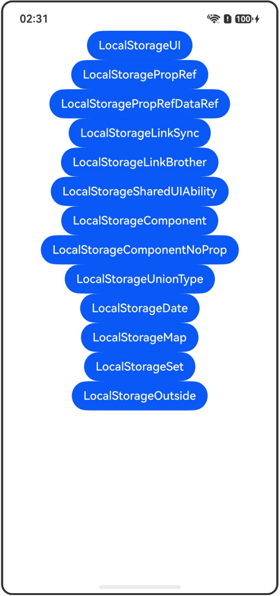

# LocalStorage：页面级UI状态存储

## 介绍

本工程帮助开发者更好地理解LocalStorage的使用场景。该工程中展示的代码详细描述可查如下链接：

[LocalStorage：页面级UI状态存储](https://gitcode.com/openharmony/docs/blob/OpenHarmony_feature_sta_20260331/zh-cn/application-dev/ui/state-management-static/arkts-static-localstorage.md)

## 使用说明

执行测试用例会先打开相应界面，然后点击按钮或图标，演示接口的使用效果。

## 效果预览

|首页                                   |
|----------------------------------------------|
||

## 工程目录
```
entry/src/
├── main
│   ├── ets
│   │   ├── entryability
│   │   ├── pages
│   │   │   ├── Index.ets
│   │   │   ├── LocalStorageUI.ets
│   │   │   ├── LocalStoragePropRef.ets
│   │   │   ├── LocalStoragePropRefDataRef.ets
│   │   │   ├── LocalStorageLinkSync.ets
│   │   │   ├── LocalStorageLinkBrother.ets
│   │   │   ├── LocalStorageSharedUIAbility.ets
│   │   │   ├── LocalStorageComponent.ets
│   │   │   ├── LocalStorageComponentNoProp.ets
│   │   │   ├── LocalStorageUnionType.ets
│   │   │   ├── LocalStorageDate.ets
│   │   │   ├── LocalStorageMap.ets
│   │   │   ├── LocalStorageSet.ets
│   │   │   └── LocalStorageOutside.ets
│   └── resources
│       ├── ...
├─── ... 
```

## 具体实现

1. 从UI内部使用LocalStorage：使用@Entry装饰器将LocalStorage添加到Parent顶层组件中，@LocalStorageLink绑定LocalStorage对应的属性，建立双向数据同步。

2. @LocalStoragePropRef单向同步：Parent和Child组件各自在本地创建与storage中'PropA'属性的单向数据同步，Parent中的修改不会同步回storage。

3. @LocalStoragePropRef获得数据源引用：@LocalStoragePropRef会获得数据源的引用，对于复杂类型，修改属性将在LocalStorage中体现。

4. @LocalStorageLink双向同步：@LocalStorageLink装饰的变量更新时，会同步写回LocalStorage对应的key，还会引起所属的自定义组件的重新渲染。

5. 兄弟组件之间同步状态变量：通过@LocalStorageLink双向同步兄弟组件之间的状态，父组件、LocalStorage API和子组件的修改都会同步刷新。

6. 从UIAbility共享LocalStorage：在UIAbility中创建LocalStorage实例，并调用windowStage.loadContent传入，实现跨页面共享。

7. 自定义组件接收LocalStorage实例：自定义组件通过构造参数接收LocalStorage实例，使得子组件可以使用不同的LocalStorage实例。

8. 自定义组件接收LocalStorage实例（无属性）：当自定义组件不需要从父组件初始化变量时，第一个参数传{}。

9. LocalStorage支持联合类型：@LocalStorageLink和@LocalStoragePropRef支持联合类型，如number | null或number | undefined。

10. 装饰Date类型变量：@LocalStorageLink装饰的Date类型变量，可以观察到Date整体的赋值以及通过Date API的更新。

11. 装饰Map类型变量：@LocalStorageLink装饰的Map类型变量，可以观察到Map整体的赋值以及通过Map API的更新。

12. 装饰Set类型变量：@LocalStorageLink装饰的Set类型变量，可以观察到Set整体的赋值以及通过Set API的更新。

13. 组件外改变状态变量：通过外部Model类调用LocalStorage的API修改状态变量，UI会同步刷新。

## 相关权限

不涉及。

## 依赖

不涉及。

## 约束与限制

1.本示例已适配API version 23及以上版本SDK。

## 下载

如需单独下载本工程，执行如下命令：

```
git init
git config core.sparsecheckout true
echo code/DocsSample/ArkUISample-Sta/LocalStorageDecorator/ > .git/info/sparse-checkout
git remote add origin https://gitcode.com/openharmony/applications_app_samples.git
git pull origin master
```