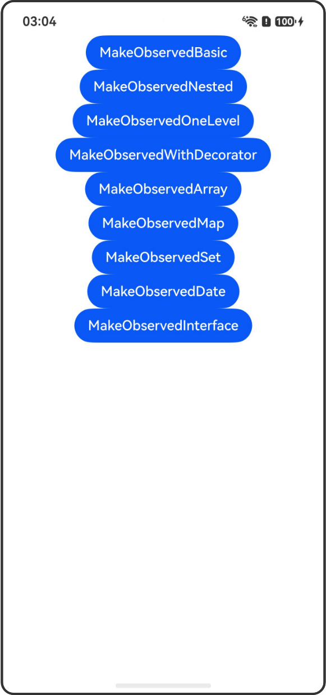

# @MakeObserved装饰器：嵌套类对象属性变化观察

## 介绍

本工程帮助开发者更好地理解@MakeObserved装饰器的使用场景。该工程中展示的代码详细描述可查如下链接：

[@MakeObserved装饰器：嵌套类对象属性变化观察](https://gitcode.com/openharmony/docs/blob/OpenHarmony_feature_sta_20260331/zh-cn/application-dev/ui/state-management-static/arkts-static-new-makeObserved.md)

## 使用说明

执行测试用例会先打开相应界面，然后点击按钮或图标，演示接口的使用效果。

## 效果预览

|首页                                   |
|----------------------------------------------|
||

## 工程目录
```
entry/src/
├── main
│   ├── ets
│   │   ├── entryability
│   ├── pages
│   │   ├── Index.ets
│   │   ├── MakeObservedBasic.ets
│   │   ├── MakeObservedNested.ets
│   │   ├── MakeObservedOneLevel.ets
│   │   ├── MakeObservedWithDecorator.ets
│   │   ├── MakeObservedArray.ets
│   │   ├── MakeObservedMap.ets
│   │   ├── MakeObservedSet.ets
│   │   ├── MakeObservedDate.ets
│   │   ├── MakeObservedInterface.ets
│   └── resources
│       ├── ...
├─── ... 
```

## 具体实现

1. @MakeObserved基本用法：将嵌套类对象转化为可观察对象，实现嵌套属性的深度观察。

2. 嵌套类对象观察：多层嵌套的类对象，使用@MakeObserved可以实现所有层级属性的观察。

3. 单层嵌套观察：仅观察一层嵌套属性的变化。

4. 结合@ObservedV2使用：@MakeObserved可以与@ObservedV2、@Trace装饰器配合使用。

5. 装饰Array类型：@MakeObserved装饰数组，观察数组元素的属性变化。

6. 装饰Map类型：@MakeObserved装饰Map，观察Map中值的属性变化。

7. 装饰Set类型：@MakeObserved装饰Set，观察Set中元素的属性变化。

8. 装饰Date类型：@MakeObserved装饰Date，观察Date对象的变化。

9. 装饰interface：@MakeObserved装饰interface类型对象。

## 相关权限

不涉及。

## 依赖

不涉及。

## 约束与限制

1.本示例已适配API version 26及以上版本SDK。

## 下载

如需单独下载本工程，执行如下命令：

```
git init
git config core.sparsecheckout true
echo code/DocsSample/ArkUISample-Sta/MakeObserved/ > .git/info/sparse-checkout
git remote add origin https://gitcode.com/openharmony/applications_app_samples.git
git pull origin master
```