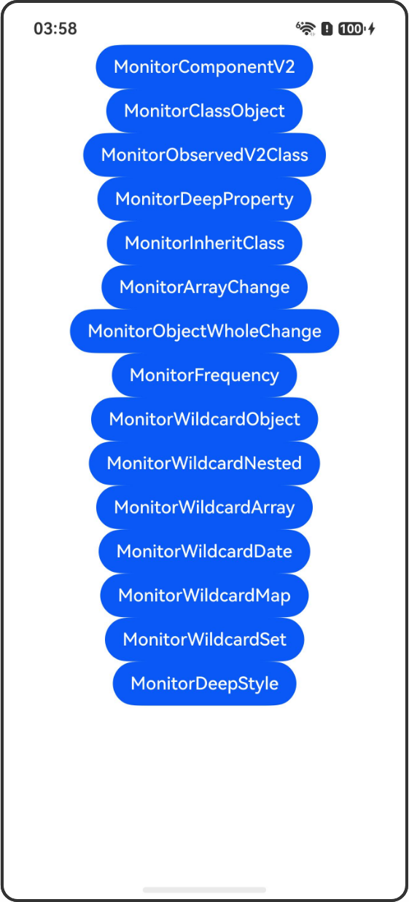

# @Monitor装饰器：状态变量修改监听

## 介绍

本示例展示了@Monitor装饰器的使用方法，@Monitor装饰器用于监听状态变量修改，使得状态变量具有深度监听的能力。该工程中展示的代码详细描述可查如下链接：

[@Monitor装饰器：状态变量修改监听](https://developer.huawei.com/consumer/cn/doc/harmonyos-guides/arkts-static-new-monitor)

## 使用说明

执行测试用例会先打开相应界面，然后点击按钮或图标，演示接口的使用效果。

## 效果预览

|首页                                   |
|----------------------------------------------|
||

## 示例列表

| 示例名称 | 描述 | 文件路径 |
|---------|------|---------|
| MonitorComponentV2 | 在@ComponentV2中使用@Monitor监听message、name变化 | pages/MonitorComponentV2.ets |
| MonitorClassObject | @Monitor监听类对象 | pages/MonitorClassObject.ets |
| MonitorObservedV2Class | 在@ObservedV2类中使用@Monitor | pages/MonitorObservedV2Class.ets |
| MonitorDeepProperty | @Monitor监听深层属性 | pages/MonitorDeepProperty.ets |
| MonitorInheritClass | @Monitor继承类场景 | pages/MonitorInheritClass.ets |
| MonitorArrayChange | @Monitor监听数组变化 | pages/MonitorArrayChange.ets |
| MonitorObjectWholeChange | @Monitor对象整体改变 | pages/MonitorObjectWholeChange.ets |
| MonitorFrequency | @Monitor多次改变场景 | pages/MonitorFrequency.ets |
| MonitorWildcardObject | 通配符监听对象属性 | pages/MonitorWildcardObject.ets |
| MonitorWildcardNested | 通配符监听嵌套对象 | pages/MonitorWildcardNested.ets |
| MonitorWildcardArray | 通配符监听数组对象 | pages/MonitorWildcardArray.ets |
| MonitorWildcardDate | 通配符监听Date对象 | pages/MonitorWildcardDate.ets |
| MonitorWildcardMap | 通配符监听Map对象 | pages/MonitorWildcardMap.ets |
| MonitorWildcardSet | 通配符监听Set对象 | pages/MonitorWildcardSet.ets |
| MonitorDeepStyle | 监听深层属性变化-UIStyle示例 | pages/MonitorDeepStyle.ets |

## 使用说明

1. 点击示例列表中的按钮进入对应的示例页面
2. 在示例页面中点击按钮观察状态变量变化和监听回调触发情况

## 约束与限制

- @Monitor装饰器从API version 23开始支持
- 从API版本26.0.0开始，支持通配符能力
- 需要使用静态模式：'use static'

## 权限要求

无

## 目录结构

```
MonitorDecorator/
├── AppScope/
│   ├── app.json5
│   └── resources/
│       └── base/
│           ├── element/
│           │   └── string.json
│           └── media/
│               ├── layered_image.json
│               ├── foreground.png
│               └── background.png
├── entry/
│   ├── src/
│   │   ├── main/
│   │   │   ├── ets/
│   │   │   │   ├── entryability/
│   │   │   │   │   └── EntryAbility.ets
│   │   │   │   └── pages/
│   │   │   │       ├── Index.ets
│   │   │   │       ├── MonitorComponentV2.ets
│   │   │   │       ├── MonitorClassObject.ets
│   │   │   │       ├── MonitorObservedV2Class.ets
│   │   │   │       ├── MonitorDeepProperty.ets
│   │   │   │       ├── MonitorInheritClass.ets
│   │   │   │       ├── MonitorArrayChange.ets
│   │   │   │       ├── MonitorObjectWholeChange.ets
│   │   │   │       ├── MonitorFrequency.ets
│   │   │   │       ├── MonitorWildcardObject.ets
│   │   │   │       ├── MonitorWildcardNested.ets
│   │   │   │       ├── MonitorWildcardArray.ets
│   │   │   │       ├── MonitorWildcardDate.ets
│   │   │   │       ├── MonitorWildcardMap.ets
│   │   │   │       ├── MonitorWildcardSet.ets
│   │   │   │       └── MonitorDeepStyle.ets
│   │   │   ├── resources/
│   │   │   │   ├── base/
│   │   │   │   │   ├── element/
│   │   │   │   │   │   ├── color.json
│   │   │   │   │   │   ├── float.json
│   │   │   │   │   │   └── string.json
│   │   │   │   │   ├── media/
│   │   │   │   │   │   ├── layered_image.json
│   │   │   │   │   │   ├── foreground.png
│   │   │   │   │   │   ├── background.png
│   │   │   │   │   │   └── startIcon.png
│   │   │   │   │   └── profile/
│   │   │   │   │       └── main_pages.json
│   │   │   │   └── dark/
│   │   │   │       └── element/
│   │   │   │           └── color.json
│   │   │   └── module.json5
│   │   ├── ohosTest/
│   │   │   ├── ets/
│   │   │   │   └── test/
│   │   │   └── module.json5
│   │   └── test/
│   ├── build-profile.json5
│   ├── hvigorfile.ts
│   ├── oh-package.json5
│   └── obfuscation-rules.txt
├── hvigor/
│   └── hvigor-config.json5
├── build-profile.json5
├── code-linter.json5
├── hvigorfile.ts
├── oh-package.json5
└── README_zh.md
```

## 下载

如需单独下载本工程，执行如下命令：

```
git init
git config core.sparsecheckout true
echo code/DocsSample/ArkUISample-Sta/MonitorDecorator/ > .git/info/sparse-checkout
git remote add origin https://gitcode.com/openharmony/applications_app_samples.git
git pull origin master
```