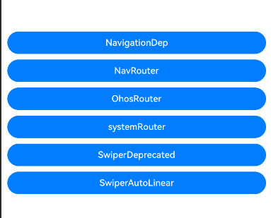

# ArkUI导航组件废弃接口指南文档示例

### 介绍

本示例展示了ArkUI导航组件废弃接口及替代方案的使用方法，包括废弃的Navigation组件用法、Router API、NavPathStack路由以及废弃的Swiper接口等。该工程中展示的代码详细描述可查如下链接：

1. [Navigation](https://gitcode.com/openharmony/docs/blob/master/zh-cn/application-dev/reference/apis-arkui/arkui-ts/ts-basic-components-navigation.md)。
2. [NavDestination](https://gitcode.com/openharmony/docs/blob/master/zh-cn/application-dev/reference/apis-arkui/arkui-ts/ts-basic-components-navdestination.md)。
3. [NavPathStack](https://gitcode.com/openharmony/docs/blob/master/zh-cn/application-dev/reference/apis-arkui/arkui-ts/ts-custom-component-api.md)。
4. [Router](https://gitcode.com/openharmony/docs/blob/master/zh-cn/application-dev/reference/apis-arkui/js-apis-router.md)。
5. [Swiper](https://gitcode.com/openharmony/docs/blob/master/zh-cn/application-dev/reference/apis-arkui/arkui-ts/ts-container-swiper.md)。

### 效果预览

| 首页                                 |
|------------------------------------|
|  |

### 使用说明

1. 在主界面，可以点击对应卡片，选择需要参考的示例。

2. 进入示例界面，查看参考示例。

3. 通过自动测试框架可进行测试及维护。

### 工程目录
```
|-- AppScope
|   |-- app.json5
|   |-- resources
|       |-- base
|           |-- element
|           |   |-- string.json
|           |-- media
|               |-- background.png
|               |-- foreground.png
|               |-- layered_image.json
|-- build-profile.json5
|-- code-linter.json5
|-- entry
|   |-- build-profile.json5
|   |-- hvigorfile.ts
|   |-- obfuscation-rules.txt
|   |-- oh-package.json5
|   |-- src
|       |-- main
|       |   |-- ets
|       |   |   |-- entryability
|       |   |   |   |-- EntryAbility.ets
|       |   |   |-- pages
|       |   |       |-- Index.ets
|       |   |       |-- routerAndNavigation
|       |   |       |   |-- navRouterExample.ets
|       |   |       |   |-- navigationDep.ets
|       |   |       |   |-- ohosRouter.ets
|       |   |       |   |-- systemRouter.ets
|       |   |       |-- swiper
|       |   |           |-- SwiperAutoLinear.ets
|       |   |           |-- SwiperDeprecated.ets
|       |   |-- module.json5
|       |   |-- resources
|       |       |-- base
|       |       |   |-- element
|       |       |   |   |-- color.json
|       |       |   |   |-- float.json
|       |       |   |   |-- string.json
|       |       |   |-- media
|       |       |   |   |-- background.png
|       |       |   |   |-- foreground.png
|       |       |   |   |-- layered_image.json
|       |       |   |   |-- startIcon.png
|       |       |   |-- profile
|       |       |       |-- main_pages.json
|       |       |-- dark
|       |       |   |-- element
|       |       |       |-- color.json
|       |-- mock
|       |   |-- mock-config.json5
|       |-- ohosTest
|       |   |-- ets
|       |   |   |-- test
|       |   |       |-- Ability.test.ets
|       |   |       |-- List.test.ets
|       |   |-- module.json5
|       |-- test
|           |-- List.test.ets
|           |-- LocalUnit.test.ets
|-- hvigor
|   |-- hvigor-config.json5
|-- hvigorfile.ts
|-- oh-package.json5
```

### 具体实现

1. **废弃Navigation组件（navigationDep.ets）**：演示废弃的Navigation组件用法，使用`NavPathStack`管理导航栈，通过`NavPathInfo`定义路由信息，结合`@Builder`和`NavDestination`实现页面导航。

2. **NavPathStack路由（navRouterExample.ets）**：演示使用`NavPathStack`进行动态页面创建和路由，通过`@Builder`映射页面名称到组件，配合`Navigation`和`NavDestination`实现导航。

3. **OHOS Router API（ohosRouter.ets）**：演示`@ohos.router`模块的完整API，包括`pushUrl()`、`replaceUrl()`、`back()`等导航方法，`pushNamedRoute()`和`replaceNamedRoute()`命名路由，以及`getParams()`、`getState()`、`getLength()`等状态管理接口，还有`showAlertBeforeBackPage()`返回拦截功能。

4. **系统Router（systemRouter.ets）**：演示系统Router API的使用，包括`RouterOptions`和`RouterState`，展示路由参数传递和生命周期管理。

5. **Swiper自动线性滚动（SwiperAutoLinear.ets）**：演示使用`Scroller`控制`Scroll`组件实现自动线性滚动动画，配合`ScrollAnimationOptions`和`Curve`定义滚动行为。

6. **废弃Swiper接口（SwiperDeprecated.ets）**：演示废弃的Swiper组件接口，包括`SwiperController`控制、`DotIndicator`指示器配置、`LazyForEach`数据加载和`displayMode`显示模式等。

### 相关权限

不涉及。

### 依赖

不涉及。

### 约束与限制

1.本示例仅支持标准系统上运行, 支持设备：RK3568。

2.本示例为Stage模型，支持SDK版本26.0.0，镜像版本号：OpenHarmony_26.0.0。

3.本示例需要使用DevEco Studio 6.0.0 Canary1及以上版本才可编译运行。

### 下载

如需单独下载本工程，执行如下命令：

````
git init
git config core.sparsecheckout true
echo code/DocsSample/ArkUISample-Sta/NavigationDeprecatedSta > .git/info/sparse-checkout
git remote add origin https://gitcode.com/openharmony/applications_app_samples.git
git pull origin master
````
