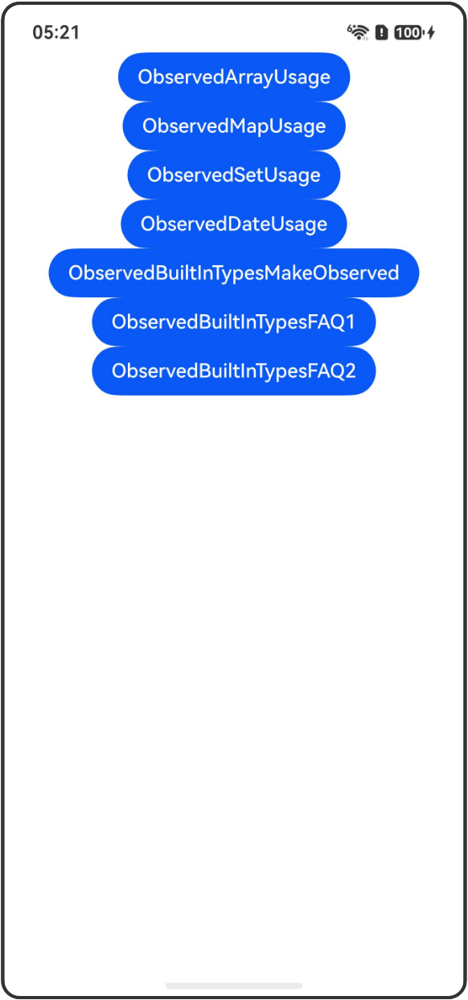

# ObservedArray/ObservedMap/ObservedSet/ObservedDate：具有观察能力的Built-in类型

## 介绍

本工程帮助开发者更好地理解ObservedArray、ObservedMap、ObservedSet和ObservedDate的使用场景。该工程中展示的代码详细描述可查如下链接：

[ObservedArray/ObservedMap/ObservedSet/ObservedDate：具有观察能力的Built-in类型](https://gitcode.com/openharmony/docs/blob/OpenHarmony_feature_sta_20260331/zh-cn/application-dev/ui/state-management-static/arkts-static-new-observed-built-in-types.md)

## 使用说明

执行测试用例会先打开相应界面，然后点击按钮或图标，演示接口的使用效果。

## 效果预览

|首页                                   |
|----------------------------------------------|
||

## 工程目录
```
entry/src/
├── main
│   ├── ets
│   │   ├── entryability
│   │   ├── pages
│   │   │   ├── Index.ets
│   │   │   ├── ObservedArrayUsage.ets
│   │   │   ├── ObservedMapUsage.ets
│   │   │   ├── ObservedSetUsage.ets
│   │   │   ├── ObservedDateUsage.ets
│   │   │   ├── ObservedBuiltInTypesMakeObserved.ets
│   │   │   ├── ObservedBuiltInTypesFAQ1.ets
│   │   │   └── ObservedBuiltInTypesFAQ2.ets
│   └── resources
│       ├── ...
├─── ... 
```

## 具体实现

1. 使用ObservedArray：ObservedArray为可观察API操作的Array对象，直接创建ObservedArray实例即具有API操作可观察能力。

2. 使用ObservedMap：ObservedMap为可观察API操作的Map对象，支持多种构造方式。

3. 使用ObservedSet：ObservedSet为可观察API操作的Set对象，支持多种构造方式。

4. 使用ObservedDate：ObservedDate为可观察API操作的Date对象，支持多种构造方式。

5. 与UIUtils.makeObserved的关系：ObservedArray等类型适用于创建可观察API操作的built-in对象，UIUtils.makeObserved适用于将已有的对象转换为可观察对象。

6. 常见问题：ObservedArray等类型创建的实例仅具备API操作可观察能力，不会对其中的元素添加可观察能力。继承这些类型的自定义属性没有观察能力。

## 相关权限

不涉及。

## 依赖

不涉及。

## 约束与限制

1.本示例已适配API version 26及以上版本SDK。

## 下载

如需单独下载本工程，执行如下命令：

```
git init
git config core.sparsecheckout true
echo code/DocsSample/ArkUISample-Sta/ObservedBuiltInTypes/ > .git/info/sparse-checkout
git remote add origin https://gitcode.com/openharmony/applications_app_samples.git
git pull origin master
```
