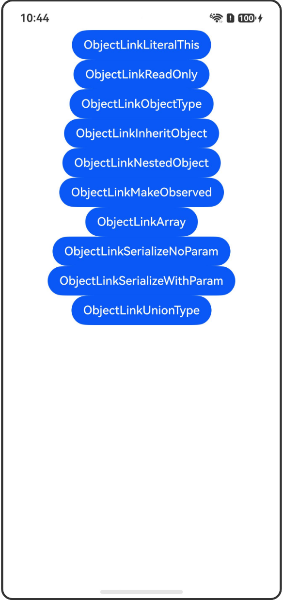

# @ObjectLink装饰器和@Observed装饰器：嵌套类对象属性变化

## 介绍

本工程帮助开发者更好地理解@ObjectLink和@Observed装饰器的使用场景。该工程中展示的代码详细描述可查如下链接：

[@ObjectLink装饰器和@Observed装饰器：嵌套类对象属性变化](https://gitcode.com/openharmony/docs/blob/OpenHarmony_feature_sta_20260331/zh-cn/application-dev/ui/state-management-static/arkts-static-observed-and-objectlink.md)

## 使用说明

执行测试用例会先打开相应界面，然后点击按钮或图标，演示接口的使用效果。

## 效果预览

|首页                                   |
|----------------------------------------------|
||

## 工程目录
```
entry/src/
├── main
│   ├── ets
│   │   ├── entryability
│   │   ├── pages
│   │   │   ├── Index.ets
│   │   │   ├── ObjectLinkLiteralThis.ets
│   │   │   ├── ObjectLinkReadOnly.ets
│   │   │   ├── ObjectLinkObjectType.ets
│   │   │   ├── ObjectLinkInheritObject.ets
│   │   │   ├── ObjectLinkNestedObject.ets
│   │   │   ├── ObjectLinkMakeObserved.ets
│   │   │   ├── ObjectLinkArray.ets
│   │   │   ├── ObjectLinkSerializeNoParam.ets
│   │   │   ├── ObjectLinkSerializeWithParam.ets
│   │   │   └── ObjectLinkUnionType.ets
│   └── resources
│       ├── ...
├─── ... 
```

## 具体实现

1. @ObjectLink字面量this.xxx特例：当且仅当对象为this.xxx结构且创建形式为字面量时，可正常编译通过。

2. @ObjectLink只读示例：@ObjectLink装饰的变量是只读的，不能被赋值，但可以更改成员属性。

3. @ObjectLink对象类型示例：使用@Observed装饰类，其属性的修改可以被观察到。

4. @ObjectLink继承对象示例：继承类中的部分属性可以被直接修改触发UI刷新。

5. @ObjectLink嵌套对象示例：嵌套类场景中，观察对象类属性变化。

6. @ObjectLink使用makeObserved示例：使用makeObserved支持深度观察。

7. @ObjectLink对象数组示例：对象数组是一种常用的数据结构。

8. @ObjectLink序列化无参构造：使用无参构造函数的@Observed装饰的类可以使用JSON序列化和反序列化。

9. @ObjectLink序列化有参构造：使用有参构造函数的@Observed装饰的类可以自定义序列化方法。

10. @ObjectLink支持联合类型：@ObjectLink支持@Observed装饰类和undefined或null组成的联合类型。

## 相关权限

不涉及。

## 依赖

不涉及。

## 约束与限制

1.本示例已适配API version 23及以上版本SDK。

## 下载

如需单独下载本工程，执行如下命令：

```
git init
git config core.sparsecheckout true
echo code/DocsSample/ArkUISample-Sta/ObservedObjectLink/ > .git/info/sparse-checkout
git remote add origin https://gitcode.com/openharmony/applications_app_samples.git
git pull origin master
```