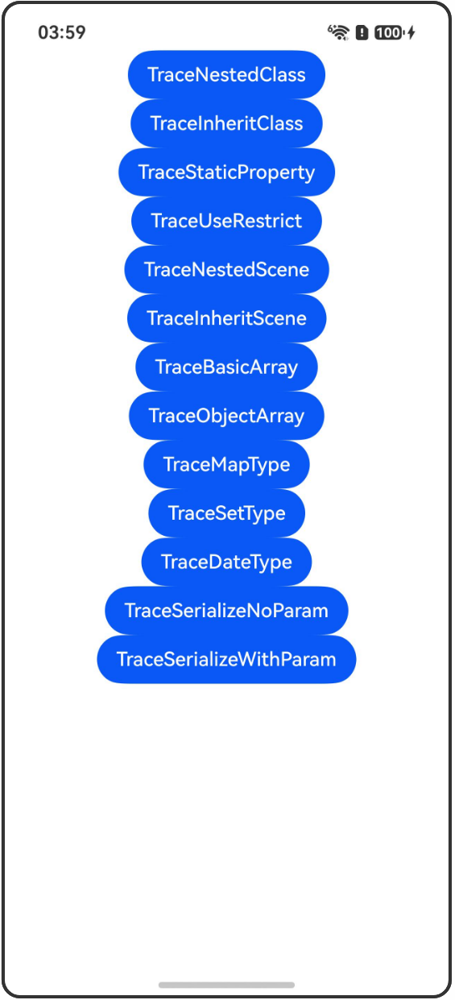

# @ObservedV2装饰器和@Trace装饰器：类属性变化观测

## 介绍

本工程帮助开发者更好地理解@ObservedV2装饰器和@Trace装饰器的使用场景。该工程中展示的代码详细描述可查如下链接：

[@ObservedV2装饰器和@Trace装饰器：类属性变化观测](https://gitcode.com/openharmony/docs/blob/master/zh-cn/application-dev/ui/state-management-static/arkts-static-new-observedV2-and-trace.md)

## 使用说明

执行测试用例会先打开相应界面，然后点击按钮或图标，演示接口的使用效果。

## 效果预览

|首页                                   |
|----------------------------------------------|
||

## 工程目录
```
entry/src/
├── main
│   ├── ets
│   │   ├── entryability
│   │   ├── pages
│   │   │   ├── Index.ets
│   │   │   ├── TraceNestedClass.ets
│   │   │   ├── TraceInheritClass.ets
│   │   │   ├── TraceStaticProperty.ets
│   │   │   ├── TraceUseRestrict.ets
│   │   │   ├── TraceNestedScene.ets
│   │   │   ├── TraceInheritScene.ets
│   │   │   ├── TraceBasicArray.ets
│   │   │   ├── TraceObjectArray.ets
│   │   │   ├── TraceMapType.ets
│   │   │   ├── TraceSetType.ets
│   │   │   ├── TraceDateType.ets
│   │   │   ├── TraceSerializeNoParam.ets
│   │   │   └── TraceSerializeWithParam.ets
│   └── resources
│       ├── ...
├─── ... 
```

## 具体实现

1. 嵌套类中使用@Trace装饰的属性：在嵌套类中，嵌套类中的属性被@Trace装饰且嵌套类被@ObservedV2装饰时，才具有触发UI刷新的能力。

2. 继承类中使用@Trace装饰的属性：在继承类中，父类或子类中的属性被@Trace装饰且该属性所在类被@ObservedV2装饰时，才具有触发UI刷新的能力。

3. 类中使用@Trace装饰的静态属性：被@Trace装饰的静态属性具有被观测变化的能力。

4. @Trace使用限制示例：未被@Trace装饰的属性用在UI中无法感知到变化，也无法触发UI刷新。

5. 嵌套类场景：多层嵌套类中，最里层类被@ObservedV2装饰且属性被@Trace装饰时，属性变化能够被观测到。

6. 继承类场景：在类的继承场景中，无论是在基类还是继承类中，只有被@Trace装饰的属性才具有被观测变化的能力。

7. @Trace装饰基础类型的数组：被@Trace装饰的数组使用支持的API能够观测到变化。

8. @Trace装饰对象数组：被@Trace装饰的对象数组以及对象类中的属性变化时均可以观测到变化。

9. @Trace装饰Map类型：被@Trace装饰的Map类型属性可以观测到调用API带来的变化。

10. @Trace装饰Set类型：被@Trace装饰的Set类型属性可以观测到调用API带来的变化。

11. @Trace装饰Date类型：被@Trace装饰的Date类型属性可以观测到调用API带来的变化。

12. 无参构造序列化和反序列化：使用无参构造函数的@ObservedV2装饰的类可以使用JSON.stringify序列化和JSON.parse反序列化。

13. 有参构造序列化和反序列化：使用有参构造函数的@ObservedV2装饰的类需要先使用JSON.parseJsonElement创建JsonElement实例，然后实现从JsonElement实例到@ObservedV2装饰类的转换。

## 相关权限

不涉及。

## 依赖

不涉及。

## 约束与限制

1.本示例已适配API version 23及以上版本SDK。

## 下载

如需单独下载本工程，执行如下命令：

```
git init
git config core.sparsecheckout true
echo code/DocsSample/ArkUISample-Sta/ObservedV2Trace/ > .git/info/sparse-checkout
git remote add origin https://gitcode.com/openharmony/applications_app_samples.git
git pull origin master
```