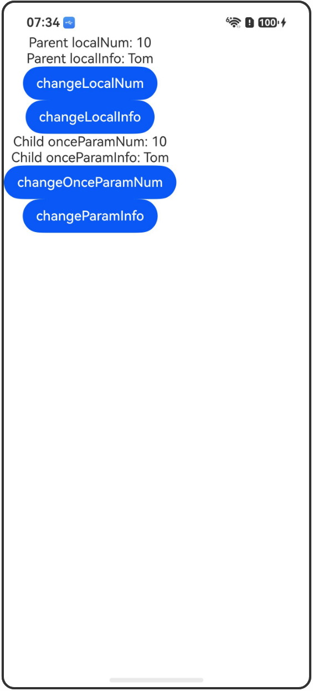

# @Once装饰器：初始化同步一次

## 介绍

本工程帮助开发者更好地理解@Once装饰器的使用场景。该工程中展示的代码详细描述可查如下链接：

[@Once装饰器：初始化同步一次](https://gitcode.com/openharmony/docs/blob/master/zh-cn/application-dev/ui/state-management-static/arkts-static-new-once.md)

## 使用说明

执行测试用例会先打开相应界面，然后点击按钮或图标，演示接口的使用效果。

## 效果预览

|首页                                   |
|----------------------------------------------|
||

## 工程目录
```
entry/src/
├── main
│   ├── ets
│   │   ├── entryability
│   │   ├── pages
│   │   │   ├── Index.ets
│   │   │   ├── OnceInitSync.ets
│   │   │   └── OnceLocalModify.ets
│   └── resources
│       ├── ...
├─── ... 
```

## 具体实现

1. 变量仅初始化同步一次：@Once用于变量仅初始化同步数据源一次，之后不再继续同步变化的场景。当父组件message变化时，子组件onceParam不会同步变化。

2. 本地修改@Param变量：当@Once与@Param结合使用时，可以解除@Param本地不可修改的限制，并能够触发UI刷新。此时，使用@Param和@Once的效果类似于@Local，但@Param和@Once还能接收外部传入的初始值。

## 相关权限

不涉及。

## 依赖

不涉及。

## 约束与限制

1.本示例已适配API version 23及以上版本SDK。

## 下载

如需单独下载本工程，执行如下命令：

```
git init
git config core.sparsecheckout true
echo code/DocsSample/ArkUISample/OnceDecorator/ > .git/info/sparse-checkout
git remote add origin https://gitcode.com/openharmony/applications_app_samples.git
git pull origin master
```