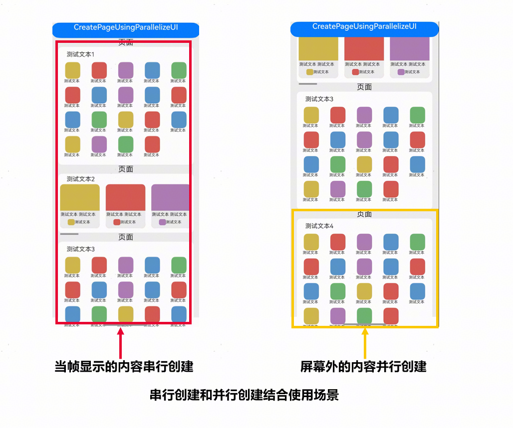
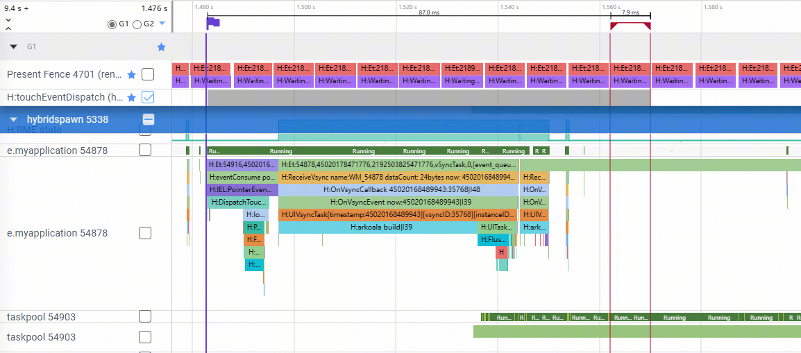
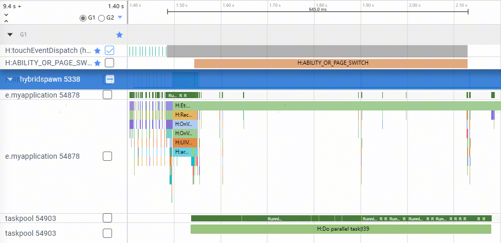

# UI并行化创建组件树指南文档示例

### 介绍

本示例通过使用[ArkUI指南文档](https://gitcode.com/openharmony/docs/blob/master/zh-cn/application-dev/ui)中UI并行化创建组件树的开发示例，
展示在静态ArkTS工程中使用`ParallelizeUI`并行创建组件、传递外部状态变量、循环创建子组件等场景，帮助开发者更好地理解并行化创建组件树的使用方式。该工程中展示的代码详细描述可查如下链接：

1. [UI并行化创建组件树](https://gitcode.com/openharmony/docs/blob/master/zh-cn/application-dev/ui/ui-parallel-components.md)。

### 效果预览

| 并行化创建组件                    | 非List和Grid并行循环创建          | List并行创建子组件                |
|-----------------------------|-----------------------------|-----------------------------|
|        |        |       |

### 使用说明

1. 在首页点击“ParallelizeUI外部状态变量示例”，查看`ParallelizeUI`中直接使用外部状态变量的限制。
2. 点击“ParallelizeUI参数构造示例”，通过`ParallelizeUI<T>`构造参数并传递外部状态变量；点击UpperCase按钮查看状态变量更新效果。
3. 点击“并行化创建组件示例（开启并行）”，查看使用`ParallelizeUI`并行创建卡片组件的效果；点击页面顶部按钮更新通过参数构造传入的页面状态。
4. 点击“并行化创建组件示例（关闭并行）”，查看相同页面在关闭并行创建时的对比效果。
5. 点击“非List和Grid并行循环创建示例”，查看非List/Grid容器中使用`ParallelizeUI<V, T>`循环并行创建卡片组件。
6. 点击“List并行创建子组件示例”，查看List容器中使用`ParallelizeUI<V, T>`按需并行创建ListItem子组件。

### 工程目录

```
entry/src/main/ets/
|---entryability
|   |---EntryAbility.ets                    // 应用入口，加载首页
|---pages
|   |---Index.ets                           // 示例入口页面，跳转到各ParallelizeUI示例
|   |---ExternalState.ets                   // 演示ParallelizeUI中直接使用外部状态变量的限制
|   |---ParameterConstruction.ets           // 演示通过ParallelizeUI<T>构造并行创建参数
|   |---MockData.ets                        // 并行创建卡片示例数据
|   |---Page.ets                            // 演示开启和关闭ParallelizeUI创建卡片组件
|   |---ParallelDemo.ets                    // 演示非List/Grid容器中的循环并行创建
|   |---ListParallel.ets                    // 演示List容器中按需并行创建子组件
|---models
|   |---MyCallback.ets                      // 回调示例模型
```

### 具体实现

一、外部状态变量使用限制
1. 在`ExternalState.ets`中，`ParallelizeUI`内部不能直接使用外部定义的状态变量。
2. 如需在并行创建的组件中使用外部状态，需要通过参数构造函数传入。

二、通过参数构造传递外部状态
1. 在`ParameterConstruction.ets`中定义Param类封装外部状态变量。
2. 使用`ParallelizeUI<Param>`的参数构造函数返回`new Param(this.str)`，在并行UI构建函数中通过param读取数据。
3. 点击UpperCase按钮更新外层状态变量，重新构造参数后刷新并行创建的Text组件。

三、并行化创建组件
1. 在`MockData.ets`中构造应用卡片和服务卡片数据。
2. 首页进入`Page.ets`时通过路由参数传入`isEnable`，用于控制`ParallelizeUI`是否开启并行创建。
3. `cardTypeInfos1`使用`ForEach`串行创建，`cardTypeInfos2`通过`ParallelizeUI<Param>`并行创建，并通过参数构造函数传入页面状态。

四、循环并行创建子组件
1. 在`ParallelDemo.ets`中，使用`ParallelizeUI<Int, CardInfo>({ enable: true }, this.arr, ...)`在非List/Grid容器中循环并行创建卡片组件。
2. 在`ListParallel.ets`中，使用`ParallelizeUI<Int, Info>({ enable: true }, this.arr, ...)`在List容器中按需并行创建ListItem子组件。

### 相关权限

不涉及。

### 依赖

不涉及。

### 约束与限制

1. 本示例仅支持标准系统上运行，支持设备：RK3568。

2. 本示例为Stage模型，使用静态ArkTS，需使用支持API version 23及以上的full-SDK编译运行。

3. 本示例需要使用DevEco Studio 6.0.0 beta5 (Build Version: 6.0.0.848, built on September 12, 2025)及以上版本才可编译运行。

### 下载

如需单独下载本工程，执行如下命令：

````
git init
git config core.sparsecheckout true
echo code/DocsSample/ArkUISample-Sta/ParallelizeUI > .git/info/sparse-checkout
git remote add origin https://gitcode.com/openharmony/applications_app_samples.git
git pull origin master
````
