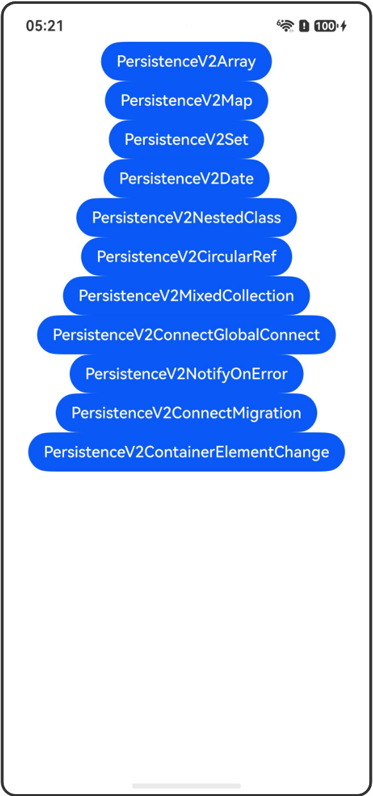

# PersistenceV2: 持久化储存UI状态

## 介绍

本工程帮助开发者更好地理解PersistenceV2持久化存储UI状态的使用场景。该工程中展示的代码详细描述可查如下链接：

[PersistenceV2: 持久化储存UI状态](https://gitcode.com/openharmony/docs/blob/OpenHarmony_feature_sta_20260331/zh-cn/application-dev/ui/state-management-static/arkts-static-new-persistencev2.md)

## 使用说明

执行测试用例会先打开相应界面，然后点击按钮或图标，演示接口的使用效果。

## 效果预览

|首页                                   |
|----------------------------------------------|
||

## 工程目录
```
entry/src/
├── main
│   ├── ets
│   │   ├── entryability
│   │   ├── pages
│   │   │   ├── Index.ets
│   │   │   ├── PersistenceV2Array.ets
│   │   │   ├── PersistenceV2Map.ets
│   │   │   ├── PersistenceV2Set.ets
│   │   │   ├── PersistenceV2Date.ets
│   │   │   ├── PersistenceV2NestedClass.ets
│   │   │   ├── PersistenceV2CircularRef.ets
│   │   │   ├── PersistenceV2MixedCollection.ets
│   │   │   ├── PersistenceV2ConnectGlobalConnect.ets
│   │   │   ├── PersistenceV2NotifyOnError.ets
│   │   │   ├── PersistenceV2ConnectMigration.ets
│   │   │   └── PersistenceV2ContainerElementChange.ets
│   └── resources
│       ├── ...
├─── ... 
```

## 具体实现

1. PersistenceV2Array：展示通过globalConnect持久化Array类型数据。

2. PersistenceV2Map：展示通过globalConnect持久化Map类型数据。

3. PersistenceV2Set：展示通过globalConnect持久化Set类型数据。

4. PersistenceV2Date：展示通过globalConnect持久化包含Date类型字段的自定义类。

5. PersistenceV2NestedClass：展示通过globalConnect持久化多层嵌套的自定义类。

6. PersistenceV2CircularRef：展示通过globalConnect持久化包含循环引用的对象。

7. PersistenceV2MixedCollection：展示通过globalConnect持久化包含Array、Map、Set三种集合类型的自定义类。

8. PersistenceV2ConnectGlobalConnect：展示使用connect、globalConnect存储数据。

9. PersistenceV2NotifyOnError：展示通过notifyOnError获取旧的序列化数据。

10. PersistenceV2ConnectMigration：展示connect向globalConnect迁移实现。

11. PersistenceV2ContainerElementChange：展示容器元素类型变更的处理。

## 相关权限

不涉及。

## 依赖

不涉及。

## 约束与限制

1.本示例已适配API version 26及以上版本SDK。

## 下载

如需单独下载本工程，执行如下命令：

```
git init
git config core.sparsecheckout true
echo code/DocsSample/ArkUISample-Sta/PersistenceV2/ > .git/info/sparse-checkout
git remote add origin https://gitcode.com/openharmony/applications_app_samples.git
git pull origin master
```
