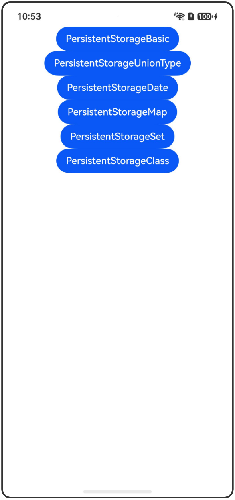

# PersistentStorage：持久化存储UI状态

## 介绍

本工程帮助开发者更好地理解PersistentStorage装饰器的使用场景。该工程中展示的代码详细描述可查如下链接：

[PersistentStorage：持久化存储UI状态](https://gitcode.com/openharmony/docs/blob/OpenHarmony_feature_sta_20260331/zh-cn/application-dev/ui/state-management-static/arkts-static-persiststorage.md)

## 使用说明

执行测试用例会先打开相应界面，然后点击按钮或图标，演示接口的使用效果。

## 效果预览

|首页                                   |
|----------------------------------------------|
||

## 工程目录
```
entry/src/
├── main
│   ├── ets
│   │   ├── entryability
│   ├── pages
│   │   ├── Index.ets
│   │   ├── PersistentStorageBasic.ets
│   │   ├── PersistentStorageUnionType.ets
│   │   ├── PersistentStorageDate.ets
│   │   ├── PersistentStorageMap.ets
│   │   ├── PersistentStorageSet.ets
│   │   └── PersistentStorageClass.ets
│   └── resources
│       ├── ...
├─── ... 
```

## 具体实现

1. 从AppStorage中访问PersistentStorage初始化的属性：通过persistProp初始化PersistentStorage属性，使用@StorageLink访问并持久化存储。

2. 支持联合类型：PersistentStorage支持联合类型，需要传入toJson和fromJson实现序列化。

3. 装饰Date类型变量：@StorageLink装饰的Date类型变量，可通过API操作更新并持久化。

4. 装饰Map类型变量：@StorageLink装饰的Map类型变量，支持Map的API操作并持久化。

5. 装饰Set类型变量：@StorageLink装饰的Set类型变量，支持Set的API操作并持久化。

6. 装饰class：@Observed装饰的class被@StorageLink装饰后，属性修改可触发持久化。

## 相关权限

不涉及。

## 依赖

不涉及。

## 约束与限制

1.本示例已适配API version 23及以上版本SDK。

## 下载

如需单独下载本工程，执行如下命令：

```
git init
git config core.sparsecheckout true
echo code/DocsSample/ArkUISample-Sta/PersistentStorageDecorator/ > .git/info/sparse-checkout
git remote add origin https://gitcode.com/openharmony/applications_app_samples.git
git pull origin master
```