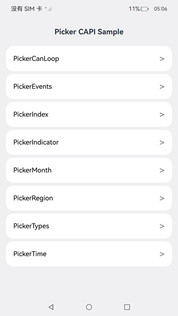

# 使用滑动选择器 (Picker)

### 介绍

本示例为开发指南中滑动选择器组件开发章节示例代码的完整工程。该工程展示了如何在应用底层通过C API（ArkUI Native Node API）创建滑动选择器组件，同时实现多样化的组件效果，帮助开发者快速掌握调用组件CAPI接口展示功能。
本工程配套的开发指南文档，详细描述了相关的开发流程与核心代码，可查阅如下链接：[使用滑动选择器 (Picker)](https://gitcode.com/openharmony/docs/blob/OpenHarmony_feature_sta_20260331/zh-cn/application-dev/ui/ndk-picker.md)。

### 效果图预览



### 使用说明

1.  启动应用，进入主界面，界面列出8个功能入口按钮。
2.  点击 **PickerCanLoop**：进入循环滑动和触控反馈开关页面，可通过按钮动态切换canLoop和hapticFeedback属性。
3.  点击 **PickerEvents**：进入回调事件页面，滑动选择器时显示onChange和onScrollStop回调事件结果。
4.  点击 **PickerIndex**：进入选中项属性设置页面，设置选中项索引、显示项数和项高度，滑动时实时显示selectedIndex。
5.  点击 **PickerIndicator**：进入选择指示器样式页面，可切换背景指示器/分割线指示器，并调整圆角、颜色、宽度、边距等属性。
6.  点击 **PickerMonth**：进入月份选择器页面，展示1-12月份数据的滑动选择器，使用分割线指示器样式。
7.  点击 **PickerRegion**：进入省市区联动选择器页面，三个Picker联动，选择省份后自动刷新城市和区县数据。
8.  点击 **PickerTime**：进入时间选择器页面，支持12/24小时制切换、秒显示切换、循环开关、数字位数切换等功能。
9.  点击 **PickerTypes**：进入图文混排页面，展示纯文本、纯图片、图文组合三种Picker选项类型。
  
### 工程目录
```
entry/src/main/
|—— cpp
|    |—— ani_init.cpp                               // ANI 入口：绑定 C++ native 方法到 ArkTS 类
|    |—— NativeEntry.h                              // Native入口定义（单例 + NodeContent 管理）
|    |—— CMakeLists.txt                             // CMake配置
|    |—— ArkUINodeAdapter.h                         // NodeAdapter 通用封装
|    |—— ScrollableNode.h                           // BaseNode 封装（节点创建/属性设置基类）
|    |—— ScrollableEvent.h                          // 事件分发封装
|    |—— ScrollableUtils.h                          // 工具函数（属性设置辅助）
|    |—— ScrollableUtils.cpp                        // 工具函数实现
|    |—— ContainerPickerCanLoopMaker.h              // 循环/触控反馈 Picker 类定义
|    |—— ContainerPickerCanLoopMaker.cpp            // 循环、音振使能开关效果功能实现
|    |—— ContainerPickerEventsMaker.h               // 回调事件 Picker 类定义
|    |—— ContainerPickerEventsMaker.cpp             // 回调事件效果功能实现
|    |—— ContainerPickerIndexMaker.h                // 选中项属性 Picker 类定义
|    |—— ContainerPickerIndexMaker.cpp              // 设置选中项属性效果功能实现
|    |—— ContainerPickerIndicatorMaker.h            // 指示器样式 Picker 类定义
|    |—— ContainerPickerIndicatorMaker.cpp          // 设置选择指示器样式效果功能实现
|    |—— ContainerPickerMonthMaker.h                // 月份 Picker 类定义
|    |—— ContainerPickerMonthMaker.cpp              // 月份效果功能实现
|    |—— ContainerPickerRegionMaker.h               // 地区联动 Picker 类定义
|    |—— ContainerPickerRegionMaker.cpp             // 省、市、区联动效果功能实现
|    |—— ContainerPickerTimeMaker.h                 // 时间选择器 Picker 类定义
|    |—— ContainerPickerTimeMaker.cpp               // 时间选择器效果功能实现
|    |—— ContainerPickerTypesMaker.h                // 图文混排 Picker 类定义
|    |—— ContainerPickerTypesMaker.cpp              // 图文混排效果功能实现
|
|—— ets
|    |—— containerPicker
|         |—— PageContainerPickerCanLoopIndex.ets   // 循环、音振使能开关页面
|         |—— PageContainerPickerEventsIndex.ets    // 回调事件页面
|         |—— PageContainerPickerIndexIndex.ets     // 设置选中项属性页面
|         |—— PageContainerPickerIndicatorIndex.ets // 设置选择指示器样式页面
|         |—— PageContainerPickerMonthIndex.ets     // 月份页面
|         |—— PageContainerPickerRegionIndex.ets    // 省、市、区联动页面
|         |—— PageContainerPickerTimeIndex.ets      // 时间选择器页面
|         |—— PageContainerPickerTypesIndex.ets     // 图文混排页面
|    |—— pages
|         |—— Index.ets                             // 应用主页面，列出各个效果展示入口
|         |—— NativeClass.ets                       // ANI native 方法声明类
|    |—— entryability
|         |—— EntryAbility.ets                      // 应用入口 Ability
```
### 具体实现

以下示例展示了如何通过C API创建滑动选择器组件并实现多样化的交互效果。

#### 在ArkTS页面上声明占位组件
在ArkTS页面上声明 `ContentSlot` 占位组件用于Native页面挂载，并在页面创建时（`aboutToAppear`）通知Native侧创建Picker界面，[源码参考](entry/src/main/ets/pages/containerPicker/PageContainerPickerCanLoopIndex.ets)。

#### 通过 ANI 桥接 C++ 与 ArkTS
1、在 ArkTS 中声明 `NativeClass` 类和 `native` 方法，包含 `createCanLoopNode`、`createEventsNode`、`createIndexNode`、`createIndicatorNode`、`createMonthNode`、`createRegionNode`、`createTimePickerNode`、`createTypesNode` 八个native方法，[源码参考](entry/src/main/ets/pages/NativeClass.ets)。

2、在 `ANI_Constructor` 入口中通过 `FindClass` + `Class_BindNativeMethods` 将 C++ native 方法与 ArkTS 类绑定，每个native方法接收 `NodeContent` 对象并在Native侧创建对应的Picker界面，[源码参考](entry/src/main/cpp/ani_init.cpp)。

#### 实现Native入口
使用 `NativeEntry` 单例管理 `NodeContent` 和根节点的添加/移除。每个native方法通过 `OH_ArkUI_NativeModule_GetNodeContentFromAniValue` 从ANI参数获取NodeContent，然后设置到 `NativeEntry` 单例中，再将创建的根节点添加到NodeContent，[源码参考](entry/src/main/cpp/NativeEntry.h)。

#### 创建Picker组件基类封装
通过 `BaseNode`（定义在 `ScrollableNode.h`）封装ArkUI Native Node API的节点创建和属性设置，`ContainerPickerCanLoopMaker` 等类继承 `BaseNode`，在构造函数中调用 `createNode(ARKUI_NODE_PICKER)` 创建Picker节点，并提供 `SetSelectedIndex`、`SetCanLoop`、`SetHapticFeedback`、`SetSelectionIndicatorBackground`、`SetSelectionIndicatorDivider` 等Picker特有属性的设置接口，[类定义参考](entry/src/main/cpp/ContainerPickerCanLoopMaker.h)。

#### 循环与触控反馈开关效果（PickerCanLoop）
创建包含10个选项的Picker，通过按钮动态切换 `NODE_PICKER_CAN_LOOP`（是否允许循环滑动）和 `NODE_PICKER_ENABLE_HAPTIC_FEEDBACK`（是否启用触控反馈）属性，按钮文字和颜色随状态实时更新，[源码参考](entry/src/main/cpp/ContainerPickerCanLoopMaker.cpp)。

#### 回调事件效果（PickerEvents）
创建包含"待办/进行中/已完成"三个选项的Picker，注册 `NODE_PICKER_EVENT_ON_CHANGE` 和 `NODE_PICKER_EVENT_ON_SCROLL_STOP` 事件，滑动选择时在界面下方实时显示onChange和onScrollStop回调的选中项索引，[源码参考](entry/src/main/cpp/ContainerPickerEventsMaker.cpp)。

#### 设置选中项属性效果（PickerIndex）
创建Picker并设置 `NODE_PICKER_OPTION_SELECTED_INDEX`（选中项索引）、`NODE_PICKER_DISPLAYED_ITEM_COUNT`（显示项数）和 `NODE_PICKER_ITEM_HEIGHT`（项高度）属性，滑动时实时显示当前selectedIndex值，[源码参考](entry/src/main/cpp/ContainerPickerIndexMaker.cpp)。

#### 设置选择指示器样式效果（PickerIndicator）
创建Picker并提供两种指示器样式切换：
- **背景指示器**：通过 `OH_ArkUI_PickerIndicatorStyle_Create(ARKUI_PICKER_INDICATOR_BACKGROUND)` + `OH_ArkUI_PickerIndicatorStyle_ConfigureBackground` 设置背景色和圆角半径。
- **分割线指示器**：通过 `OH_ArkUI_PickerIndicatorStyle_Create(ARKUI_PICKER_INDICATOR_DIVIDER)` + `OH_ArkUI_PickerIndicatorStyle_ConfigureDivider` 设置分割线颜色、宽度、起始/结束边距。

界面提供按钮动态切换圆角(2vp/10vp)、背景色(粉色/灰色)、分割线宽度(2vp/10vp)、分割线边距(2vp/10vp)、分割线颜色(粉色/灰色)等属性，[源码参考](entry/src/main/cpp/ContainerPickerIndicatorMaker.cpp)。

#### 月份选择器效果（PickerMonth）
创建包含1-12月份数据的Picker，设置分割线指示器样式，注册onChange和onScrollStop事件回调，[源码参考](entry/src/main/cpp/ContainerPickerMonthMaker.cpp)。

#### 省市区联动效果（PickerRegion）
创建三个Picker（省份、城市、区县）横向排列，通过联动逻辑实现：选择省份时自动刷新城市选项列表，选择城市时自动刷新区县选项列表。使用 `removeChild` + `addChild` 动态更新子节点来实现联动数据刷新，[源码参考](entry/src/main/cpp/ContainerPickerRegionMaker.cpp)。

#### 时间选择器效果（PickerTime）
创建多个Picker组合实现时间选择器，支持以下功能切换：
- **循环开关（canLoop）**：通过Toggle按钮切换所有Picker的循环模式。
- **秒显示开关（showSecond）**：切换是否显示秒选择器，动态增减Picker组件。
- **12/24小时制切换（useMilitary）**：切换小时制，自动转换当前选中时间并刷新小时数据。
- **数字位数切换（zeroPrefix）**：切换是否使用两位数显示（如01 vs 1），刷新所有时间数据显示。

使用背景指示器样式，通过 `RemoveAllChildren` + `UpdatePickerOptions` 实现数据动态刷新，[源码参考](entry/src/main/cpp/ContainerPickerTimeMaker.cpp)。

#### 图文混排效果（PickerTypes）
在同一界面展示三种不同类型的Picker选项：
- **纯文本选项**：使用 `ARKUI_NODE_TEXT` 作为Picker子节点。
- **纯图片选项**：使用 `ARKUI_NODE_IMAGE` 作为Picker子节点，设置 `NODE_IMAGE_SRC`。
- **图文组合选项**：使用 `ARKUI_NODE_ROW` 包含 `ARKUI_NODE_IMAGE` + `ARKUI_NODE_TEXT` 作为Picker子节点。

所有Picker设置分割线指示器样式和循环模式，[源码参考](entry/src/main/cpp/ContainerPickerTypesMaker.cpp)。

### 相关权限

不涉及。

### 依赖

不涉及。

### 约束与限制

1.  本示例仅支持标准系统上运行。
2.  本示例支持API版本 **API Version 23 Beta5**，SDK版本号：**OpenHarmony SDK Ohos_sdk_public 6.1.1.35**。
3.  本示例需要使用DevEco Studio **DevEco Studio 6.0.2 Release** 及以上版本才可编译运行。
   
### 下载

如需单独下载本工程，执行如下命令：
```
git init
git config core.sparsecheckout true
echo code/DocsSample/ArkUISample-Sta/PickerCAPI > .git/info/sparse-checkout
git remote add origin https://gitee.com/openharmony/applications_app_samples.git
git pull origin master
```