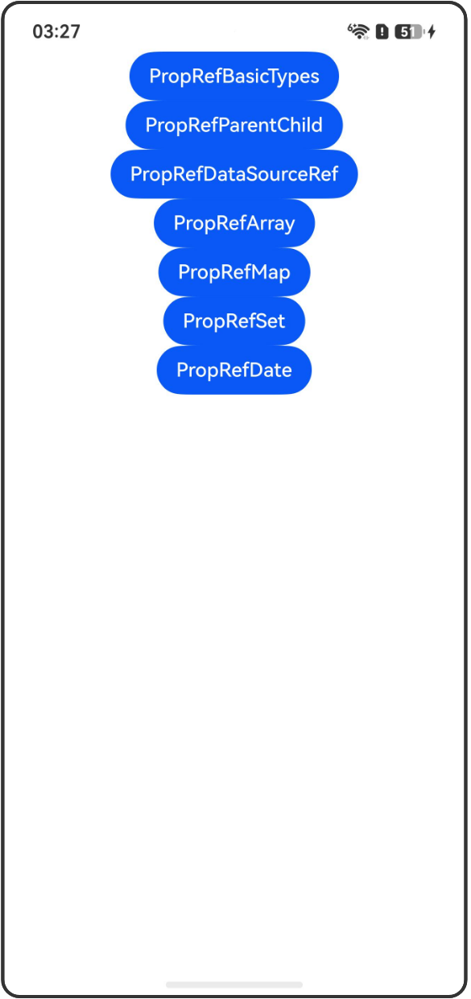

# @PropRef装饰器：父子单向同步

## 介绍

本工程帮助开发者更好地理解@PropRef装饰器的使用场景。该工程中展示的代码详细描述可查如下链接：

[@PropRef装饰器：父子单向同步](https://gitcode.com/openharmony/docs/blob/OpenHarmony_feature_sta_20260331/zh-cn/application-dev/ui/state-management-static/arkts-static-propref.md)

## 使用说明

执行测试用例会先打开相应界面，然后点击按钮或图标，演示接口的使用效果。

## 效果预览

|首页                                   |
|----------------------------------------------|
||

## 工程目录
```
entry/src/
├── main
│   ├── ets
│   │   ├── entryability
│   ├── pages
│   │   ├── Index.ets
│   │   ├── PropRefBasicTypes.ets
│   │   ├── PropRefParentChild.ets
│   │   ├── PropRefDataSourceRef.ets
│   │   ├── PropRefArray.ets
│   │   ├── PropRefMap.ets
│   │   ├── PropRefSet.ets
│   │   ├── PropRefDate.ets
│   └── resources
│       ├── ...
├─── ... 
```

## 具体实现

1. @PropRef简单类型变化观察：当装饰boolean、string、number等类型时，数据源的变化可以被同步观察到。

2. @PropRef父子组件单向同步：@PropRef可以接收父组件传递的数据源，并与之单向同步。

3. @PropRef获得父组件中数据源的引用：@PropRef会获得父组件数据源的引用，对于复杂类型，修改属性将在父组件中体现。

4. @PropRef装饰Array类型：可以观察到Array整体及其元素的变化。通过API操作更改数组内容也能被观测到。

5. @PropRef装饰Map类型：可以观察到Map整体及其API操作带来的变化。

6. @PropRef装饰Set类型：可以观察到Set整体以及API操作带来的变化。

7. @PropRef装饰Date类型：可以观察到Date整体及其API操作的变化。

## 相关权限

不涉及。

## 依赖

不涉及。

## 约束与限制

1.本示例已适配API version 23及以上版本SDK。

## 下载

如需单独下载本工程，执行如下命令：

```
git init
git config core.sparsecheckout true
echo code/DocsSample/ArkUISample-Sta/PropRefDecorator/ > .git/info/sparse-checkout
git remote add origin https://gitcode.com/openharmony/applications_app_samples.git
git pull origin master
```