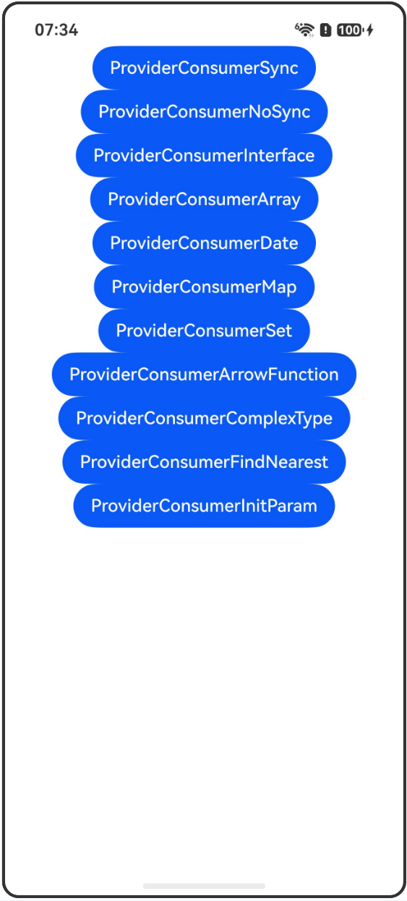

# @Provider装饰器和@Consumer装饰器：跨组件层级双向同步

## 介绍

本工程帮助开发者更好地理解@Provider和@Consumer装饰器的使用场景。该工程中展示的代码详细描述可查如下链接：

[@Provider装饰器和@Consumer装饰器：跨组件层级双向同步](https://gitcode.com/openharmony/docs/blob/OpenHarmony_feature_sta_20260331/zh-cn/application-dev/ui/state-management-static/arkts-static-new-provider-and-consumer.md)

## 使用说明

执行测试用例会先打开相应界面，然后点击按钮或图标，演示接口的使用效果。

## 效果预览

|首页                                   |
|----------------------------------------------|
||

## 工程目录
```
entry/src/
├── main
│   ├── ets
│   │   ├── entryability
│   │   ├── pages
│   │   │   ├── Index.ets
│   │   │   ├── ProviderConsumerSync.ets
│   │   │   ├── ProviderConsumerNoSync.ets
│   │   │   ├── ProviderConsumerInterface.ets
│   │   │   ├── ProviderConsumerArray.ets
│   │   │   ├── ProviderConsumerDate.ets
│   │   │   ├── ProviderConsumerMap.ets
│   │   │   ├── ProviderConsumerSet.ets
│   │   │   ├── ProviderConsumerArrowFunction.ets
│   │   │   ├── ProviderConsumerComplexType.ets
│   │   │   ├── ProviderConsumerFindNearest.ets
│   │   │   └── ProviderConsumerInitParam.ets
│   └── resources
│       ├── ...
├─── ... 
```

## 具体实现

1. @Provider和@Consumer双向同步：@Consumer装饰的属性与@Provider装饰的属性名称相同，建立双向绑定关系。

2. @Provider和@Consumer未建立双向绑定：当别名不同时，@Provider和@Consumer无法建立双向同步关系，@Consumer使用本地默认值。

3. 装饰字面量类型变量：当装饰interface字面量类型时，仅可以观察到字面量整体的变化，无法观察到属性的变化。

4. 装饰数组类型变量：可以观察到数组整体和数组项的变化，同时可以通过调用Array的接口push、pop、shift、unshift、splice、copyWithin、fill、reverse、sort更新数据。

5. 装饰Date类型变量：可以观察到数据源对Date整体的赋值，以及调用Date的接口setFullYear、setMonth、setDate等带来的变化。

6. 装饰Map类型变量：可以观察到数据源对Map整体的赋值，以及调用Map的接口set、clear、delete带来的变化。

7. 装饰Set类型变量：可以观察到数据源对Set整体的赋值，以及调用Set的接口add、clear、delete带来的变化。

8. @Provider和@Consumer装饰箭头函数：@Provider和@Consumer支持装饰箭头函数，实现跨组件的函数传递和调用。

9. @Provider和@Consumer装饰复杂类型：配合@Trace一起使用，可以观察到复杂数据类型的属性变化。

10. @Consumer向上查找最近的@Provider：@Provider可以在组件树上重名，当重名时@Consumer会向上查找其最近父节点的@Provider的数据。

11. @Provider和@Consumer初始化@Param：@Provider和@Consumer可以初始化子组件中@Param装饰的变量。

## 相关权限

不涉及。

## 依赖

不涉及。

## 约束与限制

1.本示例已适配API version 23及以上版本SDK。

## 下载

如需单独下载本工程，执行如下命令：

```
git init
git config core.sparsecheckout true
echo code/DocsSample/ArkUISample-Sta/ProviderConsumer/ > .git/info/sparse-checkout
git remote add origin https://gitcode.com/openharmony/applications_app_samples.git
git pull origin master
```