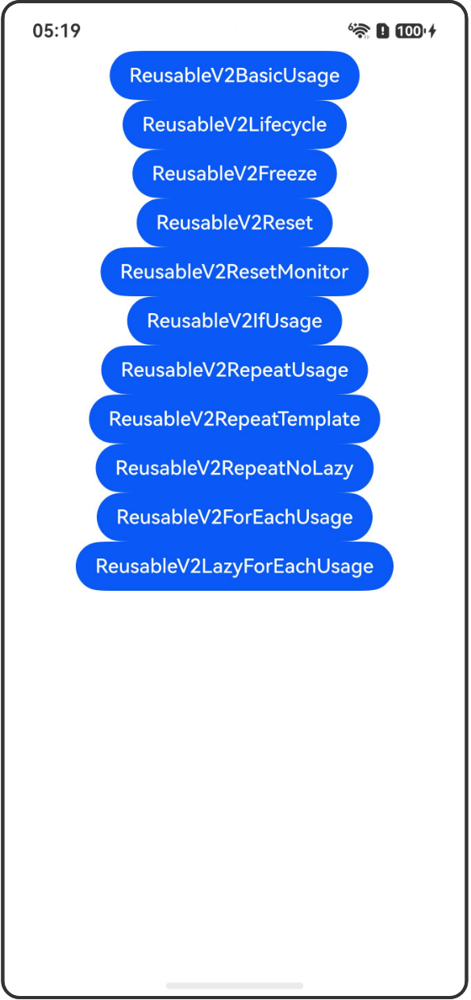

# \@ReusableV2装饰器：组件复用

## 介绍

本工程帮助开发者更好地理解@ReusableV2装饰器的使用场景。该工程中展示的代码详细描述可查如下链接：

[\@ReusableV2装饰器：组件复用](https://gitcode.com/openharmony/docs/blob/OpenHarmony_feature_sta_20260331/zh-cn/application-dev/ui/state-management-static/arkts-static-new-reusableV2.md)

## 使用说明

执行测试用例会先打开相应界面，然后点击按钮或图标，演示接口的使用效果。

## 效果预览

|首页                                   |
|----------------------------------------------|
||

## 工程目录
```
entry/src/
├── main
│   ├── ets
│   │   ├── entryability
│   │   ├── pages
│   │   │   ├── Index.ets
│   │   │   ├── ReusableV2BasicUsage.ets
│   │   │   ├── ReusableV2Lifecycle.ets
│   │   │   ├── ReusableV2Freeze.ets
│   │   │   ├── ReusableV2Reset.ets
│   │   │   ├── ReusableV2ResetMonitor.ets
│   │   │   ├── ReusableV2IfUsage.ets
│   │   │   ├── ReusableV2RepeatUsage.ets
│   │   │   ├── ReusableV2RepeatTemplate.ets
│   │   │   ├── ReusableV2RepeatNoLazy.ets
│   │   │   ├── ReusableV2ForEachUsage.ets
│   │   │   └── ReusableV2LazyForEachUsage.ets
│   └── resources
│       ├── ...
├─── ... 
```

## 具体实现

1. \@ReusableV2装饰器说明：用于装饰V2的自定义组件，表明该自定义组件具有被复用的能力。

2. 回收与复用的生命周期：提供了aboutToRecycle以及aboutToReuse的生命周期。

3. 复用阶段的冻结：V2组件在复用时将会被自动冻结，不会响应在回收期间发生的变化。

4. 复用前的组件内状态变量重置：会重置组件中的状态变量以及\@Computed、\@Monitor的内容。

5. \@Monitor重置示例：展示组件内\@Monitor的重置行为。

6. 在if组件中使用：通过改变if组件的条件可以触发组件回收/复用。

7. 在Repeat组件中使用：在Repeat组件懒加载场景中使用\@ReusableV2。

8. 在Repeat的template中使用：在Repeat的template属性中使用\@ReusableV2装饰的自定义组件。

9. 在Repeat组件非懒加载场景中使用：在Repeat组件非懒加载场景中使用\@ReusableV2。

10. 在ForEach组件中使用：使用ForEach组件渲染可复用组件。

11. 在LazyForEach组件中使用：使用LazyForEach渲染可复用组件。

## 相关权限

不涉及。

## 依赖

不涉及。

## 约束与限制

1.本示例已适配API version 23及以上版本SDK。

## 下载

如需单独下载本工程，执行如下命令：

```
git init
git config core.sparsecheckout true
echo code/DocsSample/ArkUISample-Sta/ReusableV2Decorator/ > .git/info/sparse-checkout
git remote add origin https://gitcode.com/openharmony/applications_app_samples.git
git pull origin master
```
