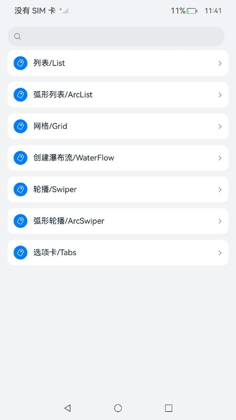

# ArkUI可滚动组件指南文档示例

### 介绍

本示例通过使用[ArkUI指南文档](https://gitcode.com/openharmony/docs/tree/master/zh-cn/application-dev/ui)中各场景的开发示例，展示在工程中，帮助开发者更好地理解ArkUI提供的可滚动组件及组件属性并合理使用。该工程中展示的代码详细描述可查如下链接：

1. [Swiper](https://gitcode.com/openharmony/docs/blob/master/zh-cn/application-dev/reference/apis-arkui/arkui-ts/ts-container-swiper.md)。
2. [ArcSwiper](https://gitcode.com/openharmony/docs/blob/master/zh-cn/application-dev/reference/apis-arkui/arkui-ts/ts-container-arcswiper.md)。
3. [Tabs](https://gitcode.com/openharmony/docs/blob/master/zh-cn/application-dev/reference/apis-arkui/arkui-ts/ts-container-tabs.md)。

### 效果预览

| 首页                                 |
|------------------------------------|
|  |

### 使用说明

1. 在主界面，可以点击对应卡片，选择需要参考的组件示例。

2. 在组件目录选择详细的示例参考。

3. 进入示例界面，查看参考示例。

4. 通过自动测试框架可进行测试及维护。

### 工程目录
```
|-- AppScope
|   |-- app.json5
|   |-- resources
|       |-- base
|           |-- element
|           |   |-- string.json
|           |-- media
|               |-- background.png
|               |-- foreground.png
|               |-- layered_image.json
|-- build-profile.json5
|-- code-linter.json5
|-- entry
|   |-- build-profile.json5
|   |-- hvigorfile.ts
|   |-- obfuscation-rules.txt
|   |-- oh-package.json5
|   |-- src
|       |-- main
|       |   |-- ets
|       |   |   |-- common
|       |   |   |   |-- Card.ets
|       |   |   |   |-- Route.ets
|       |   |   |   |-- resource.ets
|       |   |   |-- entryability
|       |   |   |   |-- EntryAbility.ets
|       |   |   |-- pages
|       |   |   |   |-- Index.ets
|       |   |   |   |-- arcSwiper
|       |   |   |   |   |-- ArcSwiperAction.ets
|       |   |   |   |   |-- ArcSwiperHorizontal.ets
|       |   |   |   |   |-- ArcSwiperSideSlip.ets
|       |   |   |   |   |-- ArcSwiperStyles.ets
|       |   |   |   |   |-- ArcSwiperToggle.ets
|       |   |   |   |   |-- ArcSwiperVertical.ets
|       |   |   |   |   |-- index.ets
|       |   |   |   |-- swiper
|       |   |   |   |   |-- SwiperAndTabsLinkage.ets
|       |   |   |   |   |-- SwiperAutoPlay.ets
|       |   |   |   |   |-- SwiperCustomAnimation.ets
|       |   |   |   |   |-- SwiperDigitIndicatorIgnoreComponentSize.ets
|       |   |   |   |   |-- SwiperDirection.ets
|       |   |   |   |   |-- SwiperIgnoreComponentSize.ets
|       |   |   |   |   |-- SwiperIndicatorStyle.ets
|       |   |   |   |   |-- SwiperLoop.ets
|       |   |   |   |   |-- SwiperMultiPage.ets
|       |   |   |   |   |-- SwiperPageSwitchMethod.ets
|       |   |   |   |   |-- SwiperVisibleContentPosition.ets
|       |   |   |   |   |-- index.ets
|       |   |   |   |-- tabs
|       |   |   |       |-- AgeFriendlyTabs.ets
|       |   |   |       |-- BottomTabBar.ets
|       |   |   |       |-- ContentPageNoAndTabLinkage.ets
|       |   |   |       |-- ContentWillChange.ets
|       |   |   |       |-- CustomTabBar.ets
|       |   |   |       |-- FixedTabBar.ets
|       |   |   |       |-- NumberOfCachesTabBar.ets
|       |   |   |       |-- ScrollableTabBar.ets
|       |   |   |       |-- SideTabBar.ets
|       |   |   |       |-- SwipeLockedTabBar.ets
|       |   |   |       |-- TabsLayout.ets
|       |   |   |       |-- TopTabBar.ets
|       |   |   |       |-- index.ets
|       |   |   |-- res
|       |   |       |-- waterFlow(0).JPG
|       |   |       |-- waterFlow(1).JPG
|       |   |       |-- waterFlow(2).JPG
|       |   |       |-- waterFlow(3).JPG
|       |   |       |-- waterFlow(4).JPG
|       |   |       |-- waterFlow(5).JPG
|       |   |-- module.json5
|       |   |-- resources
|       |       |-- base
|       |       |   |-- element
|       |       |   |   |-- color.json
|       |       |   |   |-- float.json
|       |       |   |   |-- string.json
|       |       |   |-- media
|       |       |   |   |-- MaterialSymbolsDelete.svg
|       |       |   |   |-- background.png
|       |       |   |   |-- blueTooth.svg
|       |       |   |   |-- delete.png
|       |       |   |   |-- displayAndBrightness.svg
|       |       |   |   |-- foreground.png
|       |       |   |   |-- ic_contact.svg
|       |       |   |   |-- ic_public_delete_filled.svg
|       |       |   |   |-- ic_settings_arrow.svg
|       |       |   |   |-- ic_settings_more_connections.svg
|       |       |   |   |-- ic_settings_wifi.svg
|       |       |   |   |-- iconA.svg
|       |       |   |   |-- iconB.svg
|       |       |   |   |-- iconC.svg
|       |       |   |   |-- iconD.svg
|       |       |   |   |-- iconE.svg
|       |       |   |   |-- iconF.svg
|       |       |   |   |-- layered_image.json
|       |       |   |   |-- mine_normal.png
|       |       |   |   |-- mine_selected.png
|       |       |   |   |-- mobileData.svg
|       |       |   |   |-- startIcon.png
|       |       |   |   |-- wlan.svg
|       |       |   |-- profile
|       |       |       |-- backup_config.json
|       |       |       |-- main_pages.json
|       |       |-- dark
|       |       |   |-- element
|       |       |       |-- color.json
|       |       |-- rawfile
|       |-- mock
|       |   |-- mock-config.json5
|       |-- ohosTest
|       |   |-- ets
|       |   |   |-- test
|       |   |       |-- Ability.test.ets
|       |   |       |-- List.test.ets
|       |   |-- module.json5
|       |-- test
|           |-- List.test.ets
|           |-- LocalUnit.test.ets
|-- hvigor
|   |-- hvigor-config.json5
|-- hvigorfile.ts
|-- oh-package.json5
|-- ohosTest.md
```

### 具体实现

1. **Swiper组件**：
   - **循环播放（SwiperLoop）**：通过`loop`属性控制是否循环切换。
   - **自动播放（SwiperAutoPlay）**：通过`autoPlay`和`interval`属性实现定时自动轮播。
   - **导航点样式（SwiperIndicatorStyle）**：通过`indicator`配置点状指示器样式，通过`displayArrow`配置箭头指示器样式。
   - **页面切换方式（SwiperPageSwitchMethod）**：通过`SwiperController`的`showNext()`、`showPrevious()`、`changeIndex()`方法实现编程式切换，支持`SwiperAnimationMode`设置动画模式。
   - **方向切换（SwiperDirection）**：通过`vertical`属性控制水平或垂直方向。
   - **多页显示（SwiperMultiPage）**：通过`displayCount`属性设置同时显示的页面数量。
   - **自定义动画（SwiperCustomAnimation）**：通过`customContentTransition`属性和`SwiperContentTransitionProxy`实现自定义透明度、缩放、平移等过渡动画。
   - **Swiper与Tabs联动（SwiperAndTabsLinkage）**：通过`SwiperController`和`TabsController`的`changeIndex()`方法实现两个组件之间的双向联动。
   - **忽略组件尺寸（SwiperIgnoreComponentSize/SwiperDigitIndicatorIgnoreComponentSize）**：通过`DotIndicator`和`DigitIndicator`的`bottom`方法配置指示器忽略组件尺寸。
   - **保持可见内容位置（SwiperVisibleContentPosition）**：通过`maintainVisibleContentPosition`属性在数据变化时保持内容位置。

2. **ArcSwiper组件**：
   - **水平/垂直方向（ArcSwiperHorizontal/ArcSwiperVertical）**：通过`vertical`属性控制方向，配合`ArcDirection`设置弧形指示器方向。
   - **自定义动画（ArcSwiperAction）**：通过`customContentTransition`和`ArcSwiperContentTransitionProxy`实现自定义过渡动画。
   - **侧滑处理（ArcSwiperSideSlip）**：通过`onGestureRecognizerJudgeBegin()`回调处理手势冲突。
   - **指示器样式（ArcSwiperStyles）**：通过`ArcDotIndicator`自定义指示器颜色和方向。
   - **表冠控制（ArcSwiperToggle）**：通过`digitalCrownSensitivity`设置表冠灵敏度，配合`ArcButton`和焦点管理实现可穿戴设备交互。

3. **Tabs组件**：
   - **基本布局（TabsLayout）**：使用`Tabs`和`TabContent`组件构建基本标签页。
   - **底部/顶部/侧边标签栏（BottomTabBar/TopTabBar/SideTabBar）**：通过`barPosition`设置标签栏位置为`BarPosition.END`、`BarPosition.START`，通过`vertical`和`barWidth`/`barHeight`实现侧边标签栏。
   - **滑动锁定（SwipeLockedTabBar）**：通过`scrollable(false)`禁止标签页滑动手势。
   - **固定标签栏（FixedTabBar）**：通过`barMode(BarMode.Fixed)`设置固定宽度标签栏。
   - **可滚动标签栏（ScrollableTabBar）**：通过`barMode(BarMode.Scrollable)`设置可水平滚动的标签栏。
   - **自定义标签栏（CustomTabBar）**：通过`@Builder`自定义标签栏样式，支持图标和文字的自定义选中/未选中状态。
   - **内容与标签同步（ContentPageNoAndTabLinkage）**：通过`onChange`和`onSelected`回调实现标签与内容的同步切换。
   - **适老化（AgeFriendlyTabs）**：通过`BottomTabBarStyle`自定义样式，支持字体大小缩放和深色模式。
   - **缓存配置（NumberOfCachesTabBar）**：通过`cachedMaxCount`和`TabsCacheMode`配置标签页缓存数量。

### 相关权限

不涉及。

### 依赖

不涉及。

### 约束与限制

1.本示例仅支持标准系统上运行, 支持设备：RK3568。

2.本示例为Stage模型，支持SDK版本26.0.0，镜像版本号：OpenHarmony_26.0.0。

3.本示例需要使用DevEco Studio 6.0.0 Canary1及以上版本才可编译运行。

### 下载

如需单独下载本工程，执行如下命令：

````
git init
git config core.sparsecheckout true
echo code/DocsSample/ArkUISample/ScrollableComponentStatic > .git/info/sparse-checkout
git remote add origin https://gitcode.com/openharmony/applications_app_samples.git
git pull origin master
````
