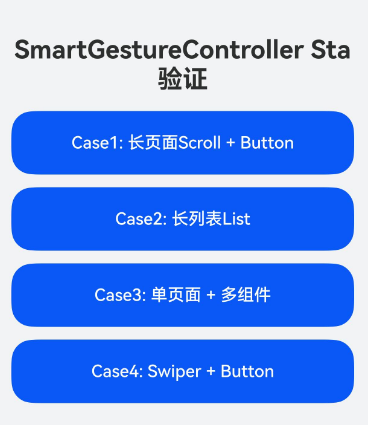
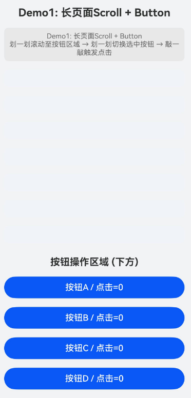
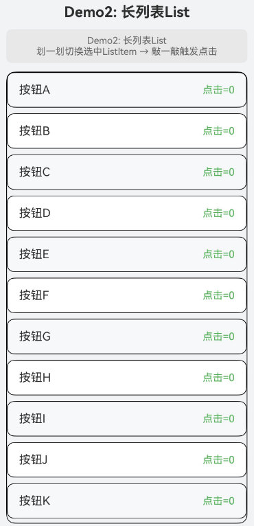
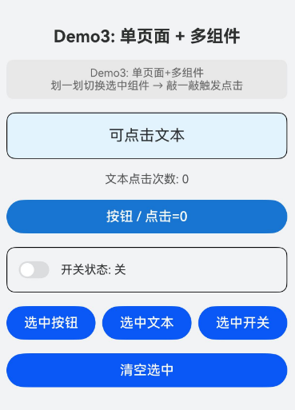
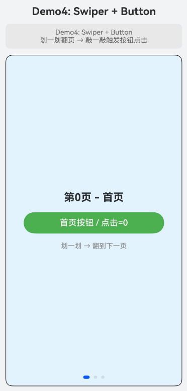

# 智慧手势控制器（ArkTS-Sta）

## 介绍

本示例为[SmartGestureController](https://gitcode.com/openharmony/docs/blob/OpenHarmony_feature_sta_20260331/zh-cn/application-dev/reference/apis-arkui/arkts-apis-uicontext-smartgesturecontroller.md)的ArkTS-Sta（1.2）配套示例工程。

本示例展示了智慧手势控制器的使能、监听、选中态控制以及动态决策智慧手势行为的完整能力，覆盖敲一敲和划一划两种交互方式在不同UI场景下的ArkTS-Sta适配方案。

## 效果预览

| 首页                                   | Case1: 长页面Scroll + Button          |
|--------------------------------------|--------------------------------------|
|   |  |
| Case2: 长列表List              | Case3: 单页面 + 多组件            |
|  |  |
| Case4: Swiper + Button      |                             |
|  |                             |

### 使用说明

1. **手势类型与场景匹配**:   
   触发组件点击：用敲一敲（TAP），通过ClickActionProposal执行点击。  
   切换选中组件：用划一划（SLIDE_FORWARD），通过SelectActionProposal切换选中焦点。  
   滚动容器内容：用划一划（SLIDE_FORWARD），通过ScrollActionProposal滚动指定距离。  
   翻页切换页面：用划一划（SLIDE_FORWARD），通过PageSwitchActionProposal切换Swiper页面。  
   返回上一页面：用BackPressActionProposal模拟返回键。  
   拒绝本次手势：用NoneActionProposal不执行任何操作。
2. **关键注意事项**：  
   启用手势：调用enableSmartTapAndSlideGestures(true)开启智慧手势，关闭后组件侧smartGestureShortcut配置仍保留但不响应。  
   注册监听：通过registerMonitor注册回调，回调类型为Callback<BaseGestureHandlingProposal, GestureHandlingResolution>，按后注册先执行的顺序触发，返回GestureHandlingResolution(true)即消费本次手势，后续回调不再执行。  
   选中控制：requestSelected请求选中组件（组件需满足可见、可响应智慧手势、绑定onClick三个条件），clearSelected清空当前选中。
3. **特殊场景适配**：  
   长页面滚动 + 按钮：Case1演示划一划先滚动到按钮区域，再划一划选中按钮，敲一敲触发点击。  
   长列表选中：Case2演示划一划选中ListItem，敲一敲触发点击。  
   单页面多组件：Case3演示在同一页面中对Text、Button、Toggle分别进行选中与点击操作。  
   Swiper翻页 + 按钮：Case4演示划一划翻页切换Swiper页面，敲一敲触发页面内按钮点击。

## 工程目录

```
entry/src/main/ets/
└── entryability
    └── EntryAbility.ets             // 应用入口Ability
└── pages
    └── Index.ets                    // 首页导航
    └── Case1.ets                    // 长页面Scroll + Button场景
    └── Case2.ets                    // 长列表List场景
    └── Case3.ets                    // 单页面 + 多组件场景
    └── Case4.ets                    // Swiper + Button场景
```

### 具体实现

1. **智慧手势使能与监听注册**：在aboutToAppear中调用controller.enableSmartTapAndSlideGestures(true)开启手势，调用controller.registerMonitor(callback)注册Callback<BaseGestureHandlingProposal, GestureHandlingResolution>类型的监听回调；在aboutToDisappear中调用controller.clearMonitors()清空回调并调用enableSmartTapAndSlideGestures(false)关闭手势。
2. **Monitor回调动态决策**：回调接收BaseGestureHandlingProposal参数，通过proposal.action判断手势动作类型（CLICK/SELECT/SCROLL_FORWARD/PAGE_FORWARD/BACK_PRESS/NONE），使用proposal as TargetedGestureProposal获取目标节点，根据业务需求构造对应的ActionProposal（如new ClickActionProposal(node)、new ScrollActionProposal(node, distance)），设置到GestureHandlingResolution的selectedProposal属性返回，实现对系统默认动作的自定义覆写。
3. **组件标记与节点定位**：交互组件通过.smartGestureShortcut({ action: GestureShortcut.PRIMARY, enabled: true, selectable: true })标记为智慧手势目标，通过.id()设置组件标识，在Monitor回调中通过this.getUIContext().getFrameNodeById(id)获取FrameNode用于构造ActionProposal。
4. **选中态手动控制**：通过controller.requestSelected(id)手动请求选中指定组件，通过controller.clearSelected()清空选中态，适用于需要跨页面选中或精确控制选中焦点的场景。
5. **ArkTS-Sta语法适配**：文件头声明'use static'；组件类型断言消除重载歧义（Column({ space: 12 } as ColumnOptions)）；容器无参数时使用Column()而非Column(undefined)；Callback类型使用Callback<T, R>而非箭头函数类型；数值类型使用int/double而非number；PageSwitchActionProposal构造函数中pageCount参数类型为int；ScrollActionProposal构造函数中distance参数类型为double；Swiper.onChange回调参数类型为int；Slider.onChange回调签名为(value: double, mode: SliderChangeMode) => void。

## 相关权限

不涉及

## 依赖

不涉及

## 约束和限制

1.本示例仅支持标准系统上运行, 支持设备：RK3568。

2.本示例为Stage模型，arkTSVersion为1.2。

3.本示例需要使用Sta SDK配套IDE版本才可编译运行。

## 下载

如需单独下载本工程，执行如下命令：
```
git init
git config core.sparsecheckout true
echo code/DocsSample/ArkUISample-Sta/SmartGesture > .git/info/sparse-checkout
git remote add origin https://gitcode.com/openharmony/applications_app_samples.git
git pull origin OpenHarmony_feature_sta_20260331
```