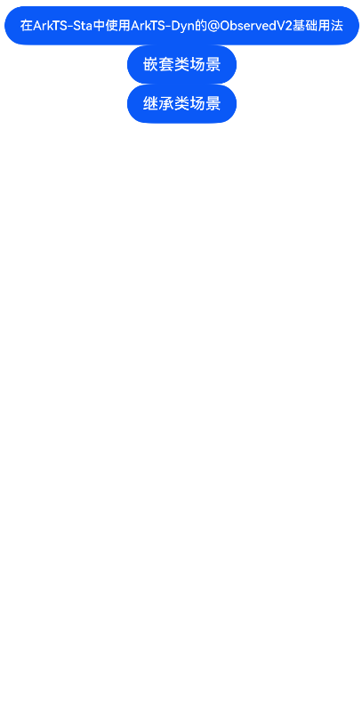

# 在ArkTS-Sta中使用ArkTS-Dyn的@ObservedV2和@Trace

## 介绍

本工程帮助开发者更好地理解在ArkTS-Sta中使用ArkTS-Dyn的@ObservedV2和@Trace的使用场景。该工程中展示的代码详细描述可查如下链接：

[在ArkTS-Sta中使用ArkTS-Dyn的@ObservedV2和@Trace](https://gitcode.com/openharmony/docs/blob/OpenHarmony_feature_sta_20260331/zh-cn/application-dev/ui/arkts-sta-interop-dyn-observedv2.md)

## 使用说明

执行测试用例会先打开相应界面，然后点击按钮或图标，演示接口的使用效果。

## 效果预览

|首页                                   |
|----------------------------------------------|
||

## 工程目录
```
entry/src/
├── main
│   ├── ets
│   │   ├── entryability
│   │   ├── pages
│   │   │   ├── Index.ets
│   │   │   ├── StaDynObservedV2.ets
│   │   │   ├── StaDynObservedV2Nested.ets
│   │   │   └── StaDynObservedV2Inherit.ets
│   └── resources
│       ├── ...
├─── ...
dynamic_module/src/
├── main
│   ├── ets
│   │   ├── components
│   │   │   └── MainPage.ets
│   │   └── module.json5
│   └── resources
│       ├── ...
├─── ...
```

## 具体实现

1. 在ArkTS-Sta中使用ArkTS-Dyn的@ObservedV2基础用法：通过enableCompatibleObservedV2ForStatic启用互操作，支持@Trace属性变化观测。

2. 嵌套类场景：支持@ObservedV2修饰的嵌套类对象中@Trace属性的变化观测。

3. 继承类场景：支持@ObservedV2修饰的继承类中@Trace属性的变化观测。

## 相关权限

不涉及。

## 依赖

不涉及。

## 约束与限制

1.本示例已适配API version 23及以上版本SDK。

## 下载

如需单独下载本工程，执行如下命令：

```
git init
git config core.sparsecheckout true
echo code/DocsSample/ArkUISample-Sta/StaInteropDynObservedV2/ > .git/info/sparse-checkout
git remote add origin https://gitcode.com/openharmony/applications_app_samples.git
git pull origin master
```
