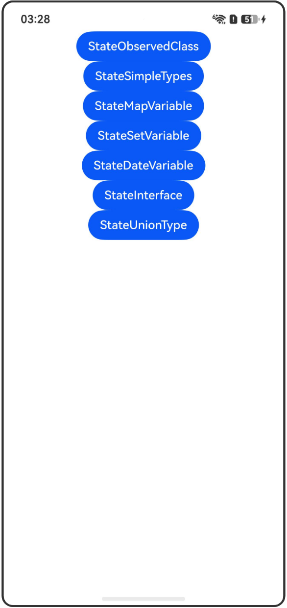

# @State装饰器：组件内状态

## 介绍

本工程帮助开发者更好地理解@State装饰器的使用场景。该工程中展示的代码详细描述可查如下链接：

[@State装饰器：组件内状态](https://gitcode.com/openharmony/docs/blob/OpenHarmony_feature_sta_20260331/zh-cn/application-dev/ui/state-management-static/arkts-static-state.md)

## 使用说明

执行测试用例会先打开相应界面，然后点击按钮或图标，演示接口的使用效果。

## 效果预览

|首页                                   |
|----------------------------------------------|
||

## 工程目录
```
entry/src/
├── main
│   ├── ets
│   │   ├── entryability
│   ├── pages
│   │   ├── Index.ets
│   │   ├── StateObservedClass.ets
│   │   ├── StateSimpleTypes.ets
│   │   ├── StateMapVariable.ets
│   │   ├── StateSetVariable.ets
│   │   ├── StateDateVariable.ets
│   │   ├── StateInterface.ets
│   │   ├── StateUnionType.ets
│   └── resources
│       ├── ...
├─── ... 
```

## 具体实现

1. @State装饰@Observed类：使用@State装饰@Observed类，可以观察到类属性的变化。

2. @State装饰简单类型：当装饰boolean、string、int类型时，可以观察到数值的变化。

3. @State装饰Map类型变量：可以观察到Map整体的赋值，以及通过调用Map的接口set、clear、delete来更新Map的值。

4. @State装饰Set类型变量：可以观察到Set整体的赋值，以及通过调用Set的接口add、clear、delete来更新Set的值。

5. @State装饰Date类型变量：可以观察到Date的赋值，以及通过调用Date的接口来更新Date的值。

6. @State装饰interface字面量类型：可以观察到字面量整体以及属性的变化。

7. @State支持联合类型：支持null、undefined以及联合类型。

## 相关权限

不涉及。

## 依赖

不涉及。

## 约束与限制

1.本示例已适配API version 23及以上版本SDK。

## 下载

如需单独下载本工程，执行如下命令：

```
git init
git config core.sparsecheckout true
echo code/DocsSample/ArkUISample-Sta/StateDecorator/ > .git/info/sparse-checkout
git remote add origin https://gitcode.com/openharmony/applications_app_samples.git
git pull origin master
```