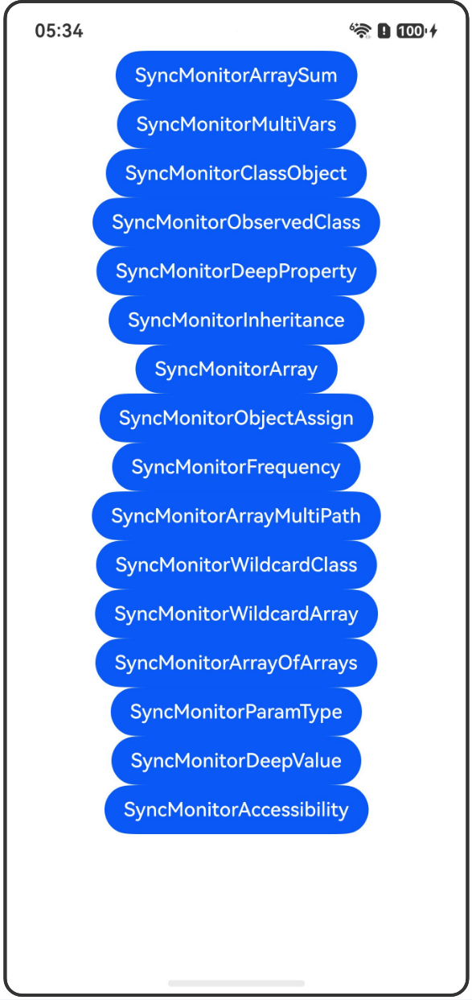

# @SyncMonitor装饰器：状态变量修改同步监听

## 介绍

本工程帮助开发者更好地理解@SyncMonitor装饰器的使用场景。该工程中展示的代码详细描述可查如下链接：

[@SyncMonitor装饰器：状态变量修改同步监听](https://gitcode.com/openharmony/docs/blob/OpenHarmony_feature_sta_20260331/zh-cn/application-dev/ui/state-management-static/arkts-static-new-syncmonitor.md)

## 使用说明

执行测试用例会先打开相应界面，然后点击按钮或图标，演示接口的使用效果。

## 效果预览

|首页                                   |
|----------------------------------------------|
||

## 工程目录
```
entry/src/
├── main
│   ├── ets
│   │   ├── entryability
│   │   ├── pages
│   │   │   ├── Index.ets
│   │   │   ├── SyncMonitorArraySum.ets
│   │   │   ├── SyncMonitorMultiVars.ets
│   │   │   ├── SyncMonitorClassObject.ets
│   │   │   ├── SyncMonitorObservedClass.ets
│   │   │   ├── SyncMonitorDeepProperty.ets
│   │   │   ├── SyncMonitorInheritance.ets
│   │   │   ├── SyncMonitorArray.ets
│   │   │   ├── SyncMonitorObjectAssign.ets
│   │   │   ├── SyncMonitorFrequency.ets
│   │   │   ├── SyncMonitorArrayMultiPath.ets
│   │   │   ├── SyncMonitorWildcardClass.ets
│   │   │   ├── SyncMonitorWildcardArray.ets
│   │   │   ├── SyncMonitorArrayOfArrays.ets
│   │   │   ├── SyncMonitorParamType.ets
│   │   │   ├── SyncMonitorDeepValue.ets
│   │   │   ├── SyncMonitorAccessibility.ets
│   └── resources
│       ├── ...
├─── ... 
```

## 具体实现

1. @SyncMonitor数组求和：对比@SyncMonitor和@Monitor的回调触发频率差异，@SyncMonitor同步回调，@Monitor异步回调。

2. @SyncMonitor监听多个状态变量：使用@SyncMonitor同时监听多个状态变量的变化，当变量变化时同步触发回调。

3. @SyncMonitor监听类对象：仅能监听类对象整体赋值的变化，无法直接监听类成员属性的变化。

4. 在@ObservedV2装饰的类中使用@SyncMonitor：监听被@Trace装饰的属性变化，未被@Trace装饰的属性无法被监听。

5. @SyncMonitor监听深层属性：使用路径监听嵌套类对象的深层属性变化。

6. @SyncMonitor继承类场景：父子类中对同一个属性分别定义@SyncMonitor进行监听，属性变化时父子类的回调均会被调用。

7. @SyncMonitor数组监听：监听多维数组、对象数组中指定项的变化。

8. @SyncMonitor对象整体改变监听属性不变：对象整体改变但监听的属性不变时，不触发@SyncMonitor回调。

9. @SyncMonitor多次改变属性：在一次事件中多次改变被@SyncMonitor监听的属性，每次改变都会触发回调。

10. @SyncMonitor多属性监听：监听数组的多个路径和属性，演示同步回调的执行时机。

11. @SyncMonitor通配符监听对象：使用通配符监听对象的任意属性变化。

12. @SyncMonitor通配符监听数组：使用通配符监听数组任意项的变化。

13. @SyncMonitor嵌套对象通配符：监听嵌套对象路径中使用通配符，观察深层对象属性的变化。

14. @SyncMonitor多维数组通配符：监听多维数组路径中使用通配符，观察数组项的变化。

15. @SyncMonitor参数类型：展示@SyncMonitor支持的参数类型（字符串字面量、const常量、enum枚举值），变量作为参数会编译报错。

16. @SyncMonitor监听深层属性变化使用场景：监听深层属性变化并根据变化幅度动态改变UI样式。

17. @SyncMonitor监听变量可访问性变化：监听变量从可访问变为不可访问或从不可访问变为可访问的变化。

## 相关权限

不涉及。

## 依赖

不涉及。

## 约束与限制

1.本示例已适配API version 23及以上版本SDK。

## 下载

如需单独下载本工程，执行如下命令：

```
git init
git config core.sparsecheckout true
echo code/DocsSample/ArkUISample-Sta/SyncMonitorDecorator/ > .git/info/sparse-checkout
git remote add origin https://gitcode.com/openharmony/applications_app_samples.git
git pull origin master
```