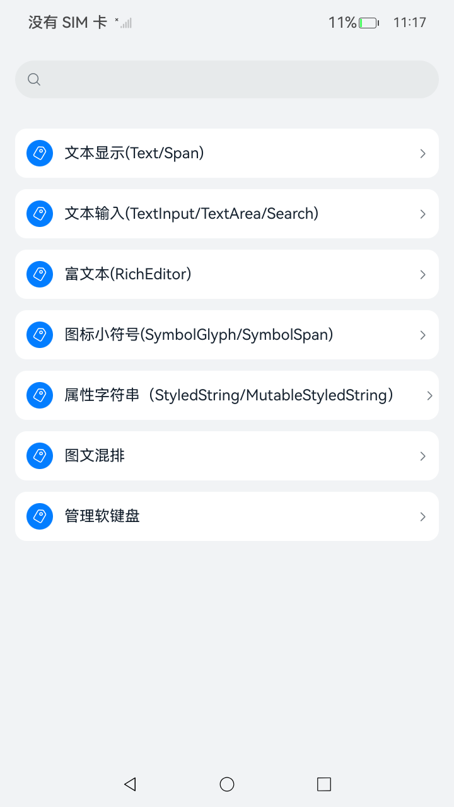
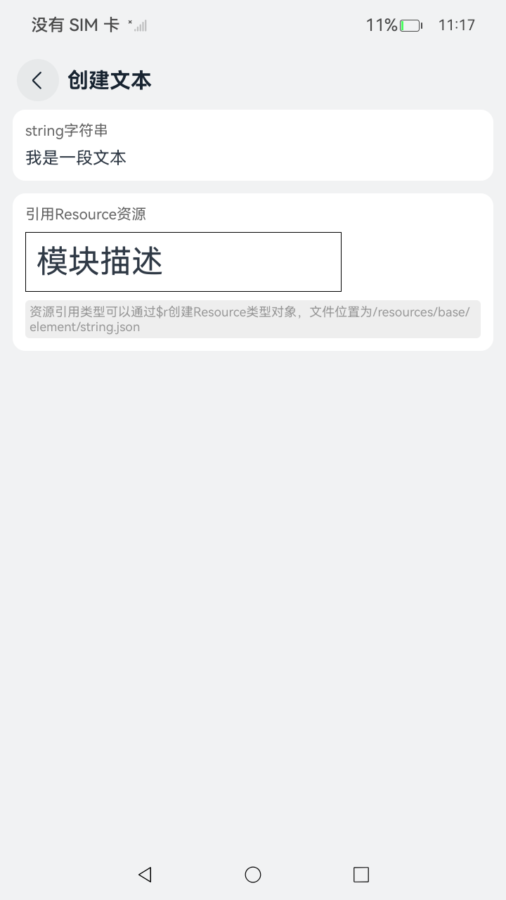

# ArkUI使用文本控件指南文档示例

### 介绍

在工程中包含各场景的开发示例，可帮助开发者更好地理解ArkUI提供的组件及组件属性并合理使用。该工程中展示的代码详细描述可查如下链接：
本示例通过使用[ArkUI指南文档](https://gitcode.com/openharmony/docs/blob/OpenHarmony_feature_sta_20260331/zh-cn/application-dev/ui/arkts-text-introduction.md)中各场景的开发示例，展示在工程中，帮助开发者更好地理解ArkUI提供的组件及组件属性并合理使用。该工程中展示的代码详细描述可查如下链接：

1. [文本显示 (Text/Span)](https://gitCode.com/openharmony/docs/blob/OpenHarmony_feature_sta_20260331/zh-cn/application-dev/ui/arkts-common-components-text-display.md)。
2. [文本输入 (TextInput/TextArea/Search)](https://gitCode.com/openharmony/docs/blob/OpenHarmony_feature_sta_20260331/zh-cn/application-dev/ui/arkts-common-components-text-input.md)。
3. [富文本 (RichEditor)](https://gitCode.com/openharmony/docs/blob/OpenHarmony_feature_sta_20260331/zh-cn/application-dev/ui/arkts-common-components-richeditor.md)。
4. [图标小符号 (SymbolGlyph/SymbolSpan)](https://gitCode.com/openharmony/docs/blob/OpenHarmony_feature_sta_20260331/zh-cn/application-dev/ui/arkts-common-components-symbol.md)。
5. [属性字符串 (StyledString/MutableStyledString)](https://gitCode.com/openharmony/docs/blob/OpenHarmony_feature_sta_20260331/zh-cn/application-dev/ui/arkts-styled-string.md)。
6. [图文混排](https://gitcode.com/openharmony/docs/blob/OpenHarmony_feature_sta_20260331/zh-cn/application-dev/ui/arkts-text-image-layout.md)。
7. [管理软键盘](https://gitcode.com/openharmony/docs/blob/OpenHarmony_feature_sta_20260331/zh-cn/application-dev/ui/arkts-manage-keyboard.md)。

### 效果预览

| 首页                                 | 显示组件目录                           | 示例                              |
|------------------------------------|----------------------------------|---------------------------------|
|  |  |  |

### 使用说明

1. 在主界面，可以点击对应卡片，选择需要参考的组件示例。

2. 在组件目录选择详细的示例参考。

3. 进入示例界面，查看参考示例。

4. 通过自动测试框架可进行测试及维护。

### 工程目录

```
entry/src/main/ets/
|---entryability
|---pages
|   |---propertyString                               // 属性字符串
|   |       |---CreateApply.ets
|   |       |---index.ets
|   |       |---StyledStringBaselineOffsetStyle.ets  //创建及应用文本基线偏移量对象（BaselineOffsetStyle）示例
|   |       |---StyledStringConvertedToParagraph.ets //支持将属性字符串转换成Paragraph示例
|   |       |---StyledStringDecorationStyle.ets      //创建及应用文本装饰线对象（DecorationStyle）示例
|   |       |---StyledStringGestureStyle.ets
|   |       |---StyledStringHtml.ets
|   |       |---StyledStringHtmlOne.ets              //格式转换场景二示例
|   |       |---StyledStringImageAttachment.ets
|   |       |---StyledStringLetterSpacingStyle.ets   //创建及应用文本字符间距对象（LetterSpacingStyle）示例
|   |       |---StyledStringLineHeightStyle.ets      //创建及应用文本行高对象（LineHeightStyle）示例
|   |       |---StyledStringParagraphStyle.ets
|   |       |---StyledStringParagraphStyleOne.ets    //设置段落样式方法一示例
|   |       |---StyledStringReplaceParagraphStyle.ets  //设置段落样式方法二示例
|   |       |---StyledStringSceneExample.ets
|   |       |---StyledStringStyle.ets
|   |       |---StyledStringTextShadowStyle.ets      //创建及应用文本阴影对象（TextShadowStyle）示例
|   |       |---StyledStringTextStyle.ets            //创建及应用文本字体样式对象（TextStyle）示例
|   |---richEditor                                   // 富文本
|   |       |---AddBuilderDecoratorContent.ets
|   |       |---AddEvent.ets
|   |       |---AddImageContent.ets
|   |       |---AddSymbolSpanContent.ets
|   |       |---AddTextContent.ets
|   |       |---BackplaneHighlighting.ets
|   |       |---CreateRichEditor.ets
|   |       |---DisableSystemServiceMenu.ets
|   |       |---GetGraphicInfoInComponent.ets
|   |       |---index.ets
|   |       |---SetAttributes.ets
|   |       |---SetUserPresetTextStyles.ets
|   |---symbol                                       // 图标小符号
|   |       |---index.ets
|   |       |---CreatSymbolGlyph.ets
|   |       |---SymbolAddEvent.ets
|   |       |---SymbolAddToText.ets
|   |       |---SymbolCustomIconAnimation.ets
|   |       |---SymbolSceneExample.ets
|   |       |---SymbolShadowAndColor.ets
|   |---text                                         // 文本显示
|   |       |---index.ets
|   |       |---AIMenu.ets
|   |       |---BindSelectionMenu.ets
|   |       |---ContentTransition.ets
|   |       |---CreateText.ets
|   |       |---CustomAndBlockMenus.ets
|   |       |---CustomTextStyle.ets
|   |       |---DisplayedTogether.ets
|   |       |---EnableAutoSpacing.ets
|   |       |---GeneralEvents.ets
|   |       |---HeightAdaptivePolicy.ets
|   |       |---LengthMetric.ets
|   |       |---LineSpacing.ets
|   |       |---PrepareMenu.ets
|   |       |---SelectMenu.ets
|   |       |---SelectionChange.ets
|   |       |---ServiceMenuItems.ets
|   |       |---ShaderStyle.ets
|   |       |---TextAddEvent.ets
|   |       |---TextHotSearch.ets
|   |       |---TextLayout.ets
|   |       |---TextLong.ets
|   |       |---TextLongTow.ets
|   |       |---TextSpan.ets
|   |       |---TextSpanOnHover.ets
|   |       |---WordBreakd.ets
|   |       |---TextMenuShowSubWindow.ets
|   |---textImageMixedLayout                         // 图文混排
|   |       |---index.ets
|   |       |---TextImageAttribute.ets
|   |       |---TextImageComponent.ets
|   |---testInput                                    // 文本输入
|   |       |---index.ets
|   |       |---AutoFill.ets
|   |       |---CreatTextInput.ets
|   |       |---CursorAvoidance.ets
|   |       |---CustomTextInputStyle.ets
|   |       |---DisableSystemServiceMenuItems.ets
|   |       |---KeyboardAvoidance.ets
|   |       |---NormalQuestion.ets
|   |       |---SelectMenu.ets
|   |       |---SetInputMultiTypeStyle.ets
|   |       |---SetProperty.ets
|   |       |---SetTextInputType.ets
|   |       |---SetTextMargin.ets
|   |       |---TextInputAddEvent.ets
|   |       |---TextMenuShowSubWindow.ets
|   |---manageKeyBoard                               // 键盘管理
|   |       |---index.ets
|   |       |---RequestFocusCloseKeyBoard.ets
|   |       |---TextInputControllerCloseKeyboard.ets
|---pages
|   |---Index.ets                                    // 应用主页面
```

## 具体实现
1. 文本显示 (Text/Span)，源码参考[text](entry/src/main/ets/pages/text)
   * 点击事件：Span('点击查看').onClick(() => { router.pushUrl(...) })，实现文本点击跳转。
   * 复制功能：Text('验证码：123456').copyOption(CopyOptions.InApp)，允许用户长按文本复制内容（CopyOptions.InApp表示仅应用内可复制）。
   * 文本选择：Text('可选择文本').textSelectable(true)，支持用户长按选择部分文本（配合自定义选择菜单可扩展功能）。
   * 悬浮反馈：Span('hover效果').onHover((isHover) => { this.isHover = isHover; })，根据悬浮状态动态修改样式（如变色、加粗）。
   * 字体大小自适应：同时设置minFontSize(12)、maxFontSize(20)+maxLines(1)+width(200)，文本会根据容器宽度自动调整字号（确保在 1 行内显示完整）。
   * 截断不处理：设置textOverflow({ overflow: TextOverflow.None })+maxLines(1)，超出容器的文本直接截断（仅显示可见部分）。
   * 显示省略号：textOverflow({ overflow: TextOverflow.Ellipsis })+maxLines(1)，超出部分用 “...” 表示（适合标题、短描述）。
   * 跑马灯滚动：文本自动横向滚动显示完整内容，可通过.marqueeOptions({ loop: -1, step: 5 })配置循环次数（-1 为无限循环）、滚动速度等。
   * 多行限制：设置maxLines(2)（最多 2 行），配合textOverflow，实现多行文本溢出处理（如 “...” 显示在最后一行末尾）。
   * 为每个Span配置独立样式：通过.fontStyle(FontStyle.Italic)（斜体）、.decoration({ type: TextDecorationType.Underline })（下划线）等区分文本。
2. 文本输入 (TextInput/TextArea/Search)，源码参考[textInput](entry/src/main/ets/pages/textInput)
   * 实现不同用途不同类型的输入框，如：基本输入模式、密码模式、邮箱地址输入模式等。
   * 实现不同样式的输入框，分别是默认风格和内联模式，或者自定义样式。
3. 富文本(RichEditor), 源码参考[richEditor](entry/src/main/ets/pages/richEditor)
   * 创建RichEditor组件：开发者可以创建使用属性字符串和不使用属性字符串构建的RichEditor组件
   * 设置属性：设置自定义选择菜单、输入框光标、手柄颜色、提示文本、最大行数、最大长度、装饰线、对齐方式、间距等
   * 添加事件：添加多场景回调，如初始化完成、光标移动、完成输入、复制粘贴等场景
   * 设置用户预设的文本样式：通过setTypingStyle设置用户预设的文本样式
   * 设置组件内的内容选中时部分背板高亮：通过setSelection设置组件内的内容选中时部分背板高亮
   * 添加文本内容：通过addTextSpan添加文本内容
   * 添加图片内容：通过addImageSpan添加图片内容
   * 添加@Builder装饰器修饰的内容：通过addBuilderSpan添加@Builder装饰器修饰的内容
   * 添加SymbolSpan内容：通过addSymbolSpan添加Symbol内容。此接口可用于特殊符号添加与展示，例如在编辑学术论文时，此接口可用于添加各种数学符号
   * 获取组件内图文信息：通过getSpans获取组件内所有图文内容的信息，包括图文的内容、id、样式、位置等信息。获取内容位置信息后，可对指定范围内容进行样式的更新
   * 禁用系统服务菜单：文字被选中时弹出的菜单不包含系统菜单
4. 图标小符号 (SymbolGlyph/SymbolSpan)，源码参考[symbol](entry/src/main/ets/pages/symbol)
   * SymbolGlyph是图标小符号组件，便于使用精美的图标，如渲染多色图标和使用动效图标。
   * SymbolSpan作为Text组件的子组件，可在文本中穿插显示图标小符号。
5. 属性字符串（StyledString/MutableStyledString），源码参考[propertyString](entry/src/main/ets/pages/propertyString)
   * 属性字符串StyledString/MutableStyledString（其中MutableStyledString继承自StyledString，下文统称为StyledString），可用于在字符或段落级别上设置文本样式。将StyledString应用到文本组件上，可以采用多种方式修改文本，包括调整字号、添加字体颜色、使文本具备可点击性，以及通过自定义方式绘制文本等。
   * 属性字符串提供多种类型样式对象，涵盖各种常见的文本样式格式，例如文本装饰线样式、文本行高样式、文本阴影样式等。也可以自行创建CustomSpan，以应用自定义样式。
6. 图文混排，源码参考[textImageMixedLayout](entry/src/main/ets/pages/textImageMixedLayout)
   * 使用Span和ImageSpan实现图文混排。
   * 使用属性字符串实现图文混排。
7. 管理软键盘，源码参考[manageKeyBoard](entry/src/main/ets/pages/manageKeyBoard)
   * 通过TextInputController收起软键盘
   * 通过RequestFocus切换焦点收起软键盘

### 相关权限

不涉及。

### 依赖

不涉及。

### 约束与限制

1.本示例仅支持标准系统上运行, 支持设备：RK3568。

2.本示例为Stage模型，arkTSVersion为1.2。

3.本示例需要使用Sta SDK配套IDE版本才可编译运行。

### 下载

如需单独下载本工程，执行如下命令：

````
git init
git config core.sparsecheckout true
echo code/DocsSample/ArkUISample-Sta/TextComponent > .git/info/sparse-checkout
git remote add origin https://gitcode.com/openharmony/applications_app_samples.git
git pull origin OpenHarmony_feature_sta_20260331
````