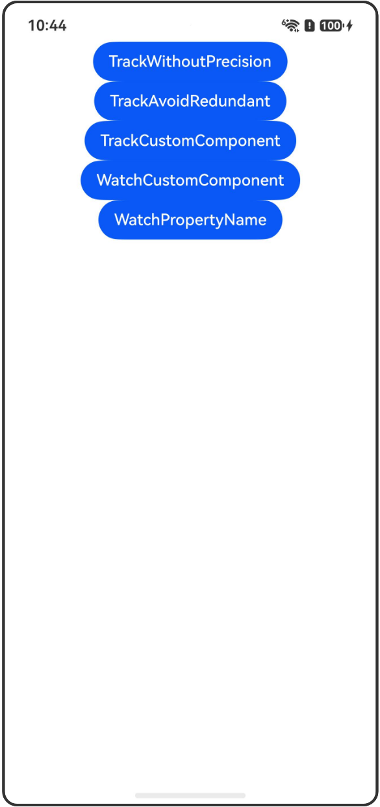

# @Track装饰器和@Watch装饰器

## 介绍

本工程帮助开发者更好地理解@Track和@Watch装饰器的使用场景。该工程中展示的代码详细描述可查如下链接：

[@Track装饰器：class对象属性级更新](https://gitcode.com/openharmony/docs/blob/OpenHarmony_feature_sta_20260331/zh-cn/application-dev/ui/state-management-static/arkts-static-track.md)

[@Watch装饰器：状态变量更改通知](https://gitcode.com/openharmony/docs/blob/OpenHarmony_feature_sta_20260331/zh-cn/application-dev/ui/state-management-static/arkts-static-watch.md)

## 使用说明

执行测试用例会先打开相应界面，然后点击按钮或图标，演示接口的使用效果。

## 效果预览

|首页                                   |
|----------------------------------------------|
||

## 工程目录
```
entry/src/
├── main
│   ├── ets
│   │   ├── entryability
│   │   ├── pages
│   │   │   ├── Index.ets
│   │   │   ├── TrackWithoutPrecision.ets
│   │   │   ├── TrackAvoidRedundant.ets
│   │   │   ├── TrackCustomComponent.ets
│   │   │   ├── WatchCustomComponent.ets
│   │   │   └── WatchPropertyName.ets
│   └── resources
│       ├── ...
├─── ... 
```

## 具体实现

### @Track装饰器示例

1. @Track无法精准观察类属性：状态管理V1中@State结合@Observed使用支持观察第一层属性的变化，但无法做到类属性级的观察。

2. @Track避免冗余刷新：使用@Track装饰器可以避免冗余刷新，当class对象中没有一个属性被标记@Track，行为与原先保持不变。

3. @Track和自定义组件更新：当class对象中有些属性被@Track装饰，有些属性未被@Track装饰时，只有被@Track装饰的属性变化会触发UI更新。

### @Watch装饰器示例

4. @Watch和自定义组件更新：当状态变量变化时，@Watch装饰的回调方法将被调用，可以用来监听状态变量的变化。

5. @Watch判断具体属性变化：当@Watch装饰interface类型或被@Observed/@Track装饰的class类型时，不同的成员属性的修改会将对应的状态变量名传入回调方法。

## 相关权限

不涉及。

## 依赖

不涉及。

## 约束与限制

1.本示例已适配API version 23及以上版本SDK。

## 下载

如需单独下载本工程，执行如下命令：

```
git init
git config core.sparsecheckout true
echo code/DocsSample/ArkUISample-Sta/TrackWatch/ > .git/info/sparse-checkout
git remote add origin https://gitcode.com/openharmony/applications_app_samples.git
git pull origin master
```