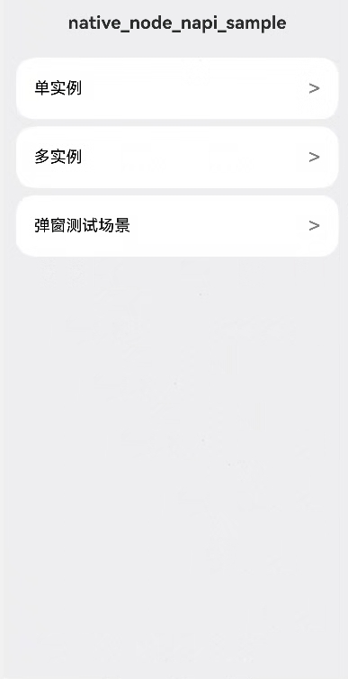
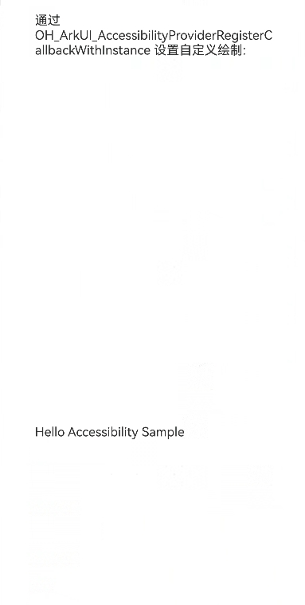
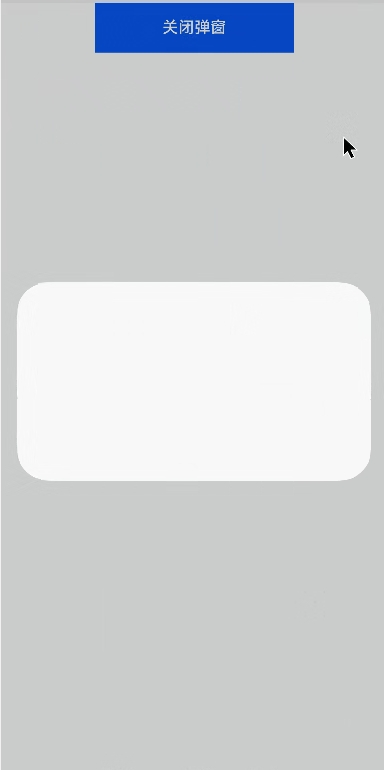

# Accessibility_Custom_CAPI示例

### 介绍

示例[通过自定义绘制接入无障碍功能](https://developer.huawei.com/consumer/cn/doc/harmonyos-guides/arkts-user-defined-draw)中各场景的开发示例，展示在项目中，帮助开发者更好地理解Accessibility Custom C接口并合理使用。该项目中展示的接口详细描述可查如下链接：
[native_interface_accessibility.h](https://gitcode.com/openharmony/docs/blob/master/zh-cn/application-dev/reference/apis-arkui/capi-native-interface-accessibility-h.md)。

### 效果预览

| 首页                                 |
|------------------------------------|
|  |

| 单实例                                 |
|------------------------------------|
|  |

| 多实例                                 |
|------------------------------------|
|  |

| 弹窗                                 |
|------------------------------------|
|  |
|  |

### 使用说明

通过开启屏幕朗读后使用单指滑动点击双击等操作，可以验证无障碍C-API接口的基本功能。

### 工程目录
```
├──entry/src/main
│  ├──cpp                                       // C++代码区
│  │  ├──CMakeLists.txt                         // CMake配置文件
│  │  ├──NapiInit.cpp                           // Napi模块注册          
|  |  ├──AccessibilityMaker.cpp                 // Accessibility Custom CAPI接口示例
|  |  ├──AccessibilityMaker.h
│  │  ├──accessibilityDialog.cpp                // Accessibility Custom Dialog CAPI接口示例
│  │  ├──accessibilityDialog.h
│  │  ├──AccessibilityDialogSubWindow.cpp       // Accessibility Custom DialogSubWindow CAPI接口示例
│  │  ├──AccessibilityDialogSubWindow.h
|  |  ├──Manager.cpp
|  |  ├──Manager.h
│  ├──ets                                       // ets代码区
│  │  ├──entryability
│  │  │  └──EntryAbility.ts                     // 程序入口类
│  │  └──pages                                  // 页面文件
│  │     └──Index.ets                           // 主界面
│  │     └──pageAccessibility.ets              // 单实例界面
│  │     └──pageAccessibilityMultiple.ets     // 多实例界面
│  │     └──PageCustomDialog.ets               // 弹窗界面
│  │     └──PageCustomDialogSubWindow.ets      // 弹窗子窗界面
│  │     └──PageNoCustom.ets                   // 非custom节点界面
|  ├──resources         			            // 资源文件目录
├──entry/src/ohosTest/
├──ets
|   |---index.test.ets                          // 示例代码测试代码
```

### 具体实现
* 获取并注册ArkUI_AccessibilityProvider指针、为custom RenderNode构建native节点树并挂载到NodeContent、在provider回调中构建并返回 ArkUI_AccessibilityElementInfo列表、处理无障碍动作并发送异步事件、以及对话框/子窗口的provider注册与内容管理，源码参考：[AccessibilityMaker.cpp](https://gitee.com/openharmony/applications_app_samples/blob/master/code/DocsSample/ArkUISample/AccessibilityCustomCapi/entry/src/main/cpp/AccessibilityMaker.cpp)
    * 通过调用OH_ArkUI_NativeModule_GetNativeAccessibilityProvider和OH_ArkUI_AccessibilityProviderRegisterCallbackWithInstance函数获取并注册ArkUI_AccessibilityProvider指针。
    * 通过调用nodeApi->createNode、nodeApi->setAttribute、nodeApi->addChild、OH_ArkUI_NodeContent_AddNode函数为custom RenderNode构建native节点树并挂载到NodeContent。
    * 通过调用OH_ArkUI_AddAndGetAccessibilityElementInfo、OH_ArkUI_AccessibilityElementInfoSetElementId、OH_ArkUI_AccessibilityElementInfoSetChildNodeIds在provider回调中构建并返回无障碍元素信息。
    * 通过调用ExecuteAccessibilityAction和SendAccessibilityAsyncEvent处理无障碍动作并发送异步事件。
    * 通过调用ArkUI_NativeDialogAPI_1::create、setContent、show、以及为customNode调用OH_ArkUI_NativeModule_GetNativeAccessibilityProvider进行弹窗、子窗口的provider注册与内容管理。

### 相关权限

不涉及。

### 依赖

不涉及。

### 约束与限制

1.本示例仅支持标准系统上运行, 支持设备：RK3568。

2.本示例为Stage模型，支持API23版本SDK，版本号：6.0.0.41，镜像版本号：OpenHarmony_6.0.0.41。

3.本示例需要使用DevEco Studio 5.0.5 Release (Build Version: 5.0.13.200, built on May 13, 2025)及以上版本才可编译运行。

4.仅当三方框架将自身UI组件映射为[ARKUI_NODE_CUSTOM](https://gitcode.com/openharmony/docs/blob/master/zh-cn/application-dev/reference/apis-arkui/capi-native-node-h.md#arkui_nodetype)的[RenderNode](https://gitcode.com/openharmony/docs/blob/master/zh-cn/application-dev/reference/apis-arkui/js-apis-arkui-renderNode.md)并得到[ArkUI_NodeHandle](https://gitcode.com/openharmony/docs/blob/master/zh-cn/application-dev/reference/apis-arkui/capi-arkui-nativemodule-arkui-node8h.md)，该接口才会生效，否则会报错误码。

5.本接口通过[RenderNode](https://gitcode.com/openharmony/docs/blob/master/zh-cn/application-dev/reference/apis-arkui/js-apis-arkui-renderNode.md)并得到[ArkUI_NodeHandle](https://gitcode.com/openharmony/docs/blob/master/zh-cn/application-dev/reference/apis-arkui/capi-arkui-nativemodule-arkui-node8h.md)实现三方框架的接入，仅支持[ARKUI_NODE_CUSTOM](https://gitcode.com/openharmony/docs/blob/master/zh-cn/application-dev/reference/apis-arkui/capi-native-node-h.md#arkui_nodetype)接入无障碍服务，可以实现无障碍控件树获取能力。

6.不支持多线程并发，由三方框架保证调用时的线程安全。

### 下载

如需单独下载本工程，执行如下命令：

````
git init
git config core.sparsecheckout true
echo code/DocsSample/ArkUISample/AccessibilityCustomCapi > .git/info/sparse-checkout
git remote add origin https://gitcode.com/openharmony/applications_app_samples.git
git pull origin master
````