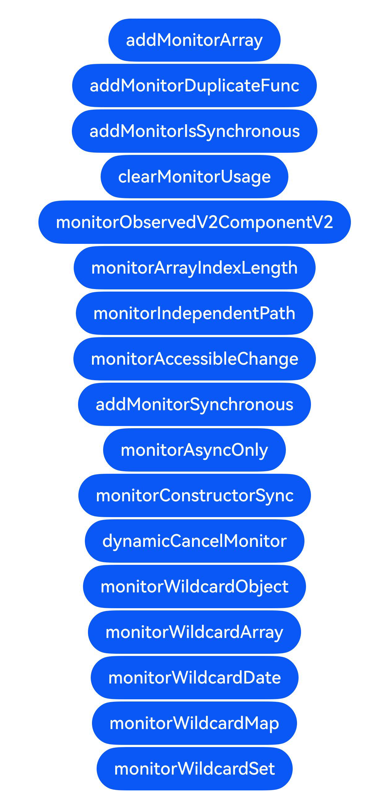

# addMonitor/clearMonitor接口：动态添加/取消监听

## 介绍

本工程帮助开发者更好地理解addMonitor/clearMonitor接口的使用场景。该工程中展示的代码详细描述可查如下链接：

[addMonitor/clearMonitor接口：动态添加/取消监听](https://gitcode.com/openharmony/docs/blob/master/zh-cn/application-dev/ui/state-management/arkts-new-addMonitor-clearMonitor.md)

## 效果预览

|首页                                   |
|----------------------------------------------|
||

## 使用说明

执行测试用例会先打开相应界面，然后点击按钮或图标，演示接口的使用效果。

## 工程目录
```
entry/src/
├── main
│   ├── ets
│   │   ├── entryability
│   │   ├── entrybackupability
│   │   ├── pages
│   │   │   ├── AddMonitorArray.ets
│   │   │   ├── AddMonitorDuplicateFunc.ets
│   │   │   ├── AddMonitorIsSynchronous.ets
│   │   │   ├── AddMonitorSynchronous.ets
│   │   │   ├── ClearMonitorUsage.ets
│   │   │   ├── DynamicCancelMonitor.ets
│   │   │   ├── Index.ets
│   │   │   ├── MonitorAccessibleChange.ets
│   │   │   ├── MonitorArrayIndexLength.ets
│   │   │   ├── MonitorAsyncOnly.ets
│   │   │   ├── MonitorConstructorSync.ets
│   │   │   ├── MonitorIndependentPath.ets
│   │   │   ├── MonitorObservedV2ComponentV2.ets
│   │   │   ├── MonitorWildcardArray.ets
│   │   │   ├── MonitorWildcardDate.ets
│   │   │   ├── MonitorWildcardMap.ets
│   │   │   ├── MonitorWildcardObject.ets
│   │   │   └── MonitorWildcardSet.ets
│   └── resources
│       ├── ...
├─── ... 
```

## 具体实现

1. addMonitor/clearMonitor可以传入数组一次性给多个状态变量添加或删除回调函数。

2. 给同一path添加同名监听函数会失败，addMonitor设置isSynchronous仅第一次有效，更改会失败并打印错误日志。

3. clearMonitor可以删除指定监听函数，也可以删除当前path对应状态变量的所有监听回调函数。

4. addMonitor可以监听@ObservedV2类中@Trace修饰属性和@ComponentV2组件中状态变量的变化。

5. addMonitor可以监听数组类型状态变量的下标和length的变化。

6. addMonitor对不同path采取独立监听机制，仅监听真正发生变化的状态变量。

7. addMonitor会记录变量不可访问的状态，可以监听变量从可访问到不访问和从不可访问到可访问。

8. addMonitor可配置成同步监听函数，@Monitor仅支持异步监听。

9. addMonitor是同步构造的，可以监听构造函数中同步修改的状态变量的变化。

10. addMonitor/clearMonitor可以对不同的@ObservedV2/@ComponentV2实例动态添加/取消监听函数。

11. 从API版本26.0.0开始，addMonitor可通过enableWildcard配置项支持使用通配符路径，监听对象属性以及Array、Date、Map、Set内置类型状态变量的API调用。

## 相关权限

不涉及。

## 依赖

不涉及。

## 约束与限制

1.本示例已适配API version 20及以上版本SDK，其中通配符相关样例需API version 26.0.0及以上。

## 下载

如需单独下载本工程，执行如下命令：

```
git init
git config core.sparsecheckout true
echo code/DocsSample/ArkUISample/AddMonitorClearMonitorSample/ > .git/info/sparse-checkout
git remote add origin https://gitcode.com/openharmony/applications_app_samples.git
git pull origin master
```
