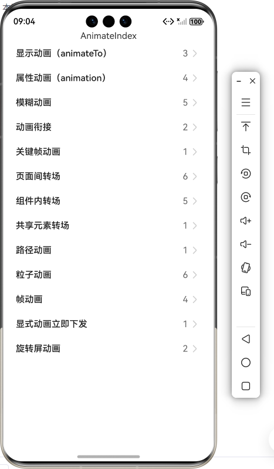

# ArkUI使用动效组件指南文档示例

### 介绍

本示例通过使用[ArkUI指南文档](https://gitcode.com/openharmony/docs/tree/master/zh-cn/application-dev/ui)中各场景的开发示例，展示在工程中，帮助开发者更好地理解ArkUI提供的组件及组件属性并合理使用。该工程中展示的代码详细描述可查如下链接：

1. [显示动画（animateTo）](https://gitcode.com/openharmony/docs/blob/master/zh-cn/application-dev/reference/apis-arkui/arkui-ts/ts-explicit-animation.md)。
2. [属性动画（animation）](https://gitcode.com/openharmony/docs/blob/master/zh-cn/application-dev/reference/apis-arkui/arkui-ts/ts-animatorproperty.md)。
3. [模糊动画](https://gitcode.com/openharmony/docs/blob/master/zh-cn/application-dev/ui/arkts-blur-effect.md)。
4. [动画衔接](https://gitcode.com/openharmony/docs/blob/master/zh-cn/application-dev/ui/arkts-animation-smoothing.md)。
5. [关键帧动画](https://gitcode.com/openharmony/docs/blob/master/zh-cn/application-dev/reference/apis-arkui/arkui-ts/ts-keyframeAnimateTo.md)。
6. [页面间转场](https://gitcode.com/openharmony/docs/blob/master/zh-cn/application-dev/reference/apis-arkui/arkui-ts/ts-page-transition-animation.md)。
7. [组件内转场](https://gitcode.com/openharmony/docs/blob/master/zh-cn/application-dev/reference/apis-arkui/arkui-ts/ts-transition-animation-component.md)。
8. [共享元素转场](https://gitcode.com/openharmony/docs/blob/master/zh-cn/application-dev/reference/apis-arkui/arkui-ts/ts-transition-animation-shared-elements.md)。
9. [路径动画](https://gitcode.com/openharmony/docs/blob/master/zh-cn/application-dev/reference/apis-arkui/arkui-ts/ts-motion-path-animation.md)。
10. [粒子动画](https://gitcode.com/openharmony/docs/blob/master/zh-cn/application-dev/reference/apis-arkui/arkui-ts/ts-particle-animation.md)。
11. [帧动画](https://gitcode.com/openharmony/docs/blob/master/zh-cn/application-dev/reference/apis-arkui/js-apis-animator.md)。
12. [显式动画立即下发](https://gitcode.com/openharmony/docs/blob/master/zh-cn/application-dev/reference/apis-arkui/arkui-ts/ts-explicit-animatetoimmediately.md)。
13. [旋转屏动画](https://gitcode.com/openharmony/docs/blob/master/zh-cn/application-dev/ui/arkts-rotation-transition-animation.md)。

### 效果预览

| 首页                                 |
|------------------------------------|
|  |

### 使用说明

1. 在主界面，可以点击对应卡片，选择需要参考的组件示例。

2. 在组件目录选择详细的示例参考。

3. 进入示例界面，查看参考示例。

4. 通过自动测试框架可进行测试及维护。

### 工程目录
```
entry/src/main/ets/
|---entryability
|---pages
|   |---animateTo                       // 显示动画（animateTo） 
|   |   |---template1         
|   |   |   |---Index.ets           // 示例1（在组件出现时创建动画）
|   |   |---template2    
|   |   |   |---Index.ets                // 示例2（动画执行结束后组件消失）
|   |   |---template3                    
|   |   |   |---Index.ets            // 示例3（在状态管理V2中使用animateTo）
|   |---animateToImmediately                      // 显式动画立即下发
|   |   |---template1
|   |   |   |---Index.ets
|   |---animation                             // 属性动画（animation）
|   |   |---template1
|   |   |   |---Index.ets
|   |   |---template2                   
|   |   |   |---Index.ets          // 示例2（使用animateTo产生属性动画）
|   |   |---template3             
|   |   |   |---Index.ets        // 示例3（使用animation产生属性动画）
|   |   |---template4         
|   |   |   |---Index.ets         // 示例4（使用keyframeAnimateTo产生属性动画）
|   |---animationBlur                             // 属性动画（animation）
|   |   |---template1
|   |   |   |---Index.ets           // 示例1（使用backdropBlur为组件添加背景模糊）
|   |   |---template2                   
|   |   |   |---Index.ets          // 示例2（使用blur为组件添加内容模糊）
|   |   |---template3             
|   |   |   |---Index.ets        // 示例3（使用backgroundBlurStyle为组件添加背景模糊效果）
|   |   |---template4         
|   |   |   |---Index.ets         // 示例4（使用foregroundBlurStyle为组件添加内容模糊效果）
|   |   |---template5         
|   |   |   |---Index.ets         // 示例5（使用motionBlur为组件添加运动模糊效果）
|   |---animator              // 帧动画
|   |   |---template1        // 示例1（基于ArkTS扩展的声明式开发范式）
|   |   |   |---Index.ets
|   |   |---template2          // 示例2（位移动画示例）
|   |   |   |---Index.ets
|   |   |---template3           // 示例3（使用帧动画实现小球抛物运动）
|   |   |   |---Index.ets
|   |   |---template4           // 示例4（使用帧动画实现小球抛物运动）
|   |   |   |---Index.ets
|   |---cohesion                  // 动画衔接
|   |   |---template1
|   |   |   |---Index.ets
|   |   |---template2
|   |   |   |---Index.ets
|   |---compTransition                 // 组件内转场
|   |   |---template1     
|   |   |   |---Index.ets            // 示例1（使用同一接口实现图片出现消失）
|   |   |---template2       
|   |   |   |---Index.ets       // 示例2（使用不同接口实现图片出现消失）
|   |   |---template3       
|   |   |   |---Index.ets       // 示例3（设置父子组件为transition）
|   |   |---template4      
|   |   |   |---Index.ets        // 示例4（出现/消失转场）
|   |   |---template5       
|   |   |   |---Index.ets    // 示例5（多个组件渐次出现消失）
|   |---keyframeAnimateTo                      // 关键帧动画
|   |   |---template1
|   |   |   |---Index.ets     
|   |---motionPath                   // 路径动画
|   |   |---template1
|   |   |   |---Index.ets          
|   |---pageTransition                       // 页面间转场
|   |   |---template1      
|   |   |   |---Index.ets         // 示例1（设置退入场动画）
|   |   |---template2      
|   |   |   |---Index.ets      // 示例2（设置退入场平移效果）
|   |   |---template3    
|   |   |   |---Index.ets     // 示例3（不推荐)（利用pushUrl跳转能力）
|   |   |---template4     
|   |   |   |---Index.ets         // 示例4（不推荐)（type为None的页面转场）
|   |   |---template5    
|   |   |   |---Index.ets     // 示例5（不推荐)（type配置为RouteType.None）
|   |   |---template6     
|   |   |   |---Index.ets         // 示例6（不推荐)（type配置为RouteType.Push或RouteType.Pop）
|   |---particle                          // 粒子动画
|   |   |---template1       
|   |   |   |---Index.ets      // 示例1（圆形初始化粒子）
|   |   |---template2      
|   |   |   |---Index.ets     // 示例2（图片初始化粒子）
|   |   |---template3     
|   |   |   |---Index.ets     // 示例3（粒子扰动场的干扰下运动轨迹发生变化）
|   |   |---template4         
|   |   |   |---Index.ets         // 示例4（调整粒子发射器位置）  
|   |   |---template5     
|   |   |   |---Index.ets          // 示例5（环形发射器创建）
|   |   |---template6       
|   |   |   |---Index.ets        // 示例6（环形发射器更新）
|   |---rotation                          // 旋转屏动画
|   |   |---template1
|   |   |   |---Index.ets       
|   |   |---template2
|   |   |   |---Index.ets       
|   |---shareTransition                        // 共享元素转场
|   |   |---template1
|   |   |   |---Index.ets        
|---pages
|   |---Index.ets                       // 应用主页面
entry/src/ohosTest/
|---ets
|   |---test
|   |   |---AnimateTo.test.ets                      // 显示动画（animateTo）示例代码测试代码
|   |   |---AnimateToImmediately.test.ets                     // 显式动画立即下发示例代码测试代码
|   |   |---Animation.test.ets                            // 属性动画（animation）示例代码测试代码
|   |   |---Animator.test.ets             // 帧动画示例代码测试代码
|   |   |---Cohesion.test.ets                 // 动画衔接示例代码测试代码
|   |   |---ComponentTransition.test.ets                // 组件内转场示例代码测试代码
|   |   |---KeyFrameAnimateTo.test.ets                     // 关键帧动画示例代码测试代码
|   |   |---MotionPath.test.ets                  // 路径动画示例代码测试代码
|   |   |---PageTransition.test.ets                      // 页面间转场示例代码测试代码
|   |   |---Particle.test.ets                         // 粒子动画示例代码测试代码
|   |   |---Rotation.test.ets                         // 旋转屏动画示例代码测试代码
|   |   |---ShareTransition.test.ets                       // 共享元素转场示例代码测试代码
```
### 具体实现
1. 帧动画：通过向应用提供onFrame逐帧回调，帧动画使开发者能够在应用的每一帧设置属性值，从而实现组件属性值变化的自然过渡，营造出动画效果。源码参考[animator/template1/Index.ets](https://gitcode.com/openharmony/applications_app_samples/blob/master/code/DocsSample/ArkUISample/Animation/entry/src/main/ets/pages/animator/template1/Index.ets)
    * 使用帧动画ohos.animator开发者可每帧修改UI侧属性值，UI侧属性实时更新。
    * 在属性动画UI侧只计算动画最终状态，动画过程为渲染值在改变，UI侧一直为动画最终状态，不感知实时渲染值。
    * 帧动画在动画过程中即可实时响应，而属性动画按最终状态响应。
2. 模糊动画：使用backdropBlur为组件添加背景模糊。源码参考[animationBlur/template1/blurEffectsExample.ets](https://gitcode.com/openharmony/applications_app_samples/blob/master/code/DocsSample/ArkUISample/SupportingAgingFriendly/entry/src/main/ets/pages/animationBlur/template1/blurEffectsExample.ets)
    * 模糊和阴影效果可以让物体看起来更加立体，使得动画更加生动。
    * 提供了丰富的效果接口，开发者可快速打造出精致、个性化的效果。
    * 常用的模糊、阴影和色彩效果。
3. 动画衔接：使用animation接口作用的属性值，即可产生动画。源码参考[cohesion/template1/Index.ets](https://gitcode.com/openharmony/applications_app_samples/blob/master/code/DocsSample/ArkUISample/SupportingAgingFriendly/entry/src/main/ets/pages/cohesion/template1/Index.ets)
    * 对于桌面翻页类从跟手到离手触发动画的场景，离手后动画的初始速度应承继手势速度，避免由于速度不接续导致停顿感的产生。
    * 系统已提供动画与动画、手势与动画之间的衔接能力，保证各类场景下动画平稳光滑地过渡的同时，尽可能降低开发难度。
    * 开发者仅需在animateTo动画闭包中改变属性值或者改变animation接口作用的属性值，即可产生动画。
### 相关权限

不涉及。

### 依赖

不涉及。

### 约束与限制

1.本示例仅支持标准系统上运行, 支持设备：RK3568。

2.本示例为Stage模型，支持API20版本SDK，版本号：6.0.0.33，镜像版本号：OpenHarmony_6.0.0.33。

3.本示例需要使用DevEco Studio 6.0.0 Canary1 (Build Version: 6.0.0.270， built on May 9, 2025)及以上版本才可编译运行。

### 下载

如需单独下载本工程，执行如下命令：

````
git init
git config core.sparsecheckout true
echo code/DocsSample/ArkUISample/Animation > .git/info/sparse-checkout
git remote add origin https://gitcode.com/openharmony/applications_app_samples
git pull origin master
````