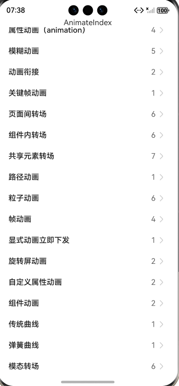

# ArkUI使用动效组件指南文档示例

### 介绍

本示例通过使用[ArkUI指南文档](https://gitcode.com/openharmony/docs/tree/master/zh-cn/application-dev/ui)中各场景的开发示例，展示在工程中，帮助开发者更好地理解ArkUI提供的组件及组件属性并合理使用。该工程中展示的代码详细描述可查如下链接：
1. [显示动画（animateTo）](https://gitcode.com/openharmony/docs/blob/master/zh-cn/application-dev/reference/apis-arkui/arkui-ts/ts-explicit-animation.md)。
2. [属性动画（animation）](https://gitcode.com/openharmony/docs/blob/master/zh-cn/application-dev/reference/apis-arkui/arkui-ts/ts-animatorproperty.md)。
3. [动画衔接](https://gitcode.com/openharmony/docs/blob/master/zh-cn/application-dev/ui/arkts-animation-smoothing.md)。
4. [关键帧动画](https://gitcode.com/openharmony/docs/blob/master/zh-cn/application-dev/reference/apis-arkui/arkui-ts/ts-keyframeAnimateTo.md)。
5. [页面间转场](https://gitcode.com/openharmony/docs/blob/master/zh-cn/application-dev/reference/apis-arkui/arkui-ts/ts-page-transition-animation.md)。
6. [组件内转场](https://gitcode.com/openharmony/docs/blob/master/zh-cn/application-dev/reference/apis-arkui/arkui-ts/ts-transition-animation-component.md)。
7. [共享元素转场](https://gitcode.com/openharmony/docs/blob/master/zh-cn/application-dev/reference/apis-arkui/arkui-ts/ts-transition-animation-shared-elements.md)。
8. [路径动画](https://gitcode.com/openharmony/docs/blob/master/zh-cn/application-dev/reference/apis-arkui/arkui-ts/ts-motion-path-animation.md)。
9. [粒子动画](https://gitcode.com/openharmony/docs/blob/master/zh-cn/application-dev/reference/apis-arkui/arkui-ts/ts-particle-animation.md)。
10. [帧动画](https://gitcode.com/openharmony/docs/blob/master/zh-cn/application-dev/reference/apis-arkui/js-apis-animator.md)。
11. [显式动画立即下发](https://gitcode.com/openharmony/docs/blob/master/zh-cn/application-dev/reference/apis-arkui/arkui-ts/ts-explicit-animatetoimmediately.md)。
12. [旋转屏动画](https://gitcode.com/openharmony/docs/blob/master/zh-cn/application-dev/ui/arkts-rotation-transition-animation.md)。
13. [模糊动画](https://gitcode.com/openharmony/docs/blob/master/zh-cn/application-dev/ui/arkts-blur-effect.md)
14. [自定义属性动画](https://gitcode.com/openharmony/docs/blob/master/zh-cn/application-dev/ui/arkts-custom-attribute-animation.md)
15. [组件动画](https://gitcode.com/openharmony/docs/blob/master/zh-cn/application-dev/ui/arkts-component-animation.md)

### 效果预览

| 首页                                 |
|------------------------------------|
|  |

### 使用说明

1. 在主界面，可以点击对应卡片，选择需要参考的组件示例。

2. 在组件目录选择详细的示例参考。

3. 进入示例界面，查看参考示例。

4. 通过自动测试框架可进行测试及维护。

### 工程目录
```
entry/src/main/ets/
|---entryability
|---pages
|   |---animateTo                       // 显示动画（animateTo） 
|   |   |---template1         
|   |   |   |---Index.ets           // 示例1（在组件出现时创建动画）
|   |   |---template2    
|   |   |   |---Index.ets                // 示例2（动画执行结束后组件消失）
|   |   |---template3                    
|   |   |   |---Index.ets            // 示例3（在状态管理V2中使用animateTo）
|   |---animateToImmediately                      // 显式动画立即下发
|   |   |---template1
|   |   |   |---Index.ets
|   |---animation                             // 属性动画（animation）
|   |   |---template1
|   |   |   |---Index.ets
|   |   |---template2                   
|   |   |   |---Index.ets          // 示例2（使用animateTo产生属性动画）
|   |   |---template3             
|   |   |   |---Index.ets        // 示例3（使用animation产生属性动画）
|   |   |---template4         
|   |   |   |---Index.ets         // 示例4（使用keyframeAnimateTo产生属性动画）
|   |---animator              // 帧动画
|   |   |---template1        // 示例1（基于ArkTS扩展的声明式开发范式）
|   |   |   |---Index.ets
|   |   |---template2          // 示例2（位移动画示例）
|   |   |   |---Index.ets
|   |   |---template3           // 示例3（使用帧动画实现小球抛物运动）
|   |   |   |---Index.ets
|   |---cohesion                  // 动画衔接
|   |   |---template1
|   |   |   |---Index.ets
|   |   |---template2
|   |   |   |---Index.ets
|   |---component                 // 组件动画
|   |   |---template1
|   |   |   |---Index.ets           // 示例1（Scroll组件滑动动效）
|   |   |---template2
|   |   |   |---Index.ets           // 示例2（List组件动态替换动效）
|   |---compTransition                 // 组件内转场
|   |   |---template1     
|   |   |   |---Index.ets            // 示例1（使用同一接口实现图片出现消失）
|   |   |---template2       
|   |   |   |---Index.ets       // 示例2（使用不同接口实现图片出现消失）
|   |   |---template3       
|   |   |   |---Index.ets       // 示例3（设置父子组件为transition）
|   |   |---template4      
|   |   |   |---Index.ets        // 示例4（出现/消失转场）
|   |   |---template5       
|   |   |   |---Index.ets    // 示例5（多个组件渐次出现消失）
|   |---keyframeAnimateTo                      // 关键帧动画
|   |   |---template1
|   |   |   |---Index.ets     
|   |---motionPath                   // 路径动画
|   |   |---template1
|   |   |   |---Index.ets          
|   |---pageTransition                       // 页面间转场
|   |   |---template1      
|   |   |   |---Index.ets         // 示例1（设置退入场动画）
|   |   |---template2      
|   |   |   |---Index.ets      // 示例2（设置退入场平移效果）
|   |   |---template3    
|   |   |   |---Index.ets     // 示例3（不推荐)（利用pushUrl跳转能力）
|   |   |---template4     
|   |   |   |---Index.ets         // 示例4（不推荐)（type为None的页面转场）
|   |---particle                          // 粒子动画
|   |   |---template1       
|   |   |   |---Index.ets      // 示例1（圆形初始化粒子）
|   |   |---template2      
|   |   |   |---Index.ets     // 示例2（图片初始化粒子）
|   |   |---template3     
|   |   |   |---Index.ets     // 示例3（粒子扰动场的干扰下运动轨迹发生变化）
|   |   |---template4         
|   |   |   |---Index.ets         // 示例4（调整粒子发射器位置）  
|   |   |---template5     
|   |   |   |---Index.ets          // 示例5（环形发射器创建）
|   |   |---template6       
|   |   |   |---Index.ets        // 示例6（环形发射器更新）
|   |---rotation                          // 旋转屏动画
|   |   |---template1
|   |   |   |---Index.ets       
|   |   |---template2
|   |   |   |---Index.ets       
|   |---shareTransition                        // 共享元素转场
|   |   |---template1
|   |   |   |---Index.ets        
|---pages
|   |---Index.ets                       // 应用主页面
entry/src/ohosTest/
|---ets
|   |---test
|   |   |---AnimateTo.test.ets                      // 显示动画（animateTo）示例代码测试代码
|   |   |---AnimateToImmediately.test.ets                     // 显式动画立即下发示例代码测试代码
|   |   |---Animation.test.ets                            // 属性动画（animation）示例代码测试代码
|   |   |---Animator.test.ets             // 帧动画示例代码测试代码
|   |   |---Cohesion.test.ets                 // 动画衔接示例代码测试代码
|   |   |---Component.test.ets                 // 组件动画示例代码测试代码
|   |   |---ComponentTransition.test.ets                // 组件内转场示例代码测试代码
|   |   |---KeyFrameAnimateTo.test.ets                     // 关键帧动画示例代码测试代码
|   |   |---MotionPath.test.ets                  // 路径动画示例代码测试代码
|   |   |---PageTransition.test.ets                      // 页面间转场示例代码测试代码
|   |   |---Particle.test.ets                         // 粒子动画示例代码测试代码
|   |   |---Rotation.test.ets                         // 旋转屏动画示例代码测试代码
|   |   |---ShareTransition.test.ets                       // 共享元素转场示例代码测试代码
```

### 具体实现
1.自定义属性动画
数值类型可动画属性功能封装在AnimatablePropertyModule，源码参考：[Index.ets](https://gitcode.com/openharmony/applications_app_samples/blob/master/code/DocsSample/ArkUISample/Animation/entry/src/main/ets/pages/AnimatableProperty/template1/Index.ets)
* 自定义可动画属性接口：使用@AnimatableExtend装饰器为 Text 组件封装animatableWidth方法，内部调用系统width属性接口，源码参考上述AnimatablePropertyExample中对应方法。
* 动画触发与使用：在AnimatablePropertyExample组件中，通过@State修饰的textWidth变量控制宽度值，为animatableWidth绑定animation配置动画参数，在 Button 的onClick事件中修改textWidth触发动画，实现 Text 组件宽度的动画效果。

自定义类型可动画属性功能封装在AnimatedShapeModule，源码参考：[Index.ets](https://gitcode.com/openharmony/applications_app_samples/blob/master/code/DocsSample/ArkUISample/Animation/entry/src/main/ets/pages/AnimatableProperty/template2/Index.ets)
* 自定义可动画数据类型：实现PointClass和PointVector类，分别继承数组并实现AnimatableArithmetic接口的add、subtract、multiply、equals等方法，支持动画框架对自定义点集合类型的计算，源码参考上述AnimatedShape中对应类的实现。
* 自定义可动画属性接口：使用@AnimatableExtend装饰器为 Polyline 组件封装animatablePoints方法，内部调用系统points属性接口，源码参考上述AnimatedShape中对应方法。
* 动画触发与使用：在AnimatedShape组件中，通过@State修饰的polyline1Vec等变量控制图形点集合，为animatablePoints绑定animation配置动画参数，在 Polyline 的onClick事件中切换点集合变量触发动画，实现 Polyline 图形形状的动画效果。

2.组件动画
组件默认动画功能封装在ComponentDefaultAnimationModule，源码参考：[Index.ets](https://gitcode.com/openharmony/applications_app_samples/blob/master/code/DocsSample/ArkUISample/Animation/entry/src/main/ets/pages/component/template1/Index.ets)
* 默认动画特性：ArkUI 部分基础组件（如 Checkbox、Button、List 等）内置了状态切换或交互反馈动画。例如 Checkbox 的勾选 / 取消动效、Button 的点击高亮反馈、List 的滑动过渡效果，这些动画无需开发者手动编写逻辑，能直观提示用户操作状态（如选中、点击生效）。
* 使用方式：直接声明组件并配置基础属性（如 Checkbox 的shape、size、select状态），当组件状态发生变更时（如通过交互修改select值），默认动画会自动触发，简化了基础交互场景的动效实现。
* 适用场景：适用于需要快速实现标准化交互反馈的场景，无需关注动画细节即可让界面具备基础生动性，减少开发工作量。
  Scroll 组件定制化动效封装在TaskSwitchModule，源码参考：[Index.ets](https://gitcode.com/openharmony/applications_app_samples/blob/master/code/DocsSample/ArkUISample/Animation/entry/src/main/ets/pages/component/template2/Index.ets)
* 动效定制逻辑：通过Scroller和PanGesture手势监控滑动距离，结合WindowManager获取屏幕尺寸，动态计算子组件的仿射属性。例如根据滑动进度调整卡片的scale（中间卡片放大、边缘卡片正常）、translate（位移偏移）和zIndex（层级叠加），实现滑动时的立体层次感。
* 动画参数配置：为子组件绑定animation，设置不同曲线（如Curve.Smooth用于缩放过渡、curves.springMotion()用于位移弹性效果），确保滑动过程中动效自然流畅。
* 边界与校准处理：在手势结束回调中，通过计算滑动速度和偏移量，校准卡片最终位置（如左滑 / 右滑到极限时锁定位置，未满足切换距离时自动回位），保证交互体验一致性。
* 触发方式：支持滑动手势直接触发动效，也可通过点击 “Move to first/last” 按钮切换首尾位置，按钮点击会同步更新偏移量并触发动画。
  List 组件定制化动效封装在ListAutoSortModule，源码参考：[Index.ets](https://gitcode.com/openharmony/applications_app_samples/blob/master/code/DocsSample/ArkUISample/Animation/entry/src/main/ets/pages/component/template3/Index.ets)
* 动效核心实现：通过DragSortCtrl类管理列表项数据与视觉属性，该类封装了列表项移动逻辑（itemMove方法）和偏移量计算（onMove方法）。结合animateTo和createAnimator创建弹簧动画（使用interpolatingSpring曲线），在逐帧回调中更新translate属性，实现 Item 移动时的弹性过渡。
* 交互触发机制：为 ListItem 配置swipeAction，滑动 Item 后显示 “To TOP” 按钮，点击按钮时启动动画；通过attributeModifier动态应用ListItemModify中的偏移量，让列表项在移动过程中实时更新位置。
* 列表分组适配：支持将列表项分为多个ListItemGroup，动效会自动适配分组内的 Item 排列逻辑，确保移动时不破坏分组结构，保持界面布局合理性。
* 动画控制细节：通过listScroll.closeAllSwipeActions确保滑动操作完成后再启动动画，避免交互冲突；动画结束后自动更新列表数据顺序，实现视觉与数据的同步。

### 相关权限

不涉及。

### 依赖

不涉及。

### 约束与限制

1.本示例仅支持标准系统上运行, 支持设备：RK3568。

2.本示例为Stage模型，支持API20版本SDK，版本号：6.0.0.33，镜像版本号：OpenHarmony_6.0.0.33。

3.本示例需要使用DevEco Studio 6.0.0 Canary1 (Build Version: 6.0.0.270， built on May 9, 2025)及以上版本才可编译运行。

### 下载

如需单独下载本工程，执行如下命令：

````
git init
git config core.sparsecheckout true
echo code/DocsSample/ArkUISample/Animation > .git/info/sparse-checkout
git remote add origin https://gitcode.com/openharmony/applications_app_samples
git pull origin master
````