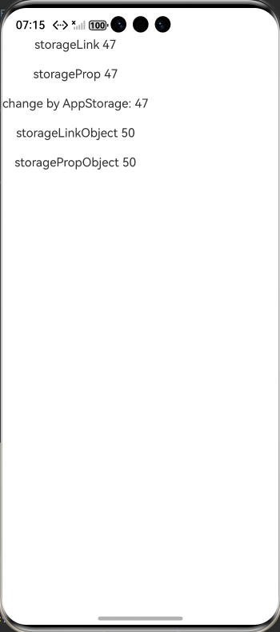
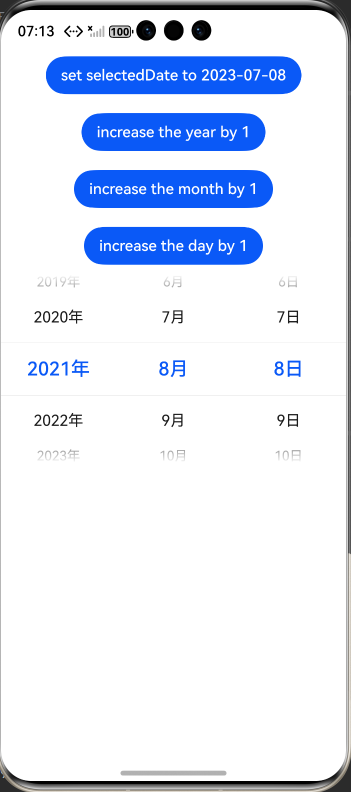

# arkts-appstorage

## 介绍

AppStorage是在应用启动时创建的单例，用于提供应用状态数据的中心存储。这些状态数据在应用级别可访问。AppStorage在应用运行过程中保留其属性。

AppStorage中保存的属性通过唯一的字符串类型属性名（key）访问，该属性可以和UI组件同步，且可以在应用业务逻辑中被访问。

AppStorage支持应用的主线程内多个UIAbility实例间的UI状态数据共享。

AppStorage中的属性通过唯一的字符串类型key值访问，支持与UI组件同步，并可在应用业务逻辑中被访问。其支持应用的主线程内多个UIAbility实例间的UI状态数据共享。

[AppStorage：应用全局的UI状态存储](https://gitcode.com/openharmony/docs/blob/master/zh-cn/application-dev/ui/state-management/arkts-appstorage.md)。

## 效果预览

| 首页                                                 | CustomDialogController_CAPI页面                       | OpenCustomDialog_CAPI页面                            |
|----------------------------------------------------|-----------------------------------------------------|----------------------------------------------------|
|  |  |  |

## 使用说明

1. 安装编译生成的hap包，并打开应用；
2. 首页面会出现页面列表，点击此列表项进入对应页面示例界面；

## 工程目录

```
PersistentStorage
entry
└──  src
    ├── main
    │   ├── ets
    │   │   ├── entryability
    │   │   │   └── EntryAbility.ets
    │   │   ├── entrybackupability
    │   │   │   └── EntryBackupAbility.ets
    │   │   └── pages
    │   │       ├── Index.ets
    │   │       ├── PageEight.ets //示例8：emit接口不支持在Previewer预览器中使用
    │   │       ├── PageFive.ets //示例5：装饰Map类型变量
    │   │       ├── PageFour.ets //示例4：装饰Date类型变量
    │   │       ├── PageNine.ets //示例9：三元表达式使用
    │   │       ├── PageOne.ets  //示例1：从应用逻辑使用AppStorage和LocalStorage
    │   │       ├── PageSeven.ets //示例7：不建议借助@StorageLink的双向同步机制实现事件通知
    │   │       ├── PageSix.ets  //示例6：装饰Set类型变量
    │   │       ├── PageTen.ets  //示例10：@StorageProp和AppStorage接口配合使用时，需要注意更新规则
    │   │       ├── PageThree.ets //示例3：AppStorage支持联合类型
    │   │       └── PageTwo.ets  //示例2：从UI内部使用AppStorage
    │   ├── module.json5
    │   └── resources
    │       ├── base
    │       │   ├── element
    │       │   │   ├── color.json
    │       │   │   ├── float.json
    │       │   │   └── string.json
    │       │   ├── media
    │       │   │   ├── background.png
    │       │   │   ├── foreground.png
    │       │   │   ├── layered_image.json
    │       │   │   └── startIcon.png
    │       │   └── profile
    │       │       ├── backup_config.json
    │       │       └── main_pages.json
    │       ├── dark
    │       │   └── element
    │       │       └── color.json
    │       └── rawfile
    ├── mock
    │   └── mock-config.json5
    ├── ohosTest
    │   ├── ets
    │   │   └── test
    │   │       ├── Ability.test.ets
    │   │       ├── Index.test.ets
    │   │       └── List.test.ets
    │   └── module.json5
    │   └── ohosTest.md
    └── test
        ├── List.test.ets
        └── LocalUnit.test.ets
```
## 具体实现

1. AppStorage 基础初始化与数据操作实现：通过AppStorage.setOrCreate('propA', 47)初始化全局状态（键propA，值 47），支持跨主线程内多个 UIAbility 共享；通过AppStorage.get<number>('propA')获取值，AppStorage.set('propA', 100)修改值，且操作仅作用于运行内存，应用重启后未持久化的数据会丢失。
2. @StorageProp 单向同步实现：组件内用@StorageProp('propA') storageProp: number = 1绑定 AppStorage 的propA，本地可修改（如this.storageProp += 1）但不回传 AppStorage；当 AppStorage 中propA更新（如AppStorage.set('propA', 100)），storageProp会被覆盖并触发组件刷新，且禁止从父组件初始化该变量。
3. @StorageLink 双向同步实现：组件内用@StorageLink('propA') storageLink: number = 1绑定 AppStorage 的propA，本地修改（如this.storageLink += 1）会同步回 AppStorage；AppStorage 中propA更新时，所有绑定该键的@StorageLink和@StorageProp变量均会同步刷新，支持初始化子组件的@State/@Prop等状态。
4. 联合类型（含 null/undefined）同步实现：API 12 + 支持@StorageLink('linkA') linkA: number | null = null或@StorageProp('propB') propB: number | undefined = undefined；点击文本可切换值（如this.linkA ? this.linkA = null : this.linkA = 1），值变化会同步（双向 / 单向）至 AppStorage，UI 实时展示当前类型值。
5. Date 类型同步实现：API 12 + 支持@StorageLink('date') selectedDate: Date = new Date('2021-08-08')；通过this.selectedDate.setFullYear(this.selectedDate.getFullYear() + 1)修改日期属性，或AppStorage.setOrCreate('date', new Date('2023-07-08'))直接更新 AppStorage，两者均能触发DatePicker组件 UI 刷新。
6. Map 类型同步实现：API 12 + 支持@StorageLink('map') message: Map<number, string> = new Map([[0, 'a']])；通过this.message.set(4, 'd')（添加键值对）、this.message.clear()（清空）、AppStorage.get<Map<number, string>>('map')?.delete(0)（删除键）修改 Map，用ForEach(Array.from(this.message.entries()), ...)遍历展示，修改同步触发 UI 更新。
7. Set 类型同步实现：API 12 + 支持@StorageLink('set') memberSet: Set<number> = new Set([0,1,2])；通过this.memberSet.add(5)（新增元素）、this.memberSet.delete(0)（删除元素）、AppStorage.get<Set<number>>('set')?.clear()（清空）修改 Set，遍历Array.from(this.memberSet.entries())展示，修改同步至 AppStorage 并刷新 UI。
8. 与 LocalStorage 隔离使用实现：创建let storage: LocalStorage = new LocalStorage()实例，用storage.setOrCreate('propA', 17)初始化；AppStorage 与 LocalStorage 同名键（如propA）相互独立，AppStorage.get('propA')返回 47，storage.get('propA')返回 17，修改各自存储的值不影响对方。
9. 避免 @StorageLink 事件通知性能问题实现：不使用@StorageLink双向同步传递事件（避免多组件不必要刷新），改用emitter接口；通过emitter.on(innerEvent, data => {...})订阅事件，emitter.emit(innerEvent, eventData)发送事件，仅目标组件接收回调，减少 UI 刷新开销（如 Gallery 图片选中态切换场景）。
10. @StorageProp 与 AppStorage 同步一致性实现：若本地修改@StorageProp（如this.propA = true）后，用AppStorage.setOrCreate('propA', false)更新时，因 AppStorage 原值与新值相同，不会触发@StorageProp刷新；需改为@StorageLink（本地修改同步回 AppStorage），或直接通过AppStorage.setOrCreate('propA', true)修改，确保两者值一致。

## 相关权限

不涉及

## 依赖

不涉及

## 约束和限制

1. 本示例支持标准系统上运行，支持设备：RK3568等;

2. 本示例支持API20版本SDK，版本号：6.0.0.36;

3. 本示例已支持使DevEco Studio 6.0.0.848 (构建版本：6.0.0.848，构建 2025年10月17日)编译运行

## 下载

如需单独下载本工程，执行如下命令：

```
git init
git config core.sparsecheckout true
echo code/DocsSample/ArkUISample/AppStorage > .git/info/sparse-checkout
git remote add origin https://gitcode.com/openharmony/applications_app_samples.git
git pull origin master
```
