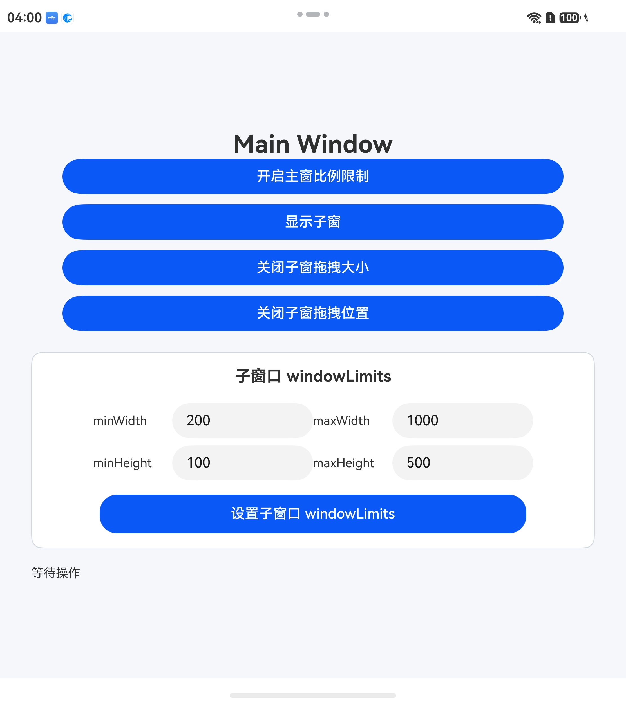
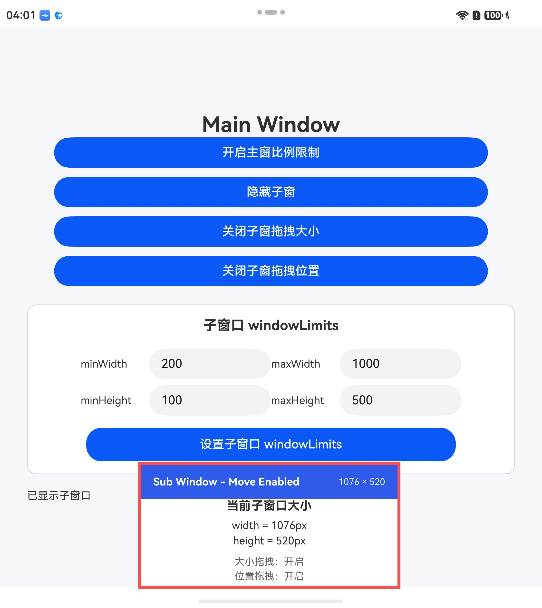
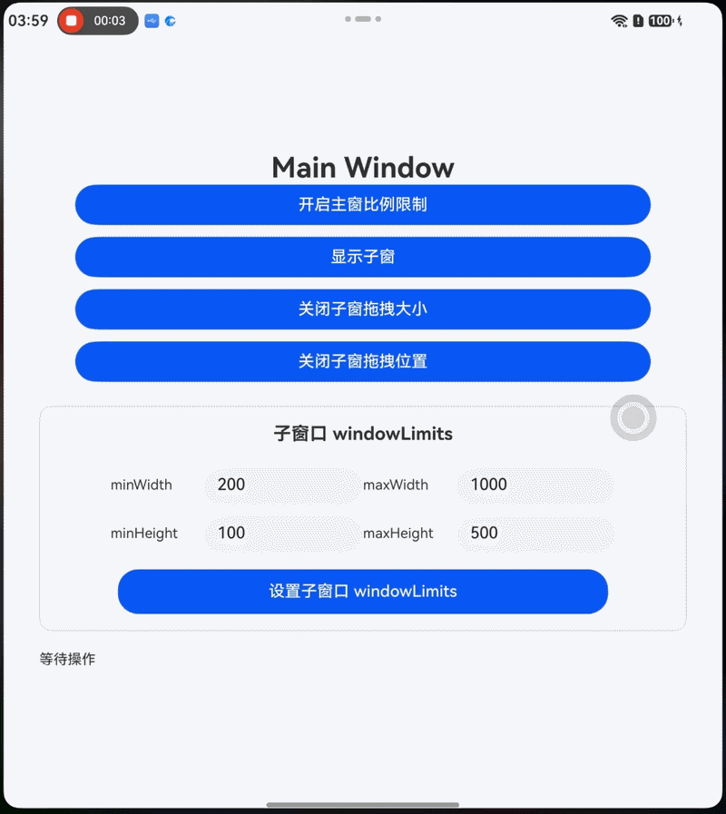

# AdjustLayout简介

### 介绍

在多窗口场景下，开发者需要对主窗口和子窗口进行灵活的布局调整。本示例演示了如何对主窗口设置宽高比例限制，以及如何创建并管理子窗口，包括子窗口的显示/隐藏、拖拽大小、拖拽位置、设置窗口尺寸限制等功能。通过本示例，开发者可以掌握窗口布局调整的核心API使用方法。

### 效果预览

| 主窗口                                   | 子窗口                                   | 交互效果                                   |
|----------------------------------------|----------------------------------------|----------------------------------------|
|  |  |  |

### 使用说明

1. 启动应用后，会显示主窗口,同时创建子窗口
2. 点击"开启主窗比例限制"按钮，主窗口将保持固定的宽高比例（1.5）
3. 点击"显示子窗/隐藏子窗"按钮，可以控制子窗口的显示和隐藏
4. 点击"开启子窗拖拽大小/关闭子窗拖拽大小"按钮，可以控制子窗口是否允许拖拽调整大小
5. 点击"开启子窗拖拽位置/关闭子窗拖拽位置"按钮，可以控制子窗口是否允许拖拽移动位置
6. 在输入框中设置子窗口的 minWidth、maxWidth、minHeight、maxHeight，点击"设置子窗口 windowLimits"按钮应用尺寸限制

### 工程目录

```
entry/src/main/ets/
|---main
|   |---ets
|   |   |---entryability
|   |   |   |---EntryAbility.ets           // 创建主窗口和子窗口，设置窗口属性
|   |   |---entrybackupability
|   |   |---pages
|   |   |   |---Index.ets                  // 主窗口页面，提供窗口控制功能
|   |   |   |---SubWindowPage.ets          // 子窗口页面，显示窗口状态信息
|   |---resources
|   |---module.json5                       
|---ohosTest
|   |---ets 
|   |   |---test
|   |   |   |---Ability.test.ets           // 自动化测试代码
|   |   |   |---List.test.ets              // 测试套件入口
```

### 具体实现

窗口布局调整的方法在EntryAbility和Index中实现，源码参考：[EntryAbility.ets](https://gitcode.com/openharmony/applications_app_samples/blob/master/code/DocsSample/ArkUISample/ArkUIWindowSamples/AdjustLayout/entry/src/main/ets/entryability/EntryAbility.ets)

**EntryAbility.ets**
- 使用 `getMainWindowSync` 获取应用主窗口
- 使用 `setWindowLimits` 设置主窗口的最小/最大宽高限制
- 使用 `windowStage.createSubWindow` 创建子窗口
- 使用 `resizeAsync` 和 `moveWindowToAsync` 设置子窗口初始尺寸和位置
- 使用 `enableDrag` 设置子窗口是否可拖拽
- 注册 `windowRectChange` 监听窗口尺寸变化

**Index.ets**
- 使用 `setContentAspectRatio` 设置主窗口的宽高比例限制
- 使用 `resetAspectRatio` 取消宽高比例限制
- 使用 `showWindow` 和 `minimize` 控制子窗口显示/隐藏
- 使用 `setWindowLimits` 设置子窗口的尺寸限制
- 使用 `startMoving` 启动子窗口的拖拽移动

**SubWindowPage.ets**
- 显示当前子窗口的尺寸信息
- 根据窗口尺寸动态切换布局样式（Compact Layout）
- 处理子窗口标题栏的拖拽移动事件

### 相关权限

不涉及

### 依赖

不涉及

### 约束与限制

1.本示例仅支持标准系统上运行, 支持设备：华为手机、平板、2in1。

2.本示例为Stage模型，支持API Version 23及以上版本SDK。

3.本示例需要使用DevEco Studio 6.0.0 Release及以上版本才可编译运行。

### 下载

如需单独下载本工程，执行如下命令：

```
git init
git config core.sparsecheckout true
echo code/DocsSample/ArkUISample/ArkUIWindowSamples/AdjustLayout > .git/info/sparse-checkout
git remote add origin https://gitcode.com/openharmony/applications_app_samples.git
git pull origin master
```