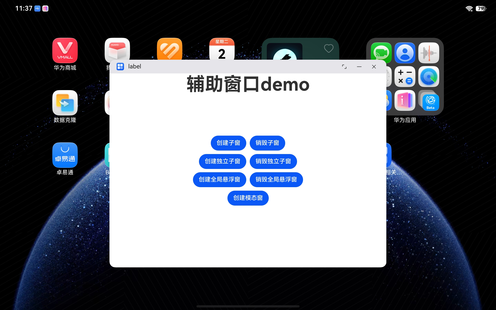
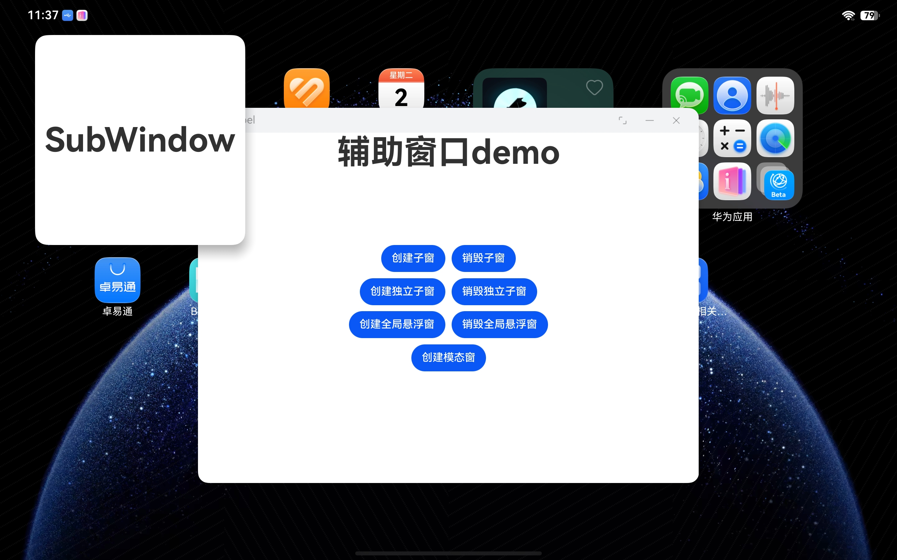
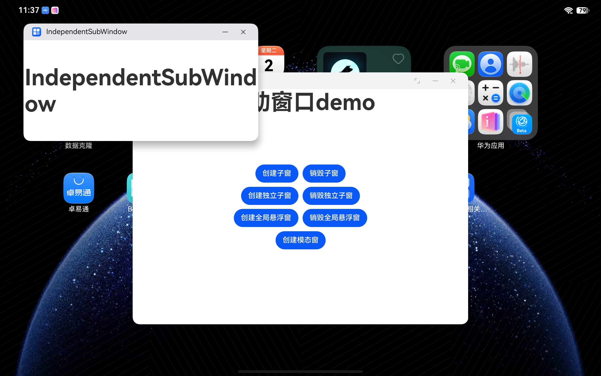
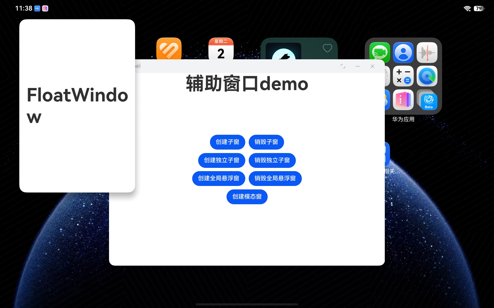
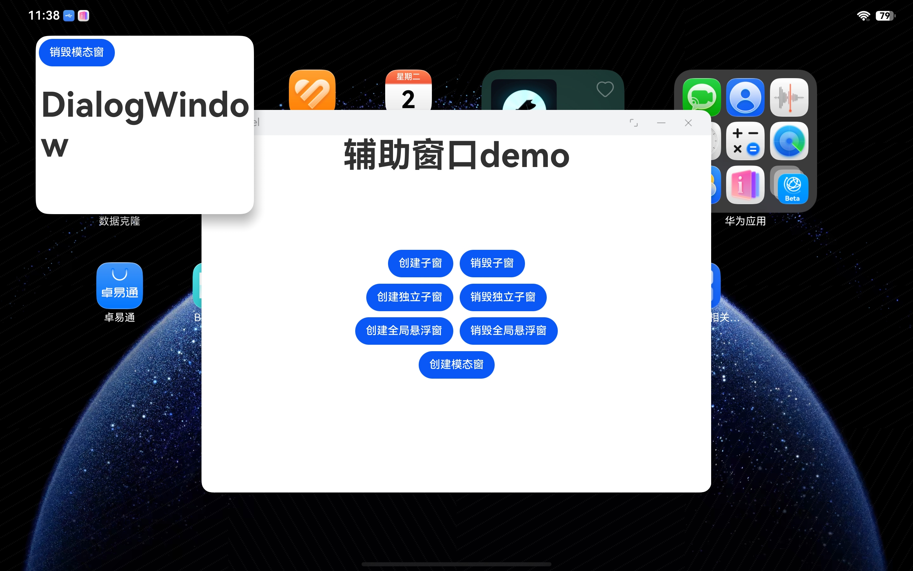

# AuxiliaryWindowSample简介

### 介绍

辅助创建由应用自行管理创建和销毁，不会在“任务管理界面”中以一个独立的任务卡片显示。包括子窗口、全局悬浮窗和模态窗口等。

### 效果预览

| 主窗口 | 子窗口 | 独立子窗口 | 全局悬浮窗 | 模态窗 |
|---|---|---|---|---|
|  |  |  |  |  |

### 使用说明

1. 调用接口创建辅助窗口。
2. 辅助窗口创建成功后，可以改变其大小、位置等，还可以根据应用需要设置窗口背景色、亮度等属性。
3. 通过setUIContent接口为辅助窗口加载对应的页面，showWindow接口显示辅助窗口。
4. 通过destroyWindow接口销毁辅助窗口。

### 工程目录

```
entry/src/main/ets/
|---main
|   |---ets
|   |   |---entryability
|   |   |   |---EntryAbility.ets           // 创建主窗口
|   |   |---entrybackupability
|   |   |---pages
|   |   |   |---Index.ets                  // 主窗口页面
|   |   |   |---SubWindow.ets              // 子窗口页面
|   |   |   |---IndependentSubWindow.ets   // 独立子窗口页面
|   |   |   |---FloatWindow.ets            // 全局悬浮窗页面
|   |   |   |---DialogWindow.ets           // 模态窗口页面
|   |---resources
|   |---module.json5        
|---ohosTest
|   |---ets 
|   |   |---test
|   |   |   |---Ability.test.ets           // 自动化测试代码               
```

### 具体实现

创建辅助窗的方法在Index中实现，包括子窗口、全局悬浮窗和模态窗口的创建和销毁，源码参考：[Index.ets](https://gitcode.com/openharmony/applications_app_samples/blob/master/code/DocsSample/ArkUISample/ArkUIWindowSamples/AuxiliaryWindowSample/entry/src/main/ets/pages/Index.ets)，下面以全局悬浮窗的创建为例：

- 通过window.createWindow接口创建全局悬浮窗类型的窗口；
- 全局悬浮窗窗口创建成功后，设置大小、位置等相关属性；
- 通过setUIContent和showWindow接口加载显示全局悬浮窗的具体内容；
- 当不再需要全局悬浮窗时，使用destroyWindow接口销毁全局悬浮窗。

### 相关权限

创建WindowType.TYPE_FLOAT即全局悬浮窗，需要申请ohos.permission.SYSTEM_FLOAT_WINDOW权限，仅符合指定场景的PC/2in1设备应用可申请该权限。申请方式请参考：[申请使用受限权限](https://developer.huawei.com/consumer/cn/doc/harmonyos-guides/declare-permissions-in-acl)

### 依赖

不涉及

### 约束与限制

1.本示例仅支持标准系统上运行，支持设备：2in1。

2.本示例为Stage模型，支持API Version 26.0.0及以上版本SDK。

3.本示例需要使用DevEco Studio 26.0.0 Canary及以上版本才可编译运行。

### 下载

如需单独下载本工程，执行如下命令：

```
git init
git config core.sparsecheckout true
echo code/DocsSample/ArkUISample/ArkUIWindowSamples/AuxiliaryWindowSample > .git/info/sparse-checkout
git remote add origin https://gitcode.com/openharmony/applications_app_samples.git
git pull origin master
```