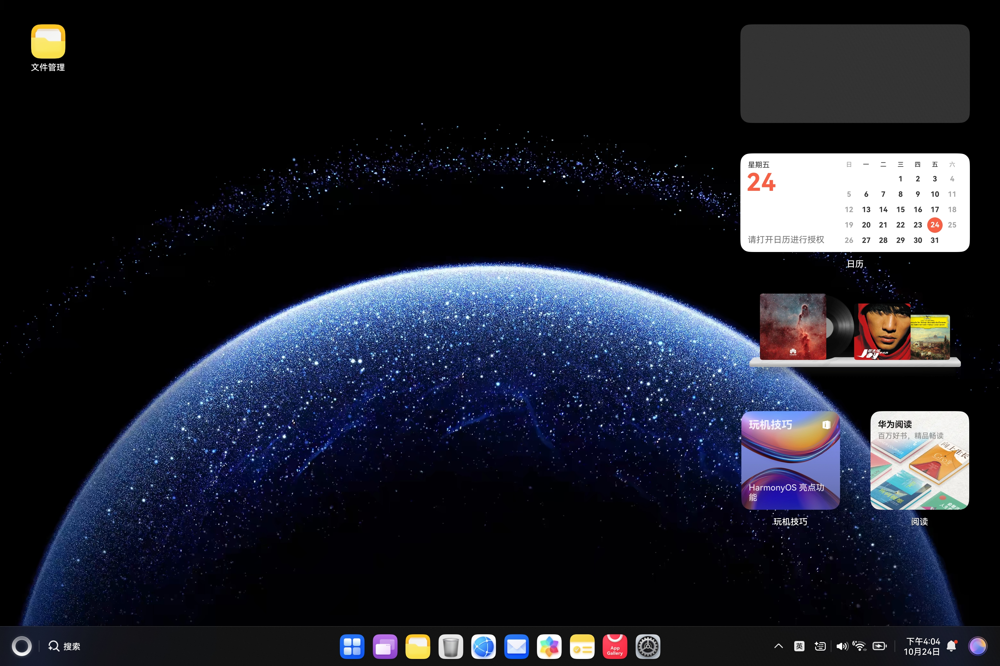
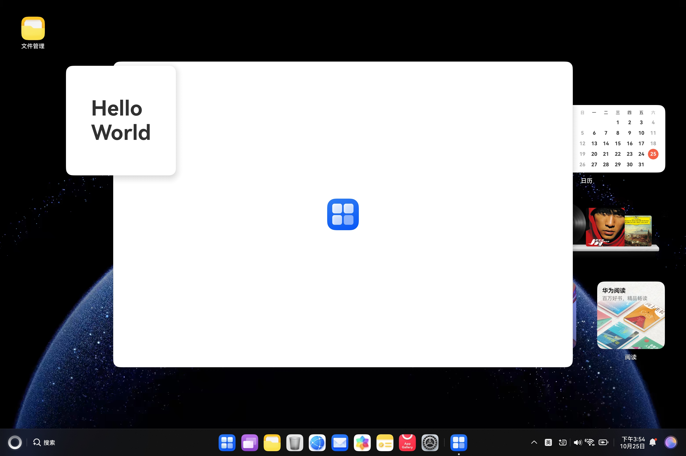
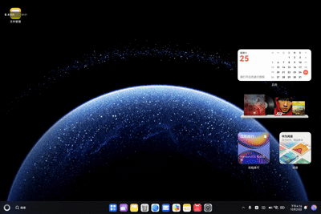

# CreateFloatWindow简介

### 介绍

全局悬浮窗可以在已有的任务基础上，创建一个始终在前台显示的窗口。即使创建全局悬浮窗的任务退至后台，全局悬浮窗仍然可以在前台显示。通常全局悬浮窗位于所有应用窗口之上，开发者可以创建全局悬浮窗，并对全局悬浮窗进行属性设置等操作。

### 效果预览


| 桌面                                     | 全局悬浮窗                                  | 交互                                     |
|----------------------------------------|----------------------------------------|----------------------------------------|
|  |  |  |



### 使用说明

1. 使用时先注释destroyWindow方法
2. 编译运行生成全局悬浮窗 
3. 点击全局悬浮窗Hello World进行交互

### 工程目录

```
entry/src/main/ets/
|---main
|   |---ets
|   |   |---entryability
|   |   |   |---EntryAbility.ets           // 创建全局悬浮窗
|   |   |---entrybackupability
|   |   |---pages
|   |   |   |---Index.ets                  // 悬浮窗页面
|   |---resources
|   |---module.json5                       
|---ohosTest
|   |---ets 
|   |   |---test
|   |   |   |---Ability.test.ets           // 自动化测试代码
```

### 具体实现

创建全局悬浮窗的方法在EntryAbility中实现，源码参考：[EntryAbility.ets](https://gitcode.com/openharmony/applications_app_samples/blob/master/code/DocsSample/ArkUISample/ArkUIWindowSamples/CreateFloatWindow/entry/src/main/ets/entryability/EntryAbility.ets)

- 通过window.createWindow接口创建全局悬浮窗类型的窗口；
- 全局悬浮窗窗口创建成功后，设置大小、位置等相关属性；
- 通过setUIContent和showWindow接口加载显示全局悬浮窗的具体内容；
- 当不再需要全局悬浮窗时，使用destroyWindow接口销毁全局悬浮窗。

目标页面在Index中实现，源码参考：[Index.ets](https://gitcode.com/openharmony/applications_app_samples/blob/master/code/DocsSample/ArkUISample/ArkUIWindowSamples/CreateFloatWindow/entry/src/main/ets/pages/Index.ets)

### 相关权限

创建WindowType.TYPE_FLOAT即全局悬浮窗类型的窗口，需要申请ohos.permission.SYSTEM_FLOAT_WINDOW权限，该权限为受控开放权限，仅符合指定场景的在2in1设备上的应用可申请该权限。申请方式请参考：[申请使用受限权限](https://developer.huawei.com/consumer/cn/doc/harmonyos-guides/declare-permissions-in-acl)

### 依赖

不涉及

### 约束与限制

1.本示例仅支持标准系统上运行, 支持设备：2in1。

2.本示例为Stage模型，支持API Version 20及以上版本SDK。

3.本示例需要使用DevEco Studio 5.0.5 Release及以上版本才可编译运行。

### 下载

如需单独下载本工程，执行如下命令：

```
git init
git config core.sparsecheckout true
echo code/DocsSample/ArkUISample/ArkUIWindowSamples/CreateFloatWindow > .git/info/sparse-checkout
git remote add origin https://gitcode.com/openharmony/applications_app_samples.git
git pull origin master
```