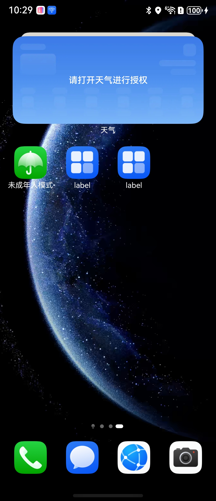

# CreateMainWindow简介

### 介绍

在Stage模型下，应用主窗口由UIAbility创建并维护生命周期。在UIAbility的onWindowStageCreate回调中，通过WindowStage获取应用主窗口，即可对其进行属性设置等操作。

### 效果预览

| 桌面                                     | 主窗口                                    | 交互                                     |
|----------------------------------------|----------------------------------------|----------------------------------------|
|  |  |  |

### 使用说明

1. 通过getMainWindow接口获取应用主窗口。
2. 可设置主窗口的背景色、亮度值、是否可触等多个属性，开发者可根据需要选择对应的接口。
3. 通过loadContent接口加载主窗口的目标页面。

### 工程目录

```
entry/src/main/ets/
|---main
|   |---ets
|   |   |---entryability
|   |   |   |---EntryAbility.ets           // 创建主窗口
|   |   |---entrybackupability
|   |   |---pages
|   |   |   |---Index.ets                  // 主窗口页面
|   |---resources
|   |---module.json5                       
|---ohosTest
|   |---ets 
|   |   |---test
|   |   |   |---Ability.test.ets           // 自动化测试代码
```

### 具体实现

创建主窗口的方法在EntryAbility中实现，源码参考：[EntryAbility.ets](https://gitcode.com/openharmony/applications_app_samples/blob/master/code/DocsSample/ArkUISample/ArkUIWindowSamples/CreateMainWindow/entry/src/main/ets/entryability/EntryAbility.ets)

- 使用getMainWindow获取应用主窗口
- 使用setWindowTouchable设置主窗口属性
- 使用loadContent加载对应的目标页面

目标页面在Index中实现，源码参考：[Index.ets](https://gitcode.com/openharmony/applications_app_samples/blob/master/code/DocsSample/ArkUISample/ArkUIWindowSamples/CreateMainWindow/entry/src/main/ets/pages/Index.ets)


### 相关权限

不涉及

### 依赖

不涉及

### 约束与限制

不涉及

### 下载

如需单独下载本工程，执行如下命令：

```
git init
git config core.sparsecheckout true
echo code/DocsSample/ArkUISample/ArkUIWindowSamples/CreateMainWindow > .git/info/sparse-checkout
git remote add origin https://gitcode.com/openharmony/applications_app_samples.git
git pull origin master
```