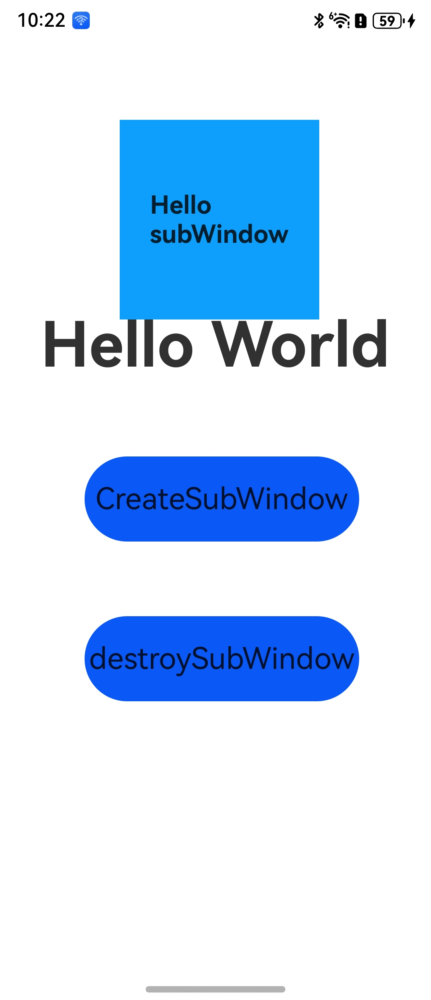

# CreateSubWindow2简介

### 介绍

创建应用子窗口是通过createSubWindow接口实现。子窗口创建成功后，可以改变其大小、位置等，还可以根据应用需要设置窗口背景色、亮度等属性。

### 效果预览

| 桌面 |主窗口|子窗口|
|---------------------------------------|--------------------------------|--------------------------------|
||||

### 使用说明

1. 通过CreateSubWind接口创建子窗口。
2. 子窗口创建成功后，可以改变其大小、位置等，还可以根据应用需要设置窗口背景色、亮度等属性。
3. 通过setUIContent接口为子窗口加载对应的页面，showWindow接口显示子窗口。
4. 通过destroyWindow接口销毁子窗。

### 工程目录

```
entry/src/main/ets/
|---main
|   |---ets
|   |   |---entryability
|   |   |   |---EntryAbility.ets           // 创建主窗口
|   |   |---entrybackupability
|   |   |---pages
|   |   |   |---Index.ets                  // 主窗口页面
|   |   |   |---SubWindow.ets              // 子窗口页面
|   |---resources
|   |---module.json5                       
|---ohosTest
|   |---ets 
|   |   |---test
|   |   |   |---Ability.test.ets           // 自动化测试代码
```
### 具体实现

创建子窗口的方法在Index中实现，源码参考：[Index.ets](https://gitcode.com/openharmony/applications_app_samples/blob/master/code/DocsSample/ArkUISample/ArkUIWindowSamples/CreateSubWindow2/entry/src/main/ets/pages/Index.ets)

- 使用createSubWindow创建应用子窗口；
- 使用moveWindowTo设置子窗口的位置、大小及相关属性等；
- 使用setUIContent为子窗口加载对应的页面；
- 使用showWindow方法显示子窗口
- 当不再需要子窗口时，可使用destroy对其进行销毁。

子窗口加载的页面在SubWindow中实现，源码参考：[SubWindow.ets](https://gitcode.com/openharmony/applications_app_samples/blob/master/code/DocsSample/ArkUISample/ArkUIWindowSamples/CreateSubWindow2/entry/src/main/ets/pages/Index.ets)

### 相关权限

不涉及

### 依赖

不涉及

### 约束与限制

1.本示例仅支持标准系统上运行, 支持设备：华为手机、平板。

2.本示例为Stage模型，支持API Version 17及以上版本SDK。

3.本示例需要使用DevEco Studio 5.0.5 Release及以上版本才可编译运行。

### 下载

如需单独下载本工程，执行如下命令：

```
git init
git config core.sparsecheckout true
echo code/DocsSample/ArkUISample/ArkUIWindowSamples/CreateSubWindow2 > .git/info/sparse-checkout
git remote add origin https://gitcode.com/openharmony/applications_app_samples.git
git pull origin master
```