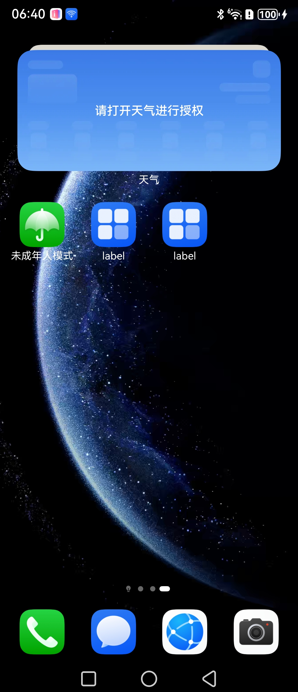

# ListenWindowStage简介

### 介绍

应用在前台显示过程中可能会进入某些不可交互的场景，对于一些应用可能需要选择暂停某个与用户正在交互的业务。当该应用从多任务又切回前台时，又变成了可交互的状态，此时需要恢复被暂停中断的业务。

### 效果预览

| 桌面                                     | 主窗口                                    | 交互                                     |
|----------------------------------------|----------------------------------------|----------------------------------------|
|  |  |  |

### 使用说明

1. 通过loadContent接口加载主窗口的目标页面。
2. 与页面进行交互

### 工程目录


```
entry/src/main/ets/
|---main
|   |---ets
|   |   |---entryability
|   |   |   |---EntryAbility.ets           // 创建主窗口
|   |   |---entrybackupability
|   |   |---pages
|   |   |   |---Index.ets                  // 主窗口页面
|   |---resources
|   |---module.json5                       
|---ohosTest
|   |---ets 
|   |   |---test
|   |   |   |---Ability.test.ets           // 自动化测试代码
```

### 相关权限

不涉及

### 依赖

不涉及

### 约束与限制

### 下载

如需单独下载本工程，执行如下命令：

```
git init
git config core.sparsecheckout true
echo code/DocsSample/ArkUISample/ArkUIWindowSamples/ListenWindowStage > .git/info/sparse-checkout
git remote add origin https://gitcode.com/openharmony/applications_app_samples.git
git pull origin master
```