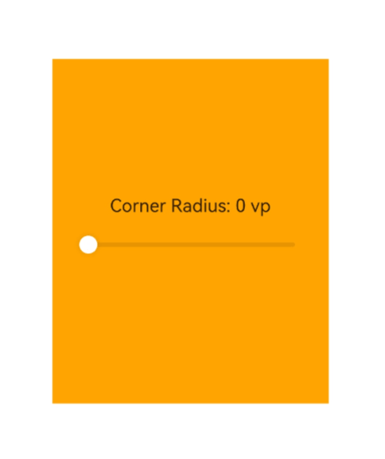

# 设置窗口圆角

### 介绍

本示例演示在Stage模型下设置全局悬浮窗的窗口圆角半径。应用启动后创建全局悬浮窗，拖动滑块可动态调整窗口圆角效果。

### 效果预览

| 设置窗口圆角 |
|---|
|  |

### 使用说明

1. 安装并打开应用，应用会创建全局悬浮窗。
2. 拖动“Corner Radius”滑块，调整窗口的圆角半径。
3. 观察全局悬浮窗圆角效果的变化。

### 工程目录

```
WindowCornerRadiusSample
|---entry/src/main/ets
|   |---entryability
|   |   |---EntryAbility.ets              // 创建全局悬浮窗并加载示例页面
|   |---pages
|   |   |---Index.ets                     // 主窗口页面
|   |   |---Page1.ets                     // 圆角半径控制页面
|---screenshots
|   |---windowCornerRadius.gif           // 效果预览图
```

### 具体实现

窗口创建在[EntryAbility.ets](entry/src/main/ets/entryability/EntryAbility.ets)中实现：

- 通过`window.createWindow()`创建`WindowType.TYPE_FLOAT`类型窗口。
- 通过`AppStorage.setOrCreate()`保存窗口对象，供页面设置圆角半径时使用。
- 通过`setUIContent()`加载[Page1.ets](entry/src/main/ets/pages/Page1.ets)。
- 通过`moveWindowTo()`、`resize()`和`showWindow()`设置并显示窗口。

窗口圆角半径在[Page1.ets](entry/src/main/ets/pages/Page1.ets)中实现：

- 通过`AppStorage.get()`获取全局悬浮窗对象。
- 通过`setWindowCornerRadius()`设置窗口的圆角半径。

### 相关权限

| 权限名 | 权限说明 | 级别 |
|---|---|---|
| ohos.permission.SYSTEM_FLOAT_WINDOW | 允许应用使用悬浮窗的能力 | system_basic |

### 依赖

不涉及。

### 约束与限制

1. 本示例仅支持标准系统上运行，工程配置支持设备：default、tablet。
2. 本示例为Stage模型，支持API Version 23及以上版本SDK。
3. 本示例需要使用DevEco Studio 6.0.0 Release及以上版本才可编译运行。
4. 本示例所配置的权限`ohos.permission.SYSTEM_FLOAT_WINDOW`为system_basic级别，需要配置系统应用签名，可参考[特殊权限配置方法](https://gitcode.com/openharmony/docs/blob/master/zh-cn/device-dev/subsystems/subsys-app-privilege-config-guide.md)。

### 下载

如需单独下载本工程，执行如下命令：

```
git init
git config core.sparsecheckout true
echo code/DocsSample/ArkUISample/ArkUIWindowSamples/WindowCornerRadiusSample/ > .git/info/sparse-checkout
git remote add origin https://gitcode.com/openharmony/applications_app_samples.git
git pull origin master
```
