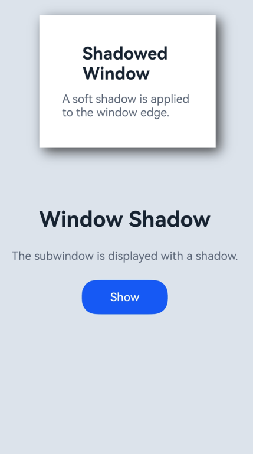

# 设置窗口阴影

### 介绍

本示例演示在Stage模型下设置应用子窗口的窗口边缘阴影效果。应用启动后点击按钮创建应用子窗口，并为子窗口设置阴影样式。

### 效果预览

| 设置窗口阴影 |
|---|
|  |

### 使用说明

1. 安装并打开应用。
2. 点击“Show”按钮，创建并显示带阴影效果的应用子窗口。
3. 观察子窗口边缘的阴影效果。

### 工程目录

```
WindowShadowSample
|---entry/src/main/ets
|   |---entryability
|   |   |---EntryAbility.ets              // 加载主窗口页面并保存WindowStage
|   |---pages
|   |   |---Index.ets                     // 创建应用子窗口并设置窗口阴影
|   |   |---SubWindow.ets                 // 应用子窗口内容页面
|---screenshots
|   |---windowShadow.png                 // 效果预览图
```

### 具体实现

主窗口页面加载在[EntryAbility.ets](entry/src/main/ets/entryability/EntryAbility.ets)中实现：

- 通过`onWindowStageCreate()`获取`WindowStage`。
- 通过`AppStorage.setOrCreate()`保存`WindowStage`，供页面创建子窗口时使用。
- 通过`loadContent()`加载[Index.ets](entry/src/main/ets/pages/Index.ets)。

窗口阴影效果在[Index.ets](entry/src/main/ets/pages/Index.ets)中实现：

- 通过`createSubWindow()`创建应用子窗口。
- 通过`moveWindowTo()`和`resize()`设置子窗口的位置和大小。
- 通过`setShadow()`设置窗口边缘阴影的模糊半径、颜色、X轴偏移量和Y轴偏移量。
- 通过`setUIContent()`加载[SubWindow.ets](entry/src/main/ets/pages/SubWindow.ets)。
- 通过`showWindow()`显示子窗口。

### 相关权限

不涉及。

### 依赖

不涉及。

### 约束与限制

1. 本示例仅支持标准系统上运行，工程配置支持设备：phone、tablet。
2. 本示例为Stage模型，支持API Version 23及以上版本SDK。
3. 本示例需要使用DevEco Studio 6.0.0 Release及以上版本才可编译运行。
4. `setShadow()`为系统接口，仅支持系统应用使用。

### 下载

如需单独下载本工程，执行如下命令：

```
git init
git config core.sparsecheckout true
echo code/DocsSample/ArkUISample/ArkUIWindowSamples/WindowShadowSample/ > .git/info/sparse-checkout
git remote add origin https://gitcode.com/openharmony/applications_app_samples.git
git pull origin master
```
