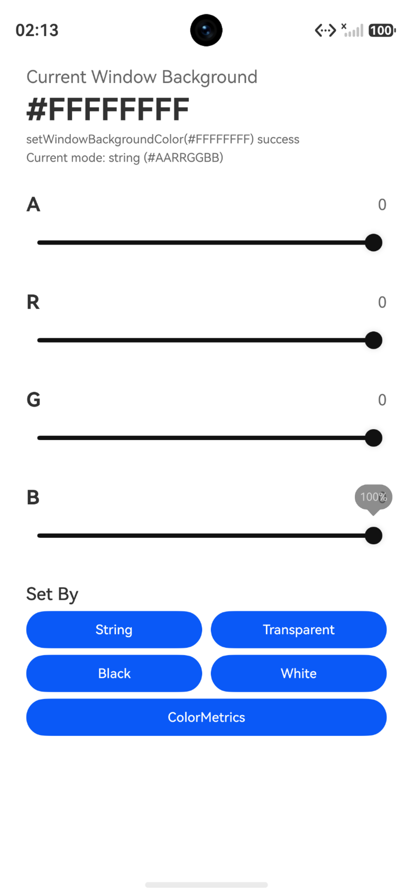

# backgroundColor简介

### 介绍

本示例演示在Stage模型下设置窗口背景色。应用启动后获取主窗口对象，并调用窗口背景色接口设置指定颜色。

### 效果预览



### 使用说明

1. 启动应用。
2. 应用在创建主窗口后获取Window对象。
3. 调用setWindowBackgroundColor接口设置窗口背景色。

### 工程目录

```
entry/src/main/ets/
|---entryability
|   |---EntryAbility.ets
|---entrybackupability
|---pages
|   |---Index.ets
```

### 具体实现

窗口背景色设置在EntryAbility中实现，源码参考：[EntryAbility.ets](entry/src/main/ets/entryability/EntryAbility.ets)。

目标页面在Index中实现，源码参考：[Index.ets](entry/src/main/ets/pages/Index.ets)。

### 相关权限

不涉及。

### 依赖

不涉及。

### 约束与限制

1. 本示例仅支持标准系统上运行。
2. 本示例为Stage模型。

### 下载

```
git init
git config core.sparsecheckout true
echo code/DocsSample/ArkUISample/ArkUIWindowSamples/backgroundColor > .git/info/sparse-checkout
git remote add origin https://gitcode.com/openharmony/applications_app_samples.git
git pull origin master
```
