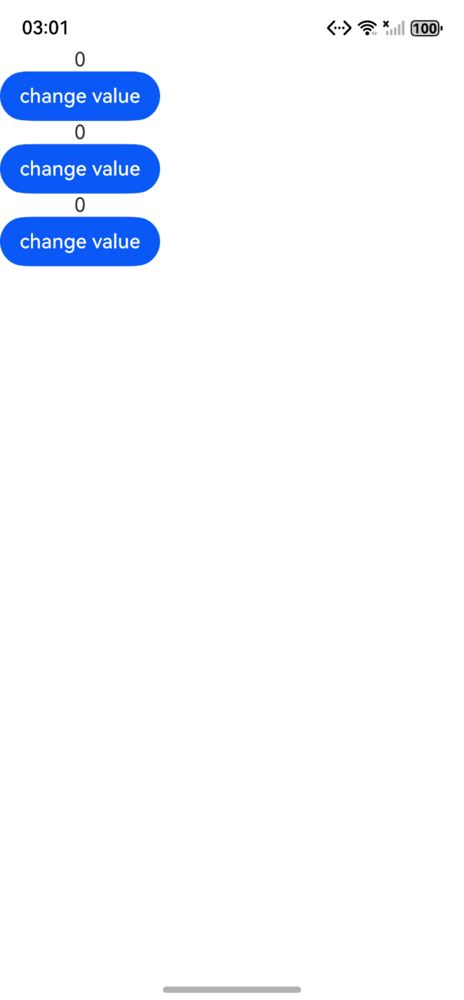
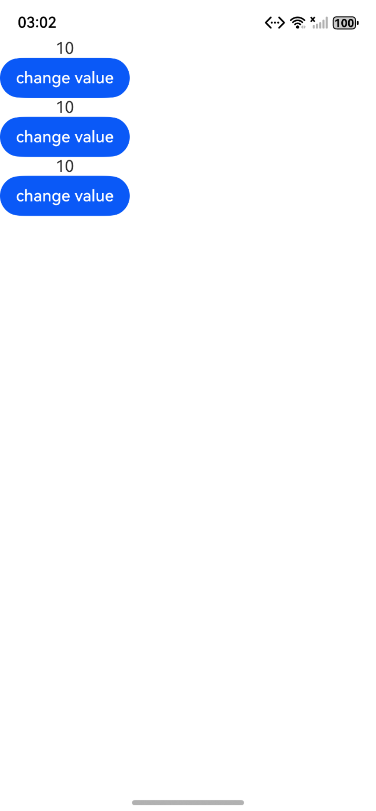
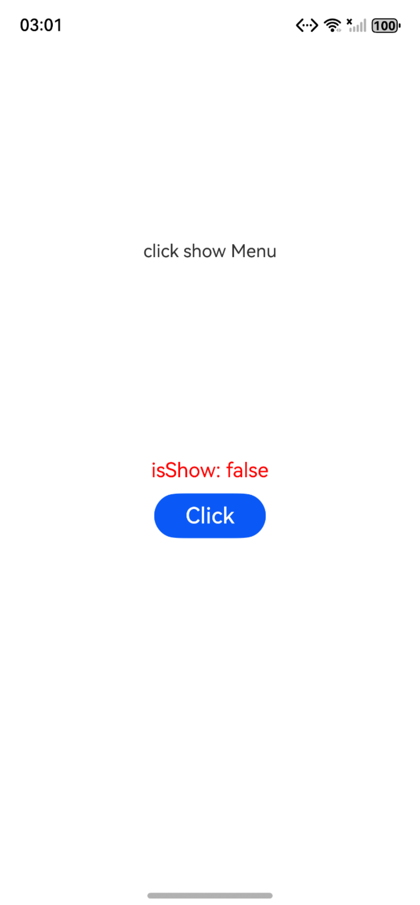
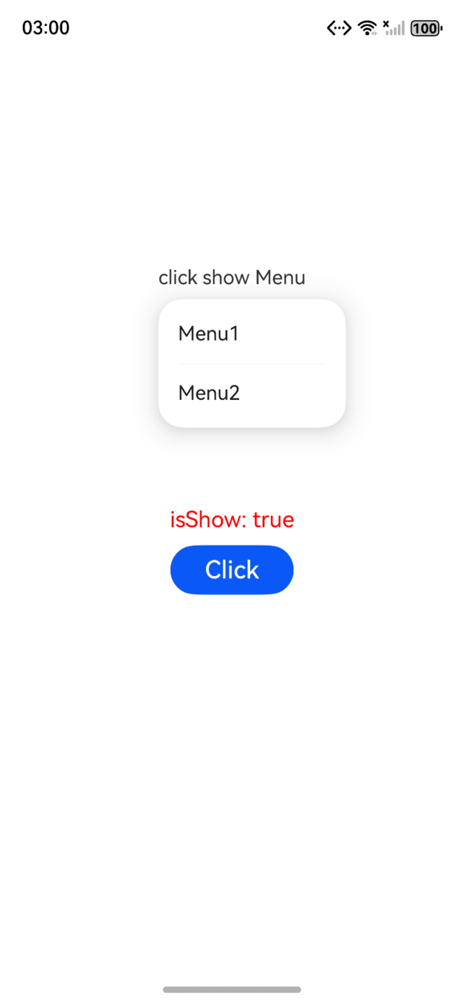

# !!语法：双向绑定

#### 概述

!!双向绑定语法，是一个语法糖方便开发者实现数据双向绑定，用于初始化子组件的@Param和@Event。其中@Event方法名需要声明为“$”+ @Param属性名，详见使用场景。

如果使用了!!双向绑定语法，表明父组件的变化会同步给子组件，子组件的变化也会同步给父组件。
父组件未使用!!时，变化是单向的。

#### 使用说明

在状态管理V1中，推荐使用$$实现系统组件的双向绑定。

在状态管理V2中，推荐使用!!语法糖统一处理双向绑定。

说明
!!语法从API version 12开始支持。

### 效果预览

| 自定义组件间双向绑定初始化页面       | 自定义组件间双向绑定数据变化页面          | 系统组件参数双向绑定初始化页面      | 系统组件参数双向绑定数据变化页面                      |
|--------------------------------|-----------------------------------|---------------------------------------|---------------------------------------|
|  |  |  |  |


### 工程目录

给出项目中关键的目录结构并描述它们的作用，示例如下：

```
entry/src/main/ets/
|---entryability
|   |---EntryAbility.ets                   // 主进程UIAbility
|---pages
|   |---index.ets                          // 应用首页
|   |---Binding_Star.ets                   // 自定义组件间双向绑定页面
|   |---Sys_Binding.ets                    // 系统组件参数双向绑定页面


```

### 具体实现
自定义组件间双向绑定

1. 在Index中构造Star子组件，双向绑定父子组件中的value，并初始化子组件的@Param value和@Event $value。 双向绑定语法糖。
2. 点击Index中的Button改变value值，父组件Index和子组件Star中的Text将同步更新。
3. 点击子组件Star中的Button，调用this.$value(10)方法，父组件Index和子组件Star中的Text将同步更新。

* 使用限制
* !!双向绑定语法不支持多层父子组件传递。
* 不支持与@Event混用。从API version 18开始，当使用!!双向绑定语法给子组件传递参数时，给对应的@Event方法传参会编译报错。
* 当使用3个或更多感叹号（!!!、!!!!、!!!!!等）时，不支持双向绑定功能。

系统组件参数双向绑定

1. bindMenu组件绑定this.isShow!!。
2. Button绑定点击事件变化isShow控制展示菜单


### 相关权限

不涉及。

### 依赖

不涉及。

### 约束与限制

1. 本示例是否支持取决于卡片使用方的实现(由于桌面差异仅支持特定操作系统)；
2. 本示例为Stage模型，支持API20版本及以上SDK，SDK版本号(API Version 20 Release),镜像版本号(6.0Release)；
3. 本示例需要使用DevEco Studio 版本号(6.0.0Release)版本才可编译运行；
4. 本示例不涉及系统接口。

### 下载

如需单独下载本工程，执行如下命令：

```
git init
git config core.sparsecheckout true
echo code\DocsSample\ArkUISample\ArkUI_Binding > .git/info/sparse-checkout
git remote add origin https://gitcode.com/openharmony/applications_app_samples.git
git pull origin master
```