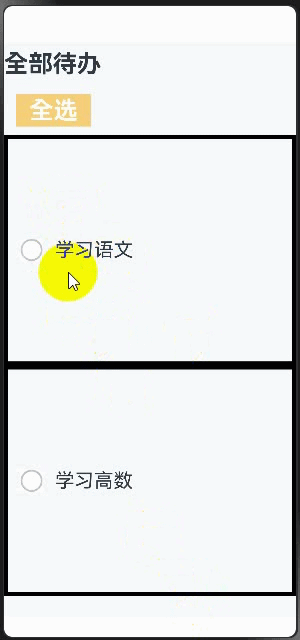
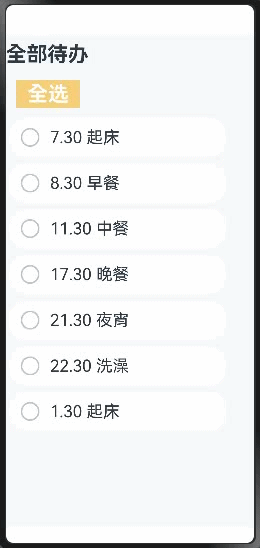
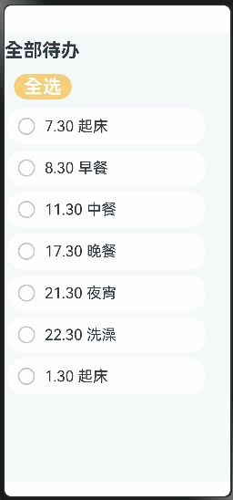
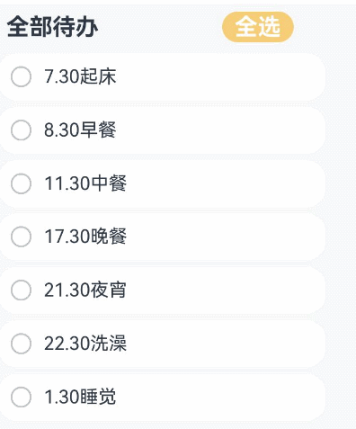

# MVVM模式（V1）

### 介绍

本示例展示了[MVVM模式](https://gitcode.com/openharmony/docs/blob/master/zh-cn/application-dev/ui/state-management/arkts-mvvm.md)的使用方法：

1. 当开发者掌握了状态管理的基本概念后，通常会尝试开发自己的应用，在应用开发初期，如果未能精心规划项目结构，随着项目扩展和复杂化，状态变量的增多将导致组件间关系变得错综复杂。此时，开发新功能可能引起连锁反应，维护成本也会增加。为此，本示例旨在示例MVVM模式以及ArkUI的UI开发模式与MVVM的关系，给开发者予以参考，以便在产品迭代和升级时，能更轻松的开发和维护。;
2. 在应用开发中，UI更新需要实时同步数据状态变化，这直接影响应用程序的性能和用户体验。为了解决数据与UI同步的复杂性，ArkUI采用了 Model-View-ViewModel（MVVM）架构模式。MVVM 将应用分为Model、View和ViewModel三个核心部分，实现数据、视图与逻辑的分离。通过这种模式，UI可以自动更新状态变化，从而更高效地管理数据和视图的绑定与更新。

### 效果展示

| @State实现备忘录演示                                | @Prop和@Link实现备忘录演示                           |
|-------------------------------------------|-------------------------------------------|
|    |       |
| ForEach实现备忘录演示                               | @Builder实现备忘录演示                              |
|  |  |
| Mvvm实现备忘录使用演示                             | 
|     |

### 使用说明

1. 必须搭配 @Param：仅能与 @Param 共同使用，不可单独使用或与@State、@Local 等其它装饰器搭配，且仅支持@ComponentV2组件（API 12+）。
2. 初始化仅同步一次：变量初始化时接收外部传入值，后续外部数据源变化时，子组件变量不再同步更新。
3. 允许本地修改：解除@Param默认“不可本地修改”的限制，修改后可触发UI刷新，且不影响外部数据源。

### 工程目录
```
entry/src/
├── main
│   ├── ets
│   │   ├── entryability
│   │   ├── entrybackupability
│   │   ├── model
│   │   │   ├── ThingModel.ets
│   │   │   └── TodoListModel.ets
│   │   ├── pages
│   │   │   ├── BuilderIndex.ets
│   │   │   ├── ForEachIndex.ets
│   │   │   ├── Index.ets
│   │   │   ├── PropLinkIndex.ets
│   │   │   └── StateIndex.ets
│   │   ├── viewModel
│   │   │   ├── ThingViewModel.ets
│   │   │   └── TodoListViewModel.ets
│   │   └── view
│   │   │   ├── AllChooseComponent.ets
│   │   │   ├── ThingComponent.ets
│   │   │   ├── TodoComponent.ets
│   │   │   └── TodoListComponent.ets
│   ├── module.json5
│   ├── syscap.json
│   └── resources
│   │   ├── base
│   │   ├── dark
│   │   └── rawfile
│   │       └── default_tasks.json
└── ohosTest
    └── ets
        └── test
            ├── Ability.test.ets  // 自动化测试代码
            └── List.test.ets    // 测试套执行列表

```

### 具体实现

1. 搭建MVVM项目目录（model、viewModel、views、pages），并在 resources下创建default_tasks.json存储初始待办数据。
2. 开发Model层：用ThingModel定义单条待办结构，TodoListModel实现从JSON读取数据的逻辑。
3. 开发ViewModel层：ThingViewModel封装单待办操作（切换状态、加后缀），TodoListViewModel处理列表逻辑（加载数据、全选）。
4. 开发View层：编写组件（标题、单待办、全选、列表），页面Index.ets组装组件并绑定ViewModel。
5. 测试应用，确认数据加载正常、交互（切换状态、全选）时UI与ViewModel数据双向同步。

### 相关权限

不涉及。

### 依赖

不涉及。

### 约束与限制

1.本示例已适配API version 20及以上版本SDK。

### 下载

如需单独下载本工程，执行如下命令：

```
git init
git config core.sparsecheckout true
echo code/DocsSample/ArkUISample/ArktsMvvmSample/ > .git/info/sparse-checkout
git remote add origin https://gitcode.com/openharmony/applications_app_samples.git
git pull origin master
```