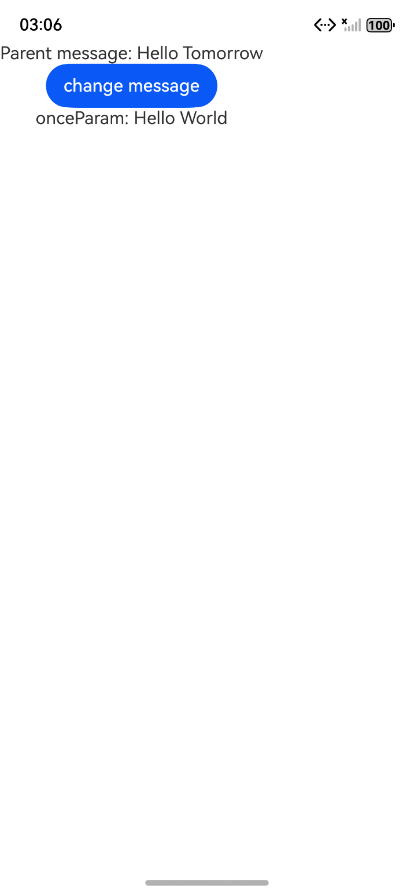

# @Once：初始化同步一次

### 介绍

本示例展示了[@Once：初始化同步一次](https://gitcode.com/openharmony/docs/blob/master/zh-cn/application-dev/ui/state-management/arkts-new-once.md)装饰器的使用方法：

1. @Once用于期望变量仅初始化同步数据源一次，之后不再继续同步变化的场景；
2. 当@Once与@Param结合使用时，可以解除@Param无法在本地修改的限制，并能够触发UI刷新。此时，使用@Param和@Once的效果类似于@Local，但@Param和@Once还能接收外部传入的初始值；

### 效果预览

1.变量仅初始化同步一次

| 应用初始页面                                   | 任务完成界面                               |
|------------------------------------------|--------------------------------------|
|  |  |

2.本地修改@Param变量

| 应用初始页面                             | 任务完成界面                         |
|------------------------------------|--------------------------------|
|  |  |

### 使用说明

1. 必须搭配@Param仅能与@Param共同使用，不可单独使用或与@State、@Local等其它装饰器搭配，且仅支持@ComponentV2组件（API 12+）。
2. 初始化仅同步一次：变量初始化时接收外部传入值，后续外部数据源变化时，子组件变量不再同步更新。
3. 允许本地修改：解除@Param 默认“不可本地修改”的限制，修改后可触发UI刷新，且不影响外部数据源。

### 测试代码说明

执行测试用例会先打开相应界面，然后会将界面上的按钮点击一遍，演示初始化同步数据源。

### 工程目录
```
entry/src/
├── main
│   ├── ets
│   │   ├── entryability
│   │   ├── entrybackupability
│   │   └── pages
│   │       ├── Index.ets   //变量仅初始化同步一次界面
│   │       └── MyComponent.ets     //本地修改@Param变量界面
│   ├── module.json5
│   └── resources
└── ohosTest
    └── ets
        └── test
            ├── Ability.test.ets  // 自动化测试代码
            └── List.test.ets    // 测试套执行列表

```

### 具体实现

1. 创建@ComponentV2装饰的父组件（如 Index）和子组件（如 Child），父组件定义@Local变量作为数据源（如数字、对象）。
2. 子组件中用@Param @Once声明变量（支持基础类型和对象），指定初始值，若为必传参数可搭配@Require。
3. 父组件在构建子组件时，将@Local变量作为参数传递给子组件的@Param @Once变量，完成初始化。
4. 父组件添加按钮交互修改自身@Local变量，子组件添加按钮交互修改自身@Param @Once变量。
5. 运行程序，验证父组件修改数据源时子组件值不变，子组件修改本地变量时UI独立刷新。

### 相关权限

不涉及。

### 依赖

不涉及。

### 约束与限制

1.本示例已适配API version 20及以上版本SDK。

### 下载

如需单独下载本工程，执行如下命令：

```
git init
git config core.sparsecheckout true
echo code/DocsSample/ArkUISample/ArktsNewOnce/ > .git/info/sparse-checkout
git remote add origin https://gitcode.com/openharmony/applications_app_samples.git
git pull origin master
```