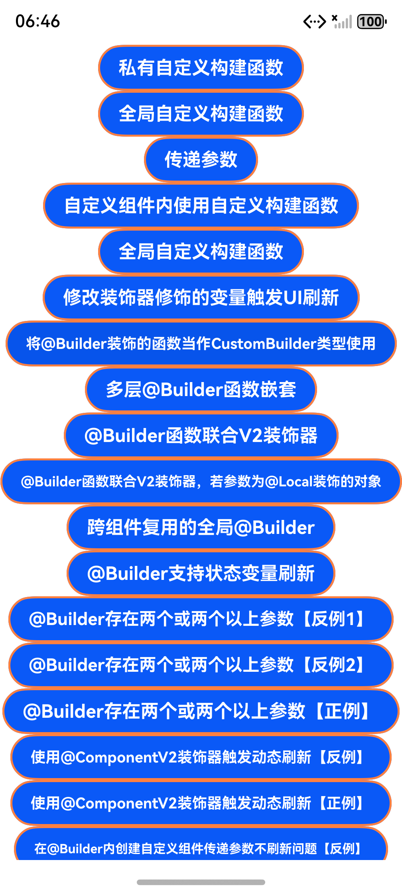
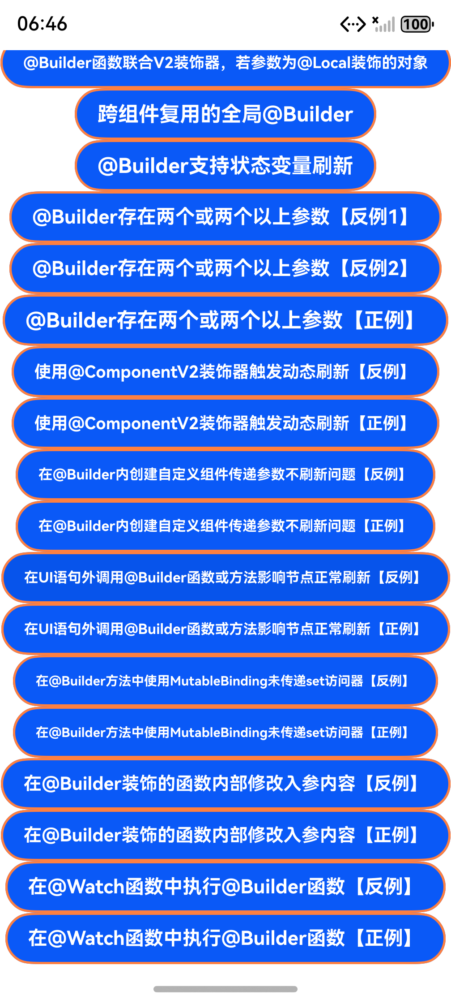

# @Builder装饰器：自定义构建函数

### 介绍

本示例通过使用[@Builder装饰器：自定义构建函数](https://gitcode.com/openharmony/docs/blob/master/zh-cn/application-dev/ui/state-management/arkts-builder.md)中各场景开发实例，主要展示了Builder装饰器的使用方法和一些常见的使用场景以及问题场景，便于开发者学习与理解。

### 效果预览

|主页前半部分|主页后半部分|
|--------------------------------|--------------------------------|
|||

使用说明

1. 在主界面，自上而下共27个按钮，每个按钮对应一个示例场景，点即可跳转至对应页面；
2. 在对应的场景页面可以查看对应参考示例效果；
3. 通过自动测试框架可进行测试及维护。

### 工程目录

```
entry/src/main/ets/
|---entryability
|---entrybackupability
|---pages
|   |---Index.ets                                         // 主页
|   |---PrivateCustomConstructor.ets                      // 私有自定义构建函数
|   |---GlobalCustomConstructor.ets                       // 全局自定义构建函数
|   |---ParameterPassing.ets                              // 自定义构建函数参数传递规则
|   |---InCustomComponent.ets                             // 自定义组件内使用自定义构建函数
|   |---GlobalCustomBuilder.ets                           // 全局自定义构建函数
|   |---ChangingByDecorator.ets                           // 修改装饰器修饰的变量触发UI刷新
|   |---AsCustomBuilder.ets                               // 将@Builder装饰的函数当作CustomBuilder类型使用
|   |---NestedBuilderFunctions.ets                        // 多层@Builder函数嵌套
|   |---BuilderCombined.ets                               // @Builder函数联合V2装饰器
|   |---BuilderCombinedLocal.ets                          // @Builder函数联合V2装饰器且传参为@Local对象
|   |---AcrossComponents.ets                              // 跨组件复用的全局@Builder
|   |---BuilderSupports.ets                               // @Builder支持状态变量刷新
|   |---MultipleIncorrectUsage1.ets                       // @Builder存在两个或两个以上参数反例1
|   |---MultipleIncorrectUsage2.ets                       // @Builder存在两个或两个以上参数反例反例2
|   |---MultipleCorrectUsage.ets                          // @Builder存在两个或两个以上参数反例正例
|   |---DynamicIncorrectUsage.ets                         // 使用@ComponentV2装饰器触发动态刷新反例
|   |---DynamicCorrectUsage.ets                           // 使用@ComponentV2装饰器触发动态刷新正例
|   |---BuilderIncorrectUsage.ets                         // 在@Builder内创建自定义组件传递参数不刷新问题反例
|   |---BuilderCorrectUsage.ets                           // 在@Builder内创建自定义组件传递参数不刷新问题正例
|   |---OutsideIncorrectUsage.ets                         // 在UI语句外调用@Builder函数或方法影响节点正常刷新反例
|   |---OutsideCorrectUsage.ets                           // 在UI语句外调用@Builder函数或方法影响节点正常刷新正例
|   |---AccessorIncorrectUsage.ets                        // 在@Builder方法中使用MutableBinding未传递set访问器反例
|   |---AccessorCorrectUsage.ets                          // 在@Builder方法中使用MutableBinding未传递set访问器正例
|   |---ChangingIncorrectUsage.ets                        // 在@Builder装饰的函数内部修改入参内容反例
|   |---ChangingCorrectUsage.ets                          // 在@Builder装饰的函数内部修改入参内容正例
|   |---WatchIncorrectUsage.ets                           // 在@Watch函数中执行@Builder函数反例
|   |---WatchCorrectUsage.ets                             // 在@Watch函数中执行@Builder函数正例
```

### 具体实现

* 私有实现自定义构建，能够在局部使用的自定义构建，源码参考[PrivateCustomConstructor.ets](./entry/src/main/ets/pages/PrivateCustomConstructor.ets);
  * 在BuilderDemo中使用@Builder修饰函数showTextBuilder()，使其能以链式调用的方式配置并构建Text组件;
  * 在BuilderDemo中使用@Builder修饰函数showTextValueBuilder(param: string)，支持以参数方式传入内容，以达到修改构建内容;
  * 在build()中分别调用上述两个自定义构建函数，可在页面看到'Hello World'和'Hello @Builder'字样;
* 全局实现自定义构建，能够在全局使用的自定义构建，源码参考[GlobalCustomConstructor.ets](./entry/src/main/ets/pages/GlobalCustomConstructor.ets);
  * 在BuilderDemo外部使用@Builder修饰函数showTextBuilder()，使其能以链式调用的方式配置并构建Text组件;
  * 在build()中调用上述自定义构建函数，可在页面看到'Hello World'字样;
* 参数传递规则
  * 当@Builder修饰的自定义构建函数具备参数，其规则大致如下，源码参考[ParameterValue.ets](./entry/src/main/ets/pages/ParameterValue.ets)和[ParameterReference.ets](./entry/src/main/ets/pages/ParameterReference.ets)。
  ```typescript
  // 按值传递（无自动刷新）
  @Builder function StaticText(content: string) {
    Text(content).fontSize(14)
  }

  // 按引用传递（支持自动刷新）
  @Builder function DynamicText($$: { content: string }) {
    Text($$.content).fontColor('#FF0000')
  }
  ```

### 相关权限

无。

### 依赖

无。

### 约束与限制

1. 本示例仅支持标准系统上运行，支持设备如：RK3568;
2. 本示例为Stage模型，仅支持API20及以上版本SDK，SDK版本号(API Version 20 Release)及以上，镜像版本号(6.0Release)及以上;
3. 本示例需要使用DevEco Studio 6.0.0 Canary1 (Build Version: 6.0.0.858, built on September 24, 2025)及以上版本才可编译运行。

### 下载

如需单独下载本工程，在本地目录使用git执行如下命令：

```
git init
git config core.sparsecheckout true
echo code/DocsSample/ArkUISample/BuilderComponent > .git/info/sparse-checkout
git remote add origin https://gitcode.com/openharmony/applications_app_samples.git
git pull origin master
```