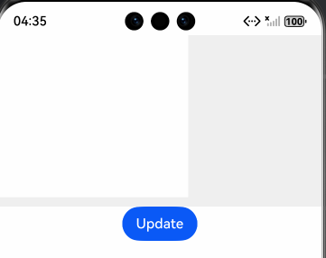
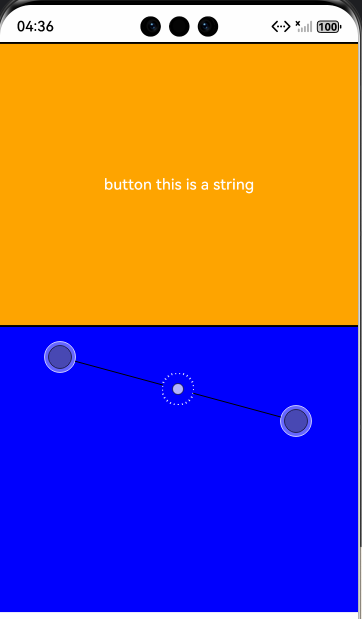
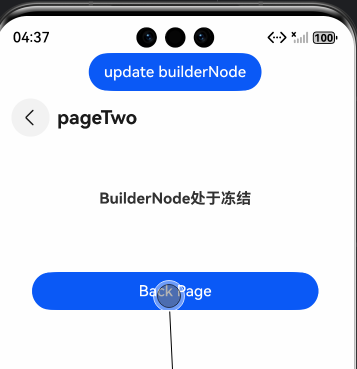

# ArkUI使用滚动类指南文档示例

### 介绍

本示例通过使用[ArkUI指南文档](https://gitcode.com/openharmony/docs/tree/master/zh-cn/application-dev/ui)中各场景的开发示例，展示在工程中，帮助开发者更好地理解ArkUI提供的组件及组件属性并合理使用。该工程中展示的代码详细描述可查如下链接：

1. [自定义声明式节点 (BuilderNode)](https://gitcode.com/openharmony/docs/blob/master/zh-cn/application-dev/ui/arkts-user-defined-arktsNode-builderNode.md)。

### 效果预览

| EnvironmentCallbackPage   | postTouchEvent            | inheritFreezeOptionsPage                 |
|---------------------------|---------------------------|---------------------------|
|  |  |  |

### 使用说明

1. 在主界面，可以点击对应卡片，选择需要参考的组件示例。

2. 在组件目录选择详细的示例参考。

3. 进入示例界面，查看参考示例。

4. 通过自动测试框架可进行测试及维护。

### 工程目录
```
entry/src/main/ets/
|---Common
|   |---CommonIndex.ets                                   // 创建NodeController
|---entryability
|---pages
|   |---ArkWebPage.ets                             //BuilderNode结合ArkWeb组件实现预渲染页面  
|   |---BuilderProxyNode01.ets                            //BuilderProxyNode导致树结构发生变化 
|   |---BuilderProxyNode02.ets                                 //修复BuilderProxyNode导致树结构发生变化  
|   |---EnvironmentCallbackPage.ets                                 //通过系统环境变化更新节点
|   |---FrameNode.ets                               //创建组件树
|   |---InheritFreezeOptionsPage.ets                                 //设置BuilderNode继承冻结能力
|   |---IsDisposedPage.ets                             //查询当前BuilderNode是否解除引用 
|   |---LocalStoragePage.ets                             //BuilderNode中使用LocalStorage  
|   |---PostTouchEvent.ets                            //注入触摸事件 
|   |---RenderNode.ets                                 //BuilderNode与RenderNode结合使用  
|   |---ReusablePage01.ets                                 //调用reuse和recycle接口实现节点复用能力
|   |---ReusablePage02.ets                               //使用@Reusable装饰器
|   |---RouterPage1.ets                                 //跨页面复用
|   |---RouterPage2.ets                             //跨页面复用 
|   |---WrappedBuilder.ets                           //更新组件树 
entry/src/ohosTest/
|---ets
|   |---ArkWebPage.test.ets                             // 页面对应测试代码  
|   |---BuilderProxyNode01.test.ets                       // 页面对应测试代码 
|   |---BuilderProxyNode02.test.ets                        // 页面对应测试代码  
|   |---EnvironmentCallbackPage.test.ets                        // 页面对应测试代码
|   |---FrameNode.test.ets                               // 页面对应测试代码
|   |---InheritFreezeOptionsPage.test.ets                         // 页面对应测试代码
|   |---IsDisposedPage.test.ets                             // 页面对应测试代码 
|   |---LocalStoragePage.test.ets                             // 页面对应测试代码  
|   |---PostTouchEvent.test.ets                            // 页面对应测试代码 
|   |---RenderNode.test.ets                                 // 页面对应测试代码 
|   |---ReusablePage01.test.ets                                 // 页面对应测试代码
|   |---ReusablePage02.test.ets                               // 页面对应测试代码
|   |---RouterPage.test.ets                                 // 页面对应测试代码
|   |---WrappedBuilder.test.ets                           // 页面对应测试代码 
```
### 具体实现

一、BuilderNode与NodeController结合实现组件挂载（基础场景）
1. 定义全局@Builder（如buildText）：封装需渲染的组件树（如Text、Column），支持传入Params参数；
2. 实现NodeController（如TextNodeController）：在makeNode方法中创建BuilderNode实例，调用builderNode.build(wrapBuilder(@Builder), Params)绑定样式与参数，通过getFrameNode()获取根FrameNode并返回；
3. 处理BuilderNode生命周期：可选调用dispose()解除后端实体节点引用，避免内存泄漏。

二、BuilderNode组件更新（支持主动更新与系统环境响应）
1. 主动更新：在NodeController中定义update方法，内部调用builderNode.update(新Params)，触发组件树重新渲染；
2. 系统环境更新：调用builderNode.updateConfiguration()，监听系统配置变化（如主题、屏幕旋转），触发组件全量更新；
3. 状态绑定：@Builder中引用的自定义组件，需通过@Prop/@ObjectLink绑定状态，确保更新时子组件同步刷新。

三、BuilderNode注入触摸事件（postTouchEvent实现事件转发）
1. 定义支持触摸的@Builder（如ButtonBuilder）：在@Builder中封装带TapGesture的组件（如Button），处理触摸反馈；
2. NodeController扩展：在NodeController中定义postTouchEvent方法，内部调用builderNode.postTouchEvent(touchEvent)，转发触摸事件；
3. 事件转发逻辑：接收触摸事件后，通过postTouchEvent注入BuilderNode对应的组件树，返回值标识事件是否被成功识别。

四、BuilderNode结合ArkWeb实现组件预渲染（优化加载效率）
1. 预渲染初始化：在EntryAbility的onWindowStageCreate中，调用createNWeb创建预渲染的BuilderNode，传入UIContext和Web地址，通过WebController调用onActive开启渲染，onFirstMeaningfulPaint后调用onInactive停止预渲染；
2. NodeController管理：myNodeController中通过initWeb方法创建BuilderNode，绑定带ArkWeb的@Builder（webBuilder），makeNode返回预渲染的FrameNode；
3. 预渲染复用：通过Map存储NodeController和WebController，页面调用getNWeb获取预渲染控制器。

### 相关权限

不涉及。

### 依赖

不涉及。

### 约束与限制

1.本示例仅支持标准系统上运行, 支持设备：RK3568。

2.本示例为Stage模型，支持API20版本full-SDK，版本号：5.1.0.107，镜像版本号：OpenHarmony_5.1.0 Release。

3.本示例需要使用DevEco Studio 5.0.5 Release (Build Version: 5.0.13.200， built on May 13, 2025)及以上版本才可编译运行。

### 下载

如需单独下载本工程，执行如下命令：

````
git init
git config core.sparsecheckout true
echo code/DocsSample/ArkUISample/BuilderNode > .git/info/sparse-checkout
git remote add origin https://gitcode.com/openharmony/applications_app_samples.git
git pull origin master
````