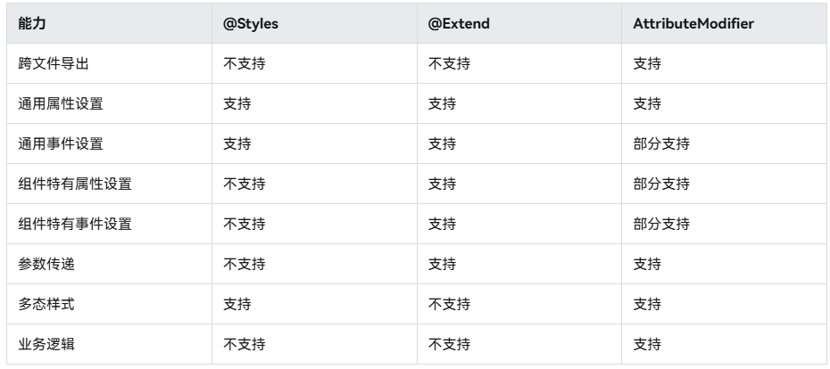

# 属性修改器 (AttributeModifier)指南文档示例

### 介绍

声明式语法引入了@Styles和@Extend两个装饰器，可以解决复用相同自定义样式的问题，但是存在以下受限场景：

1.@Styles和@Extend均是编译期处理，不支持跨文件的导出复用。
2.@Styles仅能支持通用属性、事件，不支持组件特有的属性。
3.@Styles虽然支持在多态样式下使用，但不支持传参，无法对外开放一些属性。
4.@Extend虽然能支持特定组件的私有属性、事件，但同样不支持跨文件导出复用。
5.@Styles、@Extend对于属性设置，无法支持业务逻辑编写，动态决定是否设置某些属性，只能通过三元表达式对所有可能设置的属性进行全量设置，设置大量属性时效率较低。
为了解决上述问题，ArkUI引入了AttributeModifier机制，可以通过Modifier对象动态修改属性。能力对比如下：



可以看出，与@Styles和@Extend相比，AttributeModifier提供了更强的能力和灵活性，且在持续完善全量的属性和事件设置能力，因此推荐优先使用AttributeModifier。

### 效果预览

| 按钮1                       | 按钮2                       | 按钮3                       | 按钮4                                 |
|---------------------------|---------------------------|---------------------------|-------------------------------------|
|  |  |  |  |

### 使用说明

1. 在主界面，可以点击对应卡片，选择需要参考的组件示例。

2. 在组件目录选择详细的示例参考。

3. 进入示例界面，查看参考示例。

4. 通过自动测试框架可进行测试及维护。

### 工程目录
```
entry/src/main/ets/
|---Common
|   |---button_modifier_01.ets
|   |---button_modifier_02.ets
|   |---button_modifier_03.ets
|   |---button_modifier_04.ets
|---entryability
|---pages
|   |---attributeDemo_01                            
entry/src/ohosTest/
|---ets
|   |---attribute.test.ets                       // 示例代码测试代码
```

### 相关权限

不涉及。

### 依赖

不涉及。

### 约束与限制

1.本示例仅支持标准系统上运行, 支持设备：Mate 70 Pro。

2.本示例为Stage模型，支持API18版本full-SDK，版本号：5.1.0.107，镜像版本号：OpenHarmony_5.1.0 Release。

3.本示例需要使用DevEco Studio 5.0.5 Release (Build Version: 5.0.13.200， built on May 13, 2025)及以上版本才可编译运行。

### 下载

如需单独下载本工程，执行如下命令：

````
git init
git config core.sparsecheckout true
echo code/DocsSample/ArkUIDocSample/ScrollableComponent > .git/info/sparse-checkout
git remote add origin https://gitee.com/openharmony/applications_app_samples.git
git pull origin master
````